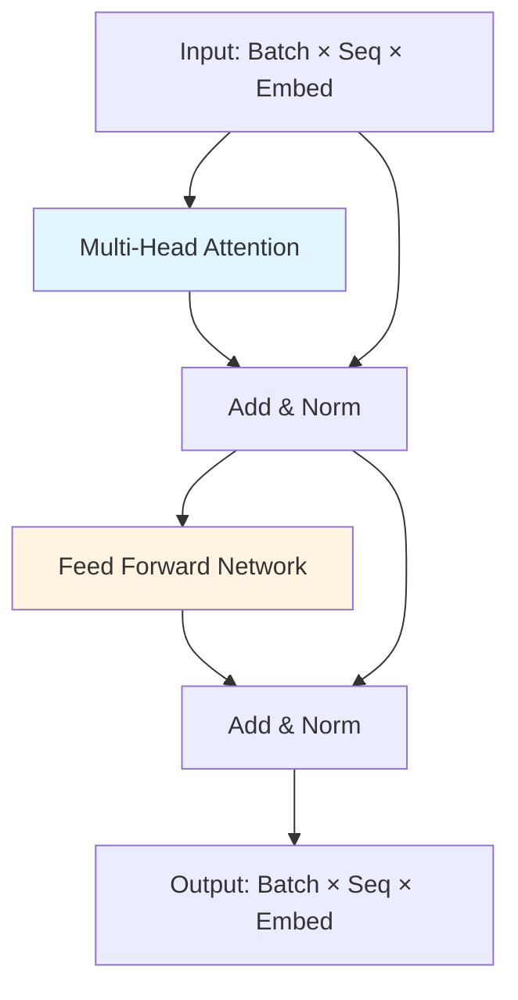

# Paper Analysis Guide for AI Engineers

## Overview

This guide provides structured frameworks for analyzing research papers using AI assistance. It helps extract paper structure, key ideas, technical details, and engineering inspiration efficiently. Designed for AI engineers who need to quickly understand papers, identify borrowable concepts, and adapt innovations for their own projects.

## Core Principles for AI Assistants

**When using this skill to analyze papers, ALWAYS follow these principles:**

### Simplicity First
- Use plain, everyday language instead of academic jargon
- Explain concepts as if talking to a colleague, not writing a thesis
- Replace formal terms with practical ones:
  - "novel contribution" → "what's new/different"
  - "methodology" → "how they did it"
  - "empirical validation" → "testing/results"
  - "architectural framework" → "how it's built"
- Break down complex ideas into simple steps
- Use concrete examples instead of abstract descriptions

### Practical Over Academic
- Focus on "how can I use this?" not "what does this mean theoretically?"
- Emphasize implementation details over theoretical foundations
- Highlight code, tools, and techniques that can be directly applied
- Skip unnecessary background unless specifically asked
- Answer "so what?" for every insight - why does it matter practically?
- Prioritize working solutions over perfect understanding

### Direct Communication
- Get straight to the point
- Start with the answer, then provide details if needed
- Use active voice: "this paper shows" not "it can be observed that"
- Say "doesn't work well" instead of "suboptimal performance"
- Be honest about limitations and tradeoffs

### Action-Oriented
- Every explanation should lead to something the user can do
- Provide "next steps" and "how to try this"
- Include code snippets, pseudocode, or clear algorithms
- Suggest concrete experiments or prototypes
- Focus on "what to build" not just "what to know"

## Quick Start

```plaintext
# Basic Paper Analysis
"Analyze the structure of this paper: List all main sections, subsections, 
and their page ranges. Highlight any figures, tables, or appendices."

"Provide a 200-word summary of the paper's gist, covering the problem statement, 
main contributions, and conclusions."

"Generate a mind map in text format summarizing the paper's structure."
```

## Setup

### Prerequisites

- **Paper Access**: Upload PDFs or provide links to research papers
- **AI Assistant**: Claude or similar AI with document analysis capabilities
- **Multi-Paper Analysis**: Reference papers by name or number for batch processing
- **Visualization Tools**: Leverage markdown, Mermaid, PlantUML for diagram generation

### Best Practices

```plaintext
# Be specific with your goals
"For my work on [specific topic], extract relevant ideas from this paper..."

# Iterate and refine
"Expand on that section with more technical details."
"Clarify with code examples in PyTorch."

# Handle volume efficiently
Process 3-5 papers per query for optimal results.

# Request compatible formats
Use markdown, Mermaid, ASCII for easy rendering.
```

### AI Response Style

When analyzing papers with this skill:
- **Avoid**: "The authors present a novel architectural paradigm..."
- **Use**: "They built a new model that..."

- **Avoid**: "This methodology demonstrates superior performance characteristics..."
- **Use**: "This method is faster/better because..."

- **Avoid**: "The empirical results substantiate the theoretical framework..."
- **Use**: "The tests show it works..."

Always translate academic language into builder/engineer language.

## Paper Structure and Gist Extraction

### Initial Structure Extraction

Get a navigable skeleton of the paper for quick orientation.

```plaintext
Prompt:
"Analyze the structure of this paper: List all main sections, subsections, 
and their page ranges. Highlight any figures, tables, or appendices."

Why it works:
Provides complete navigational overview before diving deep.
```

**Expected Output Structure:**
- Section hierarchy with page numbers
- Figure and table inventory
- Appendix content summary
- Key mathematical notation locations

### Gist Summary

Capture the essence for rapid relevance assessment.

```plaintext
Prompt:
"Provide a 200-word summary of the paper's gist, covering the problem statement, 
main contributions, and conclusions. Focus on the abstract and introduction for 
the core ideas."

Why it works:
Distills hours of reading into minutes, helps decide if paper is relevant.
```

**Summary Components:**
- Problem being addressed
- Novel contributions
- Key methodology
- Main results
- Practical implications

### Detailed Section Dive

Focus on specific sections with borrowable details.

```plaintext
Prompt:
"Break down the [specific section, e.g., Methods] in detail: Explain key concepts, 
steps, and any novel ideas I could borrow for my own work on [your topic]."

Example - For "Methodology" section:
"Break down the Methodology section in detail: Explain the neural architecture, 
training procedure, and any novel techniques I could borrow for my work on 
real-time image classification."

Why it works:
Targets actionable content specific to your engineering needs.
```

### Visualization: Mind Map Generation

Visualize paper structure for rapid comprehension.

```plaintext
Prompt:
"Generate a mind map in text format (using markdown or ASCII) summarizing 
the paper's structure: Central node as title, branches for sections, 
sub-branches for key subsections, and leaves for figures/tables."

Alternative formats:
- "Create a Mermaid diagram of the paper's conceptual flow."
- "Generate an ASCII tree structure of the paper hierarchy."
```

**Example Mind Map Output:**
```
[Paper Title: Attention Is All You Need]
├── Abstract & Introduction
│   ├── Problem: Sequential computation limits
│   └── Solution: Self-attention mechanism
├── Architecture
│   ├── Encoder Stack (6 layers)
│   ├── Decoder Stack (6 layers)
│   └── Multi-Head Attention
│       ├── Figure 2: Architecture diagram
│       └── Equations 1-3
├── Experiments
│   ├── Translation tasks (WMT 2014)
│   └── Table 2: Results comparison
└── Conclusions
    └── Impact on sequence modeling
```

### Multi-Paper Structure Comparison

```plaintext
Prompt:
"Compare the structures of Paper A [title] and Paper B [title]. Highlight 
similarities in methodology sections and differences in evaluation approaches."
```

## Idea Extraction and Borrowing

### Key Ideas Scan

Build an inventory of innovations across papers.

```plaintext
Prompt:
"Scan these [number] papers on [topic] and extract 5-10 key ideas or innovations 
from each. For each idea, note the paper's title, section where it's discussed, 
and a brief explanation."

Example:
"Scan these 3 papers on transformer architectures and extract 5-10 key ideas 
from each. Include: paper title, section reference, and 2-3 sentence explanation 
of the innovation."

Why it works:
Creates a reusable catalog of techniques for future reference.
```

**Output Format:**
```
Paper: [Title]
Idea 1: [Innovation name]
  Section: [Section X.Y, pages Z-W]
  Description: [Explanation]
  Potential Application: [How it could be used]
  
Idea 2: [Innovation name]
  ...
```

### Relevance Check

Connect extracted ideas to your specific needs.

```plaintext
Prompt:
"For each key idea from the previous list, explain how it could be adapted 
or borrowed for my research on [your specific topic]. Include potential pros, 
cons, and modifications."

Example:
"For each key idea from the previous list, explain how it could be adapted 
for my work on edge AI inference optimization. Include:
- Adaptation strategy
- Pros/cons for edge deployment
- Required modifications
- Implementation complexity"

Why it works:
Filters ideas through your project constraints for practical value.
```

### Deep Dive on Selected Ideas

Extract comprehensive details with context.

```plaintext
Prompt:
"Provide a detailed breakdown of [specific idea from paper X], including:
- Supporting evidence and experiments
- Mathematical formulations or pseudocode
- References to similar ideas in other papers
- Limitations and failure cases
- Suggested improvements"

Example:
"Provide a detailed breakdown of the 'scaled dot-product attention' mechanism 
from 'Attention Is All You Need', including equations, computational complexity, 
and how it differs from additive attention in Bahdanau et al."

Why it works:
Provides implementation-ready understanding with full context.
```

### Visualization: Idea Interconnection

Map how ideas build upon each other.

```plaintext
Prompt:
"Create a flowchart or diagram description (in markdown or PlantUML syntax) 
visualizing how the key ideas interconnect across papers. Show:
- Which ideas are foundational
- Dependencies between techniques
- Evolution of concepts across papers
- Potential hybrid combinations"

Example using Mermaid:
"Generate a Mermaid flowchart showing how attention mechanisms evolved from 
Bahdanau (2015) through Vaswani (2017) to recent sparse attention papers, 
highlighting key innovations at each step."
```

### Synthesis Prompt

Combine ideas into novel approaches.

```plaintext
Prompt:
"Synthesize ideas from all papers into a mind-map style outline for a new 
hybrid approach that:
- Combines [idea A] from Paper 1 with [idea B] from Paper 2
- Addresses limitations of [technique X]
- Is suitable for [your application domain]
- Includes implementation considerations"
```

## Engineering Inspiration and Technical Deep Dives

### Inspirational Overview

Extract engineering-focused elements for prototyping.

```plaintext
Prompt:
"For this paper on [AI subfield, e.g., transformer architectures], extract 
5-8 inspirational elements:
1. Key innovations in models/algorithms
2. Unique data handling tricks
3. Experimental setups that could be repurposed
4. Training optimization techniques
5. Evaluation metrics and benchmarks
6. Open challenges mentioned
7. Code availability and reproducibility details

For each element, note the section and why it might inspire new AI engineering 
approaches."

Example:
"For this paper on efficient transformers, extract 5-8 inspirational elements 
focusing on: model compression techniques, memory optimization tricks, 
inference speed improvements, and deployment considerations. Highlight 
elements applicable to mobile/edge deployment."

Why it works:
Identifies immediately actionable engineering insights beyond theory.
```

### Technical Deep Dive for Adaptation

Get implementation-ready details with adaptation suggestions.

```plaintext
Prompt:
"Break down the core AI component [e.g., the proposed neural network] in detail:
- Architecture layers and connections
- Key equations with explanations
- Hyperparameters and their effects
- Pseudocode or algorithm descriptions
- Training procedure and convergence characteristics

Then suggest 2-3 ways to adapt this for [your project goal, e.g., real-time 
edge AI], including:
- Potential code modifications
- Library integrations (PyTorch/TensorFlow/JAX)
- Performance trade-offs
- Resource requirements"

Example:
"Break down the Vision Transformer (ViT) architecture in detail, including 
patch embedding, position encoding, and the transformer encoder stack. 
Then suggest 2-3 ways to adapt this for real-time video processing on 
NVIDIA Jetson, including model distillation approaches and quantization 
strategies with sample PyTorch code snippets."

Why it works:
Bridges the gap between paper concepts and production code.
```

**Technical Deep Dive Checklist:**
- [ ] Architecture diagram description
- [ ] Layer-by-layer breakdown
- [ ] Activation functions and normalization
- [ ] Loss function formulation
- [ ] Optimization algorithm
- [ ] Hyperparameter sensitivity
- [ ] Computational complexity (FLOPs, memory)
- [ ] Adaptation strategies with code hints

### Cross-Pollination Synthesis

Combine ideas from multiple sources for hybrid innovations.

```plaintext
Prompt:
"Synthesize inspirational ideas from this paper with [1-2 related papers or 
concepts, e.g., GPT variants and efficient attention mechanisms]. 

Highlight synergies such as:
- Combining their attention mechanism with another model's efficiency hack
- Merging training strategies from different papers
- Applying one paper's data augmentation to another's architecture

Then propose a simple experiment outline to test it in my AI workflow:
- Hypothesis
- Required modifications
- Baseline comparison
- Success metrics
- Estimated effort"

Example:
"Synthesize the sparse attention from 'Longformer' with the sliding window 
approach from 'Perceiver IO'. Propose an experiment to test this hybrid 
for long document understanding in my legal document analysis project, 
including PyTorch implementation steps and benchmark against vanilla transformer."

Why it works:
Sparks novel approaches by combining complementary techniques.
```

### Visualization: Architecture Diagram

Conceptualize code structures visually for implementation.

```plaintext
Prompt:
"Visualize the inspired architecture as a diagram description or flowchart 
I could implement (e.g., in Mermaid syntax for a neural network flow). Include:
- Input/output shapes
- Layer types and dimensions
- Skip connections and attention heads
- Loss computation flow
- Forward and backward pass overview"

Alternative formats:
- "Create PlantUML component diagram for the model architecture"
- "Generate ASCII art of the network topology with tensor dimensions"
- "Describe the architecture in Keras/PyTorch Sequential format"
```

**Example Mermaid Output:**


### "What If" Variations

Explore creative extensions and adaptations.

```plaintext
Prompt templates:
- "How could this technique inspire a multimodal version for [your domain]?"
- "What if we applied this approach to [different data type, e.g., graph data]?"
- "How would this model perform with [constraint, e.g., 100x less data]?"
- "What modifications would make this work in [scenario, e.g., federated learning]?"

Example:
"How could the CLIP image-text alignment inspire a multimodal approach for 
code-documentation matching in my developer tools project? Include potential 
architecture modifications and training data requirements."
```

## Common Workflows

### Single Paper Analysis Pipeline

Complete workflow for thoroughly understanding one paper.

```plaintext
Step 1: Structure Scan
"Analyze the structure of [paper title]: sections, figures, key equations."

Step 2: Gist Summary
"Provide a 200-word gist covering problem, contributions, and results."

Step 3: Key Ideas Extraction
"Extract 5-7 key innovations with section references."

Step 4: Technical Deep Dive
"Break down the [core component] in implementation detail with PyTorch adaptation suggestions."

Step 5: Visual Summary
"Generate a Mermaid mind map of the paper's structure and key ideas."

Step 6: Engineering Inspiration
"List 3-5 inspirational elements I could borrow for [my project]."
```

### Multi-Paper Comparative Analysis

Workflow for analyzing multiple related papers.

```plaintext
Step 1: Overview Table
"Create a comparison table for these [N] papers: Title, Year, Main Topic, 
Key Methods, Findings, Limitations."

Step 2: Thematic Grouping
"Group the papers by common themes and summarize each theme's collective gist."

Step 3: Idea Inventory
"Extract 5 key ideas from each paper, noting unique vs. shared concepts."

Step 4: Gap Analysis
"Identify gaps and contradictions across papers that could inspire new research."

Step 5: Synthesis
"Propose a hybrid approach combining the best ideas from all papers."
```

### Rapid Screening Workflow

Quick assessment for paper relevance.

```plaintext
For each paper in a batch:
1. "Extract: Title, Year, Abstract summary (50 words), and conclusion."
2. "Rate relevance to [my topic] on 1-10 scale with justification."
3. "List 2-3 key takeaways."

Then:
"Rank papers by relevance and recommend top 3 for deep dive."
```

### Implementation-Focused Workflow

Extract code-ready insights from papers.

```plaintext
Step 1: Architecture Extraction
"Describe the model architecture with layer types, dimensions, and connections 
suitable for PyTorch implementation."

Step 2: Pseudocode Generation
"Generate pseudocode for the core algorithm with complexity analysis."

Step 3: Hyperparameter Extraction
"List all hyperparameters, their values in the paper, and sensitivity notes."

Step 4: Code Adaptation
"Suggest code modifications for [my constraint, e.g., limited GPU memory], 
including specific PyTorch functions and libraries."

Step 5: Experiment Design
"Outline an experiment to validate this approach in my setting with baseline 
and metrics."
```

### Literature Survey Workflow

Systematic analysis for comprehensive understanding of a field.

```plaintext
Step 1: Chronological Overview
"Arrange these [N] papers chronologically and trace evolution of key ideas."

Step 2: Method Taxonomy
"Categorize papers by methodological approach (e.g., attention-based, 
convolutional, hybrid)."

Step 3: Result Comparison
"Compare reported results on common benchmarks across papers."

Step 4: Trend Identification
"Identify emerging trends and declining approaches in the field."

Step 5: Future Directions
"Based on all papers, suggest 3-5 promising research directions."
```

## Quick Reference

| Task | Prompt Template | Key Focus |
|------|----------------|-----------|
| **Structure extraction** | "Analyze the structure of this paper: sections, figures, tables." | Navigation |
| **Gist summary** | "Provide 200-word summary: problem, contributions, conclusions." | Relevance check |
| **Section deep dive** | "Break down [section] in detail for my work on [topic]." | Borrowable details |
| **Mind map** | "Generate mind map in markdown: structure and key ideas." | Visual overview |
| **Idea inventory** | "Extract 5-10 key ideas with section references." | Innovation catalog |
| **Relevance check** | "How could each idea be adapted for [my project]?" | Practical filter |
| **Idea synthesis** | "Synthesize ideas into hybrid approach for [goal]." | Novel combinations |
| **Technical breakdown** | "Detail [component]: architecture, equations, code adaptation." | Implementation |
| **Cross-pollination** | "Combine [idea A] from [paper 1] with [idea B] from [paper 2]." | Hybrid innovation |
| **Architecture viz** | "Visualize architecture in Mermaid for implementation." | Code structure |
| **What-if exploration** | "How could this inspire [variant] for [domain]?" | Creative extension |
| **Multi-paper compare** | "Create comparison table: methods, results, limitations." | Batch analysis |

## Output Formats

### Structure Analysis Output
```
Paper Title: [Full Title]
Authors: [List]
Year: [Publication Year]

Main Sections:
1. Introduction (Pages 1-3)
   - Problem Statement
   - Contributions
2. Related Work (Pages 3-5)
3. Methodology (Pages 5-12)
   - Figure 1: Architecture Overview (Page 6)
   - Algorithm 1: Training Procedure (Page 9)
   - Equations 1-5: Core Formulations (Pages 7-8)
4. Experiments (Pages 12-16)
   - Table 1: Benchmark Results (Page 13)
   - Figure 3: Ablation Study (Page 15)
5. Conclusions (Pages 16-17)
Appendix A: Hyperparameter Details (Pages 18-19)
```

### Idea Extraction Output
```
Paper: [Title]

Key Idea 1: [Innovation Name]
  Section: 3.2 (Pages 7-9)
  Description: [2-3 sentence explanation]
  Novelty: [What makes it unique]
  Relevance: [How it applies to your work]
  Adaptation: [Suggested modifications]
  Pros: [Benefits]
  Cons: [Limitations]
  Implementation: [Complexity estimate: Low/Medium/High]

Key Idea 2: ...
```

### Technical Deep Dive Output
```
Component: [Name, e.g., "Multi-Head Self-Attention"]

Architecture:
- Input: [Shape and description]
- Layers: [Detailed breakdown]
- Output: [Shape and description]

Mathematical Formulation:
[Equations with explanations]

Pseudocode:
```
[Algorithm steps]
```

Hyperparameters:
- [Parameter]: [Value] (Sensitivity: [High/Medium/Low])

Computational Complexity:
- Time: [Big-O notation]
- Space: [Memory requirements]
- FLOPs: [Estimate]

Adaptation for [Your Project]:
1. [Modification 1]: [Details]
2. [Modification 2]: [Details]

PyTorch Implementation Hints:
- Use [torch.nn.Module] for [component]
- Consider [library/function] for [optimization]
- Code snippet: [Example]
```

## Advanced Techniques

### Iterative Refinement

```plaintext
Initial: "Summarize this paper on transformers."
↓
Refine: "Expand on the attention mechanism section with equations."
↓
Specify: "Show how to implement scaled dot-product attention in PyTorch."
↓
Adapt: "Modify this for sparse attention to handle 10k token sequences."
```

### Multi-Modal Paper Analysis

```plaintext
"For this paper:
1. Summarize the text content (abstract, methods, conclusions)
2. Describe each figure and its key message
3. Extract data from tables
4. Analyze code snippets in appendices
5. Synthesize all modalities into unified understanding"
```

### Collaborative Paper Reading

```plaintext
"Compare my understanding of [concept] from this paper with standard 
interpretations. Identify gaps in my comprehension and suggest clarifying 
questions."
```

## Best Practices

### Response Guidelines for AI

When responding to paper analysis requests, structure answers like this:

**For Summaries:**
```
Problem: [What they're solving in one sentence]
Solution: [Their approach in simple terms]
Results: [Did it work? By how much?]
Useful for: [When would I use this?]
```

**For Technical Details:**
```
What it is: [Simple explanation]
How it works: [Key steps, no jargon]
Code hint: [Library/function to use]
Works well when: [Use cases]
Watch out for: [Common issues]
```

**For Ideas/Techniques:**
```
Technique: [Name in plain English]
Why it's cool: [The insight]
How to try it: [Concrete steps]
Where it fits: [Real applications]
```

### Prompt Engineering Tips

1. **Be Specific with Context**
   - ❌ "Explain this paper."
   - ✅ "For my work on edge AI deployment, explain this paper's model compression techniques with PyTorch implementation guidance."

2. **Chunk Large Tasks**
   - Process 3-5 papers per query
   - Break long papers into section-by-section analysis
   - Use multiple iterations for complex extractions

3. **Request Compatible Formats**
   - Use "markdown table" for comparisons
   - Use "Mermaid syntax" for diagrams
   - Use "Python pseudocode" for algorithms
   - Use "ASCII tree" for hierarchies

4. **Iterate and Refine**
   - Start broad, then zoom in
   - Use follow-up prompts to clarify
   - Request examples when abstracts are unclear

5. **Leverage AI Capabilities**
   - Ask for visualizations (mind maps, flowcharts)
   - Request code translations (equation → PyTorch)
   - Use comparative analysis across papers
   - Explore "what-if" scenarios

### Ethical Considerations

- **Citation**: Always cite sources when borrowing ideas
- **Purpose**: Use for inspiration, not plagiarism
- **Verification**: Cross-check AI interpretations against original papers
- **Fair Use**: Respect copyright when sharing paper content
- **Attribution**: Acknowledge original authors in your work

### AI Responsibility

When using this skill to analyze papers:
- Admit when something is unclear or when you're unsure
- Don't oversimplify to the point of inaccuracy
- Highlight when theory differs from practice
- Warn about implementation challenges honestly
- Balance simplicity with correctness

## Integration with Tools

### With PDF Readers
```plaintext
"Browse page [X] of the PDF and describe Figure [Y] in detail."
"Extract the equation on page [Z] and explain each term."
```

### With Code Environments
```plaintext
"Generate PyTorch code implementing the algorithm from Section 3, 
with comments explaining each step."
```

### With Visualization Tools
```plaintext
"Create this diagram in Mermaid format that I can render in my markdown editor."
"Generate PlantUML syntax for the architecture I can use in documentation."
```

### With Reference Managers
```plaintext
"Format citations for these papers in BibTeX for my paper."
"Generate a reading list organized by topic with annotations."
```

## Troubleshooting

### Common Issues and Solutions

**Issue**: AI provides superficial summaries
- **Solution**: Add "in detail" and specify desired depth (e.g., "with equations and implementation notes")

**Issue**: Missed key insights
- **Solution**: Ask for section-specific analysis: "Focus on Section 3.2 which discusses [specific topic]"

**Issue**: Inconsistent paper references
- **Solution**: Number papers at start: "Call this Paper 1, analyze its methodology"

**Issue**: Overwhelming output for multiple papers
- **Solution**: Use staged approach: "First create comparison table, then deep dive on top 2"

**Issue**: Unclear technical details
- **Solution**: Request specific format: "Explain as pseudocode" or "Show in mathematical notation"

## Next Steps

- **Practice**: Start with 1-2 papers you know well to calibrate AI responses
- **Customize**: Adapt prompt templates to your specific domain and goals
- **Iterate**: Refine prompts based on output quality
- **Document**: Save effective prompts for reuse
- **Share**: Contribute improved frameworks back to the community

## Additional Resources

- **Paper Repositories**: arXiv, Papers With Code, Semantic Scholar
- **Visualization**: Mermaid Live Editor, PlantUML Online
- **Code**: Papers With Code (official implementations)
- **Discussions**: Reddit r/MachineLearning, AI research communities

---

**Version**: 1.0  
**Last Updated**: 2025  
**Feedback**: Adapt and improve these frameworks based on your experience
