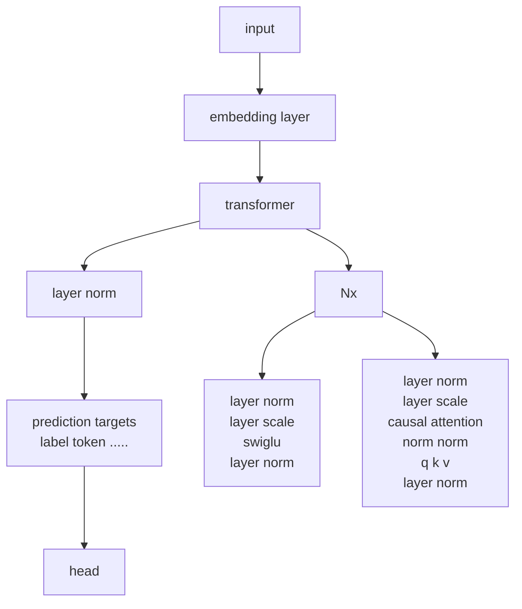

# Next-Embedding Prediction Makes Strong Vision Learners

Sihan Xu<sup>1</sup> Ziqiao Ma<sup>1</sup> Wenhao Chai<sup>3</sup> Xuweiyi Chen<sup>4</sup> Weiyang Jin<sup>‡2</sup>
Joyce Chai<sup>1</sup> Saining Xie<sup>2</sup> Stella X. Yu<sup>1</sup>

<sup>1</sup>University of Michigan <sup>2</sup>New York University <sup>3</sup>Princeton University <sup>4</sup>University of Virginia

https://sihanxu.me/nepa

## Abstract

*Inspired by the success of generative pretraining in natural language, we ask whether the same principles can yield strong self-supervised visual learners. Instead of training models to output features for downstream use, we train them to generate embeddings to perform predictive tasks directly. This work explores such a shift from learning representations to learning models. Specifically, models learn to predict future patch embeddings conditioned on past ones, using causal masking and stop gradient, which we refer to as Next-Embedding Predictive Autoregression (NEPA). We demonstrate that a simple Transformer pretrained on ImageNet-1k with next embedding prediction as its sole learning objective is effective—no pixel reconstruction, discrete tokens, contrastive loss, or task-specific heads. This formulation retains architectural simplicity and scalability, without requiring additional design complexity. NEPA achieves strong results across tasks, attaining 83.8% and 85.3% top-1 accuracy on ImageNet-1K with ViT-B and ViT-L backbones after fine-tuning, and transferring effectively to semantic segmentation on ADE20K. We believe generative pretraining from embeddings provides a simple, scalable, and potentially modality-agnostic alternative to visual self-supervised learning.*

## 1. Introduction

Visual pretraining is one of the core topic in computer vision. Self-supervised learning has become the cornerstone of modern visual pretraining method, enabling scalable visual learners without manual labels. At its core, the objective is to learn representations: models are optimized to map raw pixels to a fixed-dimensional representation, which can later be used or fine-tuned for downstream tasks. This philosophy unites methods based on instance discrimination [11, 29], self-distillation [8], and masked reconstruction [5, 30]. The goal is to learn visual representations that can be consumed by downstream modules at various scales, from lightweight task-specific heads to large cascaded systems such as vision-language models.

A fundamentally different paradigm has underpinned the success of modern natural language processing. Language models are not pretrained to be feature extractors; they are trained to be *generative and predictive systems*. The objective is not to produce a static embedding of a sentence, but to model the data distribution itself through a simple, causal objective [1, 7, 49, 50]. This training compels the model to internalize the semantics and conditional dependencies within language. Inference is no longer a two-stage process of encoding followed by task-solving, but a single predictive computation carried out by the model itself. This distinction is fundamental. It suggests that *generative prediction*, rather than *representation learning*, may offer a direct route to scale up pretraining. A very recent line of research has shifted to this philosophy, e.g., early pixel-level

Figure 1. Next-Embedding Predictive Autoregression (NEPA). An image is split into patches and embedded into a sequence. An autoregressive model predicts the next embedding from previous ones, mirroring next-token prediction in language models.

<sup>‡</sup>Work partly done when visiting NYU.

1


generative pretraining (iGPT) showed transferable features but struggled with very long sequences and weak semantic alignment [10]. JEPA [2] moves beyond pixels by predicting latent targets and aligning more closely with semantic structure. Still, JEPA trains by regressing to latent targets from a momentum encoder, rather than using generative prediction as the self-supervised objective.

We are thus tempted to ask whether minimal causal pretraining might also give rise to strong vision learners. Concretely, an image is decomposed into patches, which are mapped into a sequence of patch-wise embeddings. A causal transformer is then trained to predict the next embedding given all previous ones, closely mirroring the next-token prediction paradigm in language models. We use a stop-gradient on the target embeddings to create a stable predictive task. This formulation is deliberately minimalist. It requires no pixel-level decoder, no discrete visual tokenizer, and none of the engineered data augmentations, negative pairs, or momentum encoders common in contrastive learning. The entire learning signal is derived from the model’s ability to anticipate the future in embedding space. We call this new family of models Next-Embedding Predictive Autoregression (NEPA).

The effectiveness of this simplicity is demonstrated through its performance. A standard Vision Transformer, pretrained on ImageNet-1K using only our next-embedding prediction objective, achieves state-of-the-art classification accuracy after standard fine-tuning. Furthermore, the learned model transfers effectively to dense prediction tasks, achieving strong results on ADE20K semantic segmentation. These results validate that a purely predictive model, free from the architectural complexity of other paradigms, can learn the rich, contextual features required for diverse visual tasks.

# 2. Related Work

Visual Self-Supervised Learning. Self-supervised learning has become the leading paradigm for visual learning, leveraging large unlabeled datasets to learn representations without annotations [24, 42, 47, 69, 77]. Early progress was driven by contrastive and self-distillation approaches [6, 8, 11–13, 27–29, 33, 43, 73], which learn invariances across augmented views but often require large batches or memory banks. A parallel line uses reconstruction objectives, where lightweight decoders recover masked pixels or tokens at scale [5, 19, 30, 46, 68]. The limitations of reconstruction have motivated predictive representation learning, which forecasts semantic embeddings rather than raw inputs, as in JEPA [2]. Yet JEPA remains fundamentally representation-centric: its pretrained encoder produces features that downstream modules must consume with separate heads or fine-tuning, rather than directly driving task behavior through prediction itself.

Generative Pretraining. Generative pretraining has driven major advances in language [1, 7, 49, 50] and has a long visual lineage. Early pixel-level generative pretraining (iGPT) showed transferable features but struggled with very long sequences and weak semantic alignment [10]. Subsequent work introduced discrete tokenizers [21, 36, 45, 59, 67] to compress images into short code sequences amenable to transformer generative pretraining [21, 36, 52], enabling large-scale image generation. Recent scaling efforts, such as VAR [63] and LlamaGen [59], further close or surpass the diffusion modeling performance. In parallel, tokenizer-free generative pretraining operates directly in continuous spaces [23, 39], and masked autoregression blends bidirectional context with ordered generation for efficiency and quality [9, 38, 39, 72]. Unlike these works, we treat prediction itself as the learning signal and operate directly in the embedding space without a generative decoder.

Representation Prediction. Predicting representations instead of raw signals is a long-standing idea in both neuroscience and machine learning. Predictive coding suggests that the brain forecasts latent causes of sensory inputs [53], while Contrastive Predictive Coding (CPC) and related frameworks apply this principle in practice [6, 8, 11–13, 27, 29, 33, 43, 73]. JEPA makes this explicit by predicting target embeddings from a context view in a shared space [2], and CLIP can be interpreted as cross-modal embedding prediction aligning text and image representations [51]. However, current JEPA-style systems typically rely on auxiliary encoders and prediction heads and predict in parallel rather than causally, contrasting with the simple, scalable next-token objective that underpins generative pretrained language models, which is a formulation proven both effective and efficient.

# 3. Method

In this section, we first introduce the next-embedding prediction objective, followed by the architectural design that enables both pretraining and downstream fine-tuning.

# 3.1. Next Embedding Prediction

Given an input image x, we divide it into T non-overlapping patches and map each patch to an embedding using a shared encoder f, resulting in a sequence of embeddings z = {z1, z2, . . . , zT}. We consider next embedding prediction as the training objective, where an autoregressive predictor hθ aims to model the next embedding conditioned on the previous ones:

zt+1 = hθ(z≤t),

This is directly analogous to next-token prediction in language modeling, but operates entirely in continuous embedding space rather than over discrete tokens or pixel values.


**Algorithm 1** Next-Embedding Prediction

```
# f: embedding layer
# h: autoregressive model

for pixel_values in loader: # x, [B, H, W, C]
    input_embed = f(pixel_values) # z, [B, T, D]
    pred_embed = h(input_embed) # z_hat, [B, T, D]
    
    loss = D(input_embed, pred_embed) # loss
    
    loss.backward() # back-propagate
    update(f.param, h.param) # update parameters

def D(z, z_hat):
    target = z.detach() # stop gradient
    
    pred = z_hat[:, 0:T-1, :] # shift, [B, T-1, D]
    target = target[:, 1:T, :] # shift, [B, T-1, D]
    
    # Use any suitable distance metric.
    pred = normalize(pred, axis=-1) # l2-norm
    target = normalize(target, axis=-1) # l2-norm
    return -(pred * target).sum(dim=-1).mean()
```

To optimize this objective, we adopt a similarity-based loss inspired by SimSiam [12]. At each position $t$, the model predicts the next embedding $\hat{z}_{t+1}$ based on the context $z_{\leq t}$, and compares it to the corresponding embedding $z_{t+1}$ obtained directly from the encoder. We treat $\hat{z}_{t+1}$ as the *query* and $z_{t+1}$ as the *target*. Both vectors are normalized to unit length, and the similarity is measured via negative cosine similarity:

$$\mathcal{D}(z, \hat{z}) = -\frac{1}{T-1} \sum_{t=1}^{T-1} \left( \frac{z_{t+1}}{\|z_{t+1}\|_2} \cdot \frac{\hat{z}_{t+1}}{\|\hat{z}_{t+1}\|_2} \right).$$
(2)

To avoid degenerate solutions, we follow Chen et al. [12] and apply a stop-gradient operation to the target embeddings. The final training loss is defined as:

$$\mathcal{L} = \mathcal{D}(\text{stopgrad}(z), \hat{z}).$$
(3)

Intuitively, this objective encourages the model to predict embeddings that are semantically aligned with the ground truth, without requiring explicit reconstruction of the input. The training can be easily implemented using Algorithm 1.

## 3.2. Model Architecture

We adopt a standard Vision Transformer (ViT) backbone [20] with causal attention masking. Unlike pixel-level reconstruction methods [5, 30], our approach requires no separate decoder. The Transformer predicts future patch embeddings directly from past ones, using a single backbone for both context encoding and prediction, similar to autoregressive language models. Images are split into non-overlapping patches using a Conv2d patch embedding layer, with learnable positional embeddings added before being fed into the Transformer. We adopt a pre-norm design with LayerNorm [3] and apply a final LayerNorm to the output



**Figure 2.** Images are tokenized via a Conv2d patch embedder before entering a pre-norm Transformer with LayerNorm. Modern stabilization components (RoPE [58], LayerScale [65], SwiGLU [55], and QK-Norm [32]) are applied at all layers.

features. To improve stability and scalability, we incorporate modern training and normalization practices inspired by DINOv3 [56] and VisionLLaMA [14], as shown in Figure 2. These modeling designs are helpful for training but orthogonal to our core framework, and are included below for reproducibility and completeness.

**RoPE.** We adopt Rotary Position Embedding (RoPE [58]) at all layers to encode relative positions via complex rotations in attention. RoPE improves generalization and positional reasoning over varying sequence lengths [4, 56, 66].

**LayerScale.** We adopt LayerScale [65] to stabilize training by applying learnable per-channel scales (initialized to $10^{-5}$) to residual branches, thereby improving convergence with minimal computational overhead.

**SwiGLU.** We replace the standard GeLU activation [31] in vision transformer feed-forward networks [20] with the SwiGLU activation [55]. While our experiments (Section 4) show only modest improvements over GeLU, we retain SwiGLU to align with recent architectures [14, 44, 56, 59] and to ensure compatibility with prevailing designs in both advanced vision models and large language models [4, 66].

**QK-Norm.** To further enhance training stability, we adopt query-key normalization (QK-Norm [32]). This helps mitigate issues such as gradient explosion or collapse in attention and facilitates optimization in deeper transformers [18, 22]. In our implementation, we apply Layer-Norm [3] without bias and without learnable parameters, ensuring a lightweight yet effective normalization scheme.

3


# 3.3. Task-Specific Heads

Vision tasks such as image classification, semantic segmentation, object detection, and generative modeling differ in output structure and supervision signals. Among visual tasks, image classification and semantic segmentation are the most commonly used benchmarks for evaluating pretrained models, as they reflect global and dense prediction capabilities. Thus, in our evaluation, we focus primarily on these two tasks. To evaluate the downstream utility of our pretrained model, we design task-specific heads for classification and segmentation, respectively. These heads are lightweight, compatible with standard practices, and do not modify the model architecture.

# Classification Head.

For image-level recognition tasks, we adopt a standard linear classification head [2, 5, 8, 20, 30]. Specifically, given the final output hidden states {z1, z2, . . . , zT} from the pretrained transformer, we select the last embedding zT as a compact representation and apply a linear classifier to predict the category label. We train this head using the cross-entropy loss over the predicted logits yb and the ground-truth label y.

# Segmentation Head.

Following previous work [5, 30], for semantic segmentation, we adopt a UPerNet head [74] that operates on multi-scale features extracted from intermediate transformer blocks. We supervise predictions using the standard pixel-wise cross-entropy loss. To enable spatial context modeling, we disable causal masking and allow bidirectional attention during fine-tuning.

# 4. Experiments

We conduct comprehensive experiments to evaluate NEPA of different sizes and configurations. All models are pretrained from scratch on the ImageNet-1K dataset [54] without labels. We begin with a controlled study on the contributions of key components in our next embedding prediction algorithm, including causal masking, temporal shifting, and stop-gradient. We then ablate a series of architectural design choices that further improve performance. In comparison to previous work, we evaluate NEPA on two standard benchmarks: ImageNet-1K [54] for image classification and ADE20K [78] for semantic segmentation. To better understand the model’s internal behavior, we examine the learned attention patterns and embedding.

Appendix D. All reported results are obtained using the exponential moving average (EMA [62]) model with an EMA decay rate of 0.9999. We report the top-1 accuracy on the ImageNet-1K validation set to compare different settings. Tables 1a and 1c outline the results.

# Shifting.

In our default setup, the model predicts the embedding of the next token rather than copying the current input. Removing this shift reduces the objective to an identity mapping, which provides no meaningful prediction target. After 50k steps of pretraining, this variant diverges during fine-tuning and fails to converge to a usable model.

# Causal masking.

By default, each token attends only to its predecessors, ensuring a causal prediction setup. Removing the causal mask allows every token to attend bidirectionally, effectively turning the model into a reconstruction model. After 50k steps of pretraining, this variant achieves only 73.6% top-1 accuracy after fine-tuning, compared to 76.8% with causal masking.

# Stop-gradient.

Following SimSiam [12], we stop gradients on the ground-truth embeddings to prevent collapse. Without this operation, the training loss collapses to −1 during pretraining, indicating all embeddings are the same.

# Random masking.

We also applied random masking to the input embeddings, while still predicting all target embeddings. In Table 1c, we tested different masking ratios at 100k pretraining steps and observed a clear performance drop as masking increased: 0% masking achieved 78.2% top-1 accuracy, 40% masking achieved 76.4%, and 60% masking achieved 75.7%. This result highlights a key difference from masked image modeling paradigms such as MAE, where masking is essential to prevent trivial reconstruction. In contrast, our autoregressive setup naturally avoids shortcut solutions. This suggests that random masking, while useful for preventing trivial reconstruction in pixel-space objectives, is less compatible with embedding-level prediction, where causal modeling already imposes a meaningful learning signal. Masking in this context introduces input corruption, disrupts sequence structure, and creates a training-inference mismatch—none of which are necessary when the prediction task is inherently non-trivial. These findings reinforce the appeal of our approach: prediction is sufficient, and masking, rather than helping, may obscure the signal.

# 4.2. Ablation Study on Orthogonal Components

# 4.1. Ablation Study on Core Algorithm Design

This section separately studies the impact of masking, autoregressive shifting, and stop-gradient, which are core algorithm designs for the next embedding prediction objective. All models are pretrained with a batch size of 2048 for either 50k or 100k steps, and then fine-tuned for downstream tasks; full training details are provided in Appendix.

We ablate 4 architectural components (LayerScale, RoPE, QK-Norm, and SwiGLU) introduced in Section 3.2. Starting from a plain ViT backbone, we incrementally add each component and report top-1 accuracy after 100k steps of pretraining followed by fine-tuning. As shown in Table 1b, each component contributes to performance gains, and their combination yields the best result. Notably, enabling RoPE.


5

| shifting | causal masking | stop-grad | 50k acc (%) |
| -------- | -------------- | --------- | ----------- |
| ✗        | ✓              | ✓         | fail        |
| ✓        | ✗              | ✓         | 73.6        |
| ✓        | ✓              | ✗         | fail        |
| ✓        | ✓              | ✓         | 76.8        |


(a) Effects of causal masking, autoregressive shifting, and stop-gradient. Removing shifting leads to divergence during fine-tuning, while removing stop-gradient results in training collapse during pretraining.

| LayerScale | RoPE | QK-Norm | GatedMLP | 100k acc (%) |
| ---------- | ---- | ------- | -------- | ------------ |
| ✗          | ✗    | ✗       | ✗        | 78.2         |
| ✓          | ✗    | ✗       | ✗        | 77.4         |
| ✓          | ✓    | ✗       | ✗        | 80.2         |
| ✓          | ✓    | ✗       | ✓        | fail         |
| ✓          | ✓    | ✓       | ✗        | 81.1         |
| ✓          | ✓    | ✓       | ✓        | 81.3         |


(b) Ablation of architectural components on 100k-step accuracy.

| masking ratio | 100k acc (%) |
| ------------- | ------------ |
| 0             | 78.2         |
| 40            | 76.4         |
| 60            | 75.7         |


(c) Effect of input embedding masking ratio on 100k-step pretraining accuracy using a baseline ViT backbone with embedding prediction.

| freeze embedding | 100k acc (%) |
| ---------------- | ------------ |
| ✗                | 73.1         |
| ✓                | 77.4         |


(d) Effect of freezing the patch embedding layer in the base model with LayerScale on 100k-step pretraining accuracy.

| attn type | 100k acc (%) |
| --------- | ------------ |
| bidirect  | 82.5         |
| causal    | 81.3         |


(e) Effect of attention type during fine-tuning for our full model. We compare causal and bidirectional attention on 100k-step pretraining accuracy.

**Table 1. Ablations studies.** Default settings are marked in gray. Experiments that fail to converge are marked with fail.

significantly boosts accuracy, while QK-Norm further improves stability and final performance.

**LayerScale.** We employ LayerScale to enhance training stability during pretraining. Although LayerScale slightly reduces top-1 accuracy on ImageNet-1K after fine-tuning, we find it plays a crucial role in stabilizing optimization and helping the model converge faster to a lower training loss during pretraining (Figure 3). We attribute the degradation in fine-tuning performance to LayerScale's tendency to slow convergence in the supervised stage due to reduced gradient magnitudes. To address this, we freeze the patch embedding layer during fine-tuning, which accelerates convergence and improves overall performance, in line with previous observations [55, 65]. For these reasons, we retain LayerScale in our final model. We note that this tradeoff between pretraining stability and fine-tuning speed is a common theme in modern architectures.

**RoPE.** We use RoPE [58] to encode positional information in a continuous and extrapolatable manner. Compared to absolute position embeddings, RoPE leads to a significant improvement in top-1 accuracy after fine-tuning.

**QK-Norm.** We use QK-Norm [32] to stabilize attention and prevent gradient explosion during pretraining with SwiGLU as Section 3.2. Without QK-Norm, we observe that the model becomes unstable when combined with SwiGLU, either failing to converge or requiring a significantly smaller learning rate to avoid divergence. However, reducing the learning rate leads to underfitting and degraded performance. By applying QK-Norm to the query and key projections, we ensure smooth optimization even in deeper configurations, allowing the model to benefit from SwiGLU without sacrificing training stability.

**SwiGLU.** We adopt the Gated MLP variant with SwiGLU activation [55], following the design used in many recent vision [14, 44, 56, 59] and language models [4, 66]. We find that replacing GeLU with SwiGLU yields only marginal performance improvements. Despite its limited empirical gain in our setting, we retain SwiGLU to maintain architectural alignment with modern transformer-based backbones in both vision and language domains. This choice ensures better compatibility with emerging model designs and facilitates future integration into unified frameworks.

## 4.3. Comparisons with Previous Results

In this section, we evaluate pretrained NEPA checkpoints on two standard vision tasks: single-label image classification and semantic segmentation. For classification, we fine-tune on ImageNet-1K [54] and report top-1 accuracy. For segmentation, we attach a UperNet [74] decoder to the NEPA backbone and fine-tune on ADE20K [78], reporting mean Intersection-over-Union (mIoU). We experiment with both *Base* and *Large* model variants, each pretrained on ImageNet-1K with a patch size of 14 (following DINOv2 [44]) and a global batch size of 4096 (following MAE [30]). We use the same pretrained checkpoint for all downstream evaluations. Models are trained using the HuggingFace Trainer with distributed data parallelism (DDP) on 8 NVIDIA H100 GPUs. The *Base* model is trained for 1600 epochs (approximately 3 days), and the *Large* model for 800 epochs (approximately 5 days). Full training and fine-tuning details are provided in Appendix D.

**Scaling behavior.** We show that our next embedding prediction framework scales effectively with the size of the model. As shown in Figure 4, model accuracy steadily improves with increased training steps, and we observe no signs of overfitting even under extended compute budgets. Beyond verifying pretraining stability, the scaled models serve as the foundation for subsequent analysis of attention behavior and embedding structure, as well as for evaluating


6

Figure 3. **Ablation of key components in NEPA pretraining. Left:** EMA accuracy with and without AR shift. Without the autoregressive shift, training diverges early. **Middle-left:** Training loss with and without stop-grad; removing stop-grad causes representation collapse. **Middle-right:** Training loss with and without LayerScale; LayerScale stabilizes optimization and accelerates convergence. **Right:** Gradient norm with and without QK-Norm; QK-Norm suppresses gradient explosion and improves smoothness.

downstream performance via standard fine-tuning on classification and segmentation tasks.

**Fine-tuning practice.** We find that enabling bidirectional attention during fine-tuning improves classification performance on ImageNet-1K when the model is pretrained for 100k steps, as shown in Table 1e. Nonetheless, NEPA achieves competitive results even under causal attention, indicating that autoregressive embeddings retain sufficient global information for downstream tasks. To remain consistent with the autoregressive formulation, we use causal attention as the default setting in our experiments. However, we also report the results of bidirectional attention for completeness. For semantic segmentation, we adopt bidirectional attention during fine-tuning by default, as each output embedding corresponds to a localized prediction and requires access to the full spatial context of the input image.

**Classification results.** We follow standard protocols [5, 30, 64] and fine-tune NEPA on the labeled ImageNet-1K dataset. We use similar hyperparameters as MAE [30], including layer-wise learning rate decay [5, 15], RandAugment [17], label smoothing [60], mixup [76], cutmix [75], and DropPath [35]. Results are summarized in Table 2. Compared to prior pretraining methods such as MAE [30], BEiT [5], and MoCo [29], NEPA achieves competitive top-1 accuracy, reaching 83.8% on the *Base* model and 85.3% on the *Large* model. Our method does not require any taskspecific head, decoder, or auxiliary loss. Unlike contrastive or masked prediction approaches, we adopt a single-stream autoregressive formulation with one forward pass, no reconstruction target, and no multi-branch architecture. Moreover, the strong performance under causal attention demonstrates the effectiveness of embedding-level autoregression in capturing transferable semantics.

**Semantic Segmentation.** We evaluate NEPA on ADE20K by attaching a standard UperNet [74] decoder and fine-tuning the model using bidirectional attention, as described before. ADE20K is a challenging scene parsing benchmark with dense pixel-wise annotations. We follow the training recipe from MMSegmentation [16], using a crop size of 512 × 512, batch size of 16, and 160K training

Figure 4. ImageNet-1K validation Top-1 accuracy versus training epochs. For each epoch's checkpoint, we perform a lightweight hyperparameter search and report the best accuracy. Fine-tuning uses causal attention. The top plot corresponds to the base model, and the bottom plot to the large model.

iterations. As shown in Table 3, NEPA achieves competitive performance with only ImageNet-1k pretraining, reaching 48.3% mIoU for *Base* model and 54.0% mIoU for *Large* model. Despite not using any decoder or pixel-level objective during pretraining, NEPA transfers effectively to dense prediction tasks. Unlike prior work relying on contrastive learning or pixel reconstruction, our method learns transferable representations purely through next embedding prediction.

## 5. Quantitative Results

In this section, we investigate how NEPA organizes visual information by analyzing its attention patterns and the structure of its learned embeddings. Our goal is to understand whether the next-embedding prediction objective induces meaningful global dependencies and semantic organization.

### 5.1. Attention Map Analysis

To better understand how NEPA exploits context when predicting future patches, we visualize representative attention maps on ImageNet-1K images in Figure 5a. For each triplet, the first column marks the current query patch in the original image, and the second column shows the corresponding attention maps from NEPA.

Interestingly, the attention maps are often long-ranged


| Model           | Pretrain Task                 | Pretrain Framework        | Decoder               | # FWD / step | Epochs | Acc (%) |
| --------------- | ----------------------------- | ------------------------- | --------------------- | ------------ | ------ | ------- |
| **ViT-B**       |                               |                           |                       |              |        |         |
| MoCo v3-B \[13] | contrastive learning          | siamese                   | mlp proj. head        | 2            | 600    | 83.2    |
| BEiT-B \[5]     | masked token pred             | masked modeling           | linear pred. head     | 1            | 800    | 83.4    |
| DINO-B \[8]     | self-distillation             | siamese                   | mlp proj. head        | N            | 1600   | 83.6    |
| MAE-B \[30]     | masked pixel pred             | masked autoencoder        | transformer decoder   | 1            | 1600   | 83.6    |
| NEPA-B\*        | autoreg. embed pred           | autoregression            | none                  | 1            | 1600   | 82.5    |
| NEPA-B          | autoreg. embed pred           | autoregression            | none                  | 1            | 1600   | 83.8    |
| **ViT-L**       |                               |                           |                       |              |        |         |
| MoCo v3-L \[13] | contrastive learning          | siamese                   | mlp proj. head        | 2            | 600    | 84.1    |
| iBot-L \[79]    | self-dist & masked token pred | siamese & masked modeling | mlp proj. head        | 4            | 1000   | 84.8    |
| BEiT-L \[5]     | masked token pred             | masked modeling           | linear pred. head     | 1            | 800    | 85.2    |
| MAE-L \[30]     | masked pixel pred             | masked autoencoder        | transformer decoder   | 1            | 1600   | 85.6†   |
| JEPA-L \[2]     | masked embed pred             | siamese & masked modeling | transformer predictor | 2            | 300    | 85.2†   |
| NEPA-L\*        | autoreg. embed pred           | autoregression            | none                  | 1            | 800    | 84.1    |
| NEPA-L          | autoreg. embed pred           | autoregression            | none                  | 1            | 800    | 85.3    |


Table 2. Comparison of different self-supervised learning frameworks on ImageNet-1K classification. Results are grouped by model scale, with Base models in the upper block and Large models in the lower block. Effective pretraining epochs are used based on the actual number of images or views seen during training; see [79] for details. <sup>*</sup> indicates methods that use causal attention during fine-tuning. <sup>†</sup> Denotes results based on our implementation.

| Method        | Pre-train data | ViT-B | ViT-L |
| ------------- | -------------- | ----- | ----- |
| Supervised    | IN1K w/ labels | 47.4  | 49.9  |
| MoCo v3 \[13] | IN1K           | 47.3  | 49.1  |
| BEiT \[5]     | IN1K + DALLE   | 47.1  | 53.3  |
| MAE \[30]     | IN1K           | 48.1  | 53.6  |
| NEPA          | IN1K           | 48.3  | 54.0  |


Table 3. Comparison of ADE20K semantic segmentation (mIoU) under different pretraining methods.

and object-centric. Across a wide range of categories and viewpoints, the model consistently allocates most of its attention to regions that are semantically related to the query patch. These regions typically include other parts of the same object or nearby informative structures, rather than uniformly attending to all patches or focusing only on local neighbors. For example, when the query patch lies on the head of an animal or the body of a person, the model tends to attend to other body parts and task-relevant background regions, even when they are spatially distant. In cluttered scenes, NEPA suppresses distractors and concentrates on a small subset of visually coherent patches. These qualitative results suggest that the predictive objective encourages the Transformer to form global, semantically meaningful dependencies between patches, effectively learning to localize and group object parts without any explicit supervision.

## 5.2. Embedding Analysis

We further analyze the embeddings produced by NEPA by examining the similarity between the predicted embedding of the next patch and all other patch embeddings within the same image, shown in the third column of each triplet in Figure 5a. We observe that the predicted embedding is most similar to patches that belong to the same object or semantic region as the current patch, while unrelated background

areas exhibit much lower similarity. This behavior emerges even though NEPA is never trained with explicit labels or region annotations.

The embedding similarity maps reveal that the model does not merely memorize local texture; instead, it learns to extrapolate object-level structure. When the query patch lies on a distinctive part of an object, the predicted embedding is highly similar to distant patches covering other parts of that object, and often to patches that are occluded or outside the local neighborhood. In homogeneous backgrounds, the similarity patterns become more diffuse but remain coherent, reflecting uncertainty in the visual context. Overall, these observations indicate that generative pretraining with next-embedding prediction encourages NEPA to learn embeddings that are both predictive and semantically organized, which likely contributes to its strong downstream transfer performance.

## 6. Conclusion and Future Work

This work revisits the core idea of causal next-token prediction, not in pixel or token space, but in the embedding space of vision models. We demonstrate that simple next embedding prediction is sufficient to learn transferable visual representations that scale. By treating patch embeddings as prediction targets, we avoid brittle design choices tied to handcrafted pretext tasks, and instead rely on the structure implicitly learned through the sequence. With only IN1K self-supervised pretraining, NEPA matches or slightly outperforms mainstream methods on classification and segmentation transfer, while using a simpler training paradigm (single forward pass, no decoder). What emerges is not just an algorithm, but a different perspective: that the simplicity of autoregression, when properly adapted to vision, can help unify pretraining paradigms across modalities.

7


# Figure 5. Attention and embedding analyses.

Each example consists of three views: (i) the query patch (□) highlighted in the original image, (ii) the attention map from the NEPA showing which patches the model attends to when predicting the next embedding, and (iii) the embedding-similarity map showing the cosine similarity between the predicted embedding and all other patch embeddings in the same image. Warmer colors indicate higher attention or greater similarity; cooler colors indicate lower values.

# (a) ImageNet-1K validation samples (unseen during pretraining).

query map attn. map cosine sim. query map attn. map cosine sim. query map attn. map cosine sim. query map attn. map cosine sim.

# (b) MSCOCO validation samples (out of distribution during pretraining).

query map attn. map cosine sim. query map attn. map cosine sim. query map attn. map cosine sim. query map attn. map cosine sim.

# Modality-agnostic potentials.

Recent Large Language Models [66] increasingly adopt tied embeddings, where the input and output embedding matrices are shared. This mechanism is effectively equivalent to predicting the next embedding in the latent space, which is precisely the principle underlying our framework. From this perspective, our work does not introduce a new paradigm, but rather reveals a unifying view: different modalities can be trained under the same objective, with embeddings serving as a common representational currency.

# Generative potentials.

At the same time, our formulation naturally extends toward generative modeling. By coupling NEPA with a suitable image decoder or diffusion-based generator [25, 34, 48, 57], the same autoregressive embedding predictor could be used for image synthesis or editing. Exploring this direction, which bridges representation learning and generation within a unified model, remains an exciting avenue for future work.

# Acknowledgment

This work is supported in part by a departmental fellowship to Sihan Xu and Weinberg Cognitive Science Fellowship to Sihan Xu and Ziqiao Ma. We acknowledge the computing resources of Google Cloud Platform and Lambda Labs. The authors would like to thank Jiayi Pan and Freda Shi for their valuable feedback.


# Next-Embedding Prediction Makes Strong Vision Learners

## Supplementary Material

## A. Broader Impacts

NEPA is a generic self-supervised visual pretraining method and, like other large models, may inherit dataset biases or be misused to create misleading visual content, so care is needed in data selection, and deployment, including appropriate safeguards and monitoring.

## B. Methodology Comparisons

**Relation to CPC [43].** CPC-style methods mainly train an encoder with a contrastive loss, where a small autoregressive module just aggregates context. In NEPA, the main learned object is the transformer predictor itself: we use a simple shared embedding layer and directly regress the next embedding without negatives or a contrastive head, which makes the architecture easier to scale.

**Relation to GPT [10, 49].** NEPA shares the causal prediction idea of GPT, but works fully in the continuous embedding space. We do not use task-specific decoders, tokenizers, or language heads during pretraining.

**Relation to JEPA [2].** JEPA uses separate encoders for context and target views plus a heavy head to score representation pairs. As shown in Fig. 6, NEPA keeps the JEPA-style latent prediction goal but simplifies the architecture to a single embedding layer and an autoregressive transformer predictor, without asymmetric branches or an extra head.

Figure 6. Comparison between JEPA and NEPA.

## C. Implementation Details

We first prototyped and validated NEPA using the timm [70] library. For large-scale experiments, we switched to the Hugging Face ecosystem, relying on transformers [71], datasets [37], and evaluate. Our implementation is mainly based on the ViT code in transformers.models.vit.modeling_vit, and the training scripts are adapted from the official run_mim and run_image_classification examples. For data augmentation, we use the timm utilities, in particular Mixup and create_transform. All ImageNet experiments use the ILSVRC/imagenet-1k dataset accessed through Hugging Face datasets. ADE20K experiments

follow the standard recipes and data processing pipelines from mmsegmentation [16]. Our code and model is available at https://sihanxu.github.io/nepa.

## D. Training Details

**Pre-training.** The full pre-training hyperparameters are listed in Table 4. For all models we use the standard linear learning-rate scaling rule, i.e., lr = base_lr × B/256, where B is the global batch size.

| config                 | value                  |
| ---------------------- | ---------------------- |
| optimizer              | AdamW \[40]            |
| base learning rate     | 3e-4                   |
| weight decay           | 0.05                   |
| optimizer momentum     | β₁, β₂=0.9, 0.95 \[10] |
| batch size             | 4096                   |
| learning rate schedule | cosine decay           |
| warmup epochs \[26]    | 40                     |
| augmentation           | RandomResizedCrop      |


Table 4. Pre-training setting.

**End-to-end Fine-tuning.** Fine-tuning settings are summarized in Table 5. We use the same linear learning-rate scaling rule as in pre-training and apply layer-wise learning-rate decay. Instead of using a fixed decay factor, we linearly increase the decay rate from a smaller value to 1.0 over the course of training, which helps reduce overfitting at the beginning while still allowing all layers to adapt later.

| config                       | value                         |
| ---------------------------- | ----------------------------- |
| optimizer                    | AdamW                         |
| base learning rate           | 1e-3                          |
| weight decay                 | 0.05                          |
| optimizer momentum           | β₁, β₂=0.9, 0.999             |
| layer-wise lr decay \[5, 30] | 0.35 (B) 0.60 (L)             |
| batch size                   | 1024                          |
| learning rate schedule       | cosine decay                  |
| warmup epochs                | 5                             |
| training epochs              | 100 (B), 50 (L)               |
| augmentation                 | RandAug (9, 0.5) \[5, 30, 64] |
| label smoothing \[60]        | 0.1                           |
| mixup \[76]                  | 0.8                           |
| cutmix \[75]                 | 1.0                           |
| drop path \[35]              | 0.1 (B) 0.2 (L)               |


Table 5. Fine-tuning setting.

1


## E. Additional Experiments

### E.1. Training Dynamics

We report the pre-training loss curves and the attention maps from NEPA-L of intermediate checkpoints in this section (Figure 7). The plots and figures illustrate the overall training stability of NEPA and how the attention evolves as pre-training progresses.

![Two line graphs showing training loss curves. Top graph shows NEPA-B loss decreasing from -0.90 to -1.00 over 500000 steps. Bottom graph shows NEPA-L loss decreasing from -0.90 to -1.00 over 250000 steps.]

![Six attention map visualizations showing evolution from original through 0 epoch, 160 epoch, 320 epoch, 480 epoch, and 800 epoch, displaying query map and attention maps]

Figure 7. **Pre-training dynamics of NEPA.** Top: pre-training loss curves; Bottom: evolution of NEPA-L attention maps.

### E.2. Limitations and Failure Cases

**Linear Probing.** We evaluated two variants for linear probing, one using the last embedding of the autoregressive model and one using the average of all embeddings, with results reported in Table 6. NEPA performs poorly under standard linear probing. This is expected, as the output representation is very close to the features right after the embedding layer, thus the probing result mainly reflects this shallow representation rather than the full capacity of the predictor.

| NEPA-B  | Last Embed | Avg. Embed |
| ------- | ---------- | ---------- |
| Acc (%) | 11.3       | 14.1       |


Table 6. **Linear probing on NEPA-B.** Top-1 accuracy using the last autoregressive embedding or the average over all embeddings.

**Quantitative Failure Examples.** We also inspect typical failure cases in Figure 8. Under the current scale, NEPA often struggles with images that require non-trivial and reasoning-intensive physical understanding, such as interpreting reflections, shading, and shadows, as well as scenes containing many small or overlapping objects. In such cases, the model tends to produce uncertain or inconsistent

![Two sets of three images each showing query maps, attention maps, and cosine similarity visualizations for different failure cases]

Figure 8. **Quantitative Failure Examples.** In a multi-object scene with strong reflections, the model confuses highlights on metal surfaces with object embeddings; under backlighting, shadowed regions are misinterpreted as trees; for the animal, shaded skin is treated as background; and in the last example, bright reflective regions of the object are also mistaken for background.

predictions, suggesting room for improvement in reasoning about complex spatial layouts. We hypothesize that this reflects the limitation of the ImageNet dataset on which we train our current model [41, 61], and this could be addressed as we scale up with more diverse datasets.

### E.3. Ablations on MAE Baseline Components

Table 7 reports the effects of adding our orthogonal components to a MAE baseline, where they bring little or no gain in our experiments. We hypothesize masked reconstruction is less sensitive to embedding/positional issues, RoPE mainly helps autoregressive models, and QK-Norm is only useful when paired with LayerScale.

| MAE     | Our impl | w/ LayerScale | w/ RoPE | w/ QK-Norm |
| ------- | -------- | ------------- | ------- | ---------- |
| Acc (%) | 85.6     | 85.5          | 85.6    | 85.6       |


Table 7. **Ablations on MAE with our components.** Applying LayerScale, RoPE, and QK-Norm to a strong MAE baseline brings little additional gain on performance.

### E.4. Layer-wise LR decay and Overfitting

We study the effect of our layer-wise learning-rate decay (LLRD) schedule on overfitting. Instead of using a fixed decay factor, we linearly increase the decay from a small initial value to 1.0 over the course of fine-tuning, effectively unfreezing deeper layers gradually. As shown in Table 8, this schedule reduces overfitting and improves performance: on the NEPA-B backbone the accuracy increases from 83.0% to 83.8%.

| Layer-wise LR decay | 0.65 | 0.35 → 1.00 |
| ------------------- | ---- | ----------- |
| Acc (%)             | 83.0 | 83.8        |


Table 8. **Effect of layer-wise LR decay on NEPA-B.** Comparing a fixed decay factor of 0.65 with a schedule that increases from 0.35 to 1.00 during fine-tuning.

2


3

![Figure 9. Additional attention and embedding visualizations.]

Figure 9. **Additional attention and embedding visualizations.**

## E.5. Reproduced Results without SwiGLU

Finally, we evaluate NEPA without SwiGLU, replacing it with standard feed-forward layers. For this comparison we lightly tune the learning rate and layer-wise LR decay and report the best setting. Table 9 shows that we can reproduce similar results in this configuration, indicating that SwiGLU is non-essential optimization and that the main gains come from the overall predictive architecture.

| NEPA-B  | w/ SwiGLU | w/ GeLU |
| ------- | --------- | ------- |
| Acc (%) | 83.8      | 83.6    |


Table 9. **Reproduced Results of NEPA-B without SwiGLU.**

## E.6. Additional Quantitative Results

Figure 9 shows additional attention and embedding visualizations for eight ImageNet classes: white wolf (270), giant panda (388), golden retriever (207), balloon (417), volcano (980), loggerhead turtle (33), sulphur-crested cockatoo (89), and space shuttle (812). For each query patch, we display the query map, the attention map over all seen patches, and the cosine-similarity map between the predicted and true embeddings. Across these diverse classes, the model consistently attends to semantically related regions and assigns high similarity to patches on the same object, supporting our claim that NEPA learns object-centric and spatially coherent representations.


# References

1. Josh Achiam, Steven Adler, Sandhini Agarwal, Lama Ahmad, Ilge Akkaya, Florencia Leoni Aleman, Diogo Almeida, Janko Altenschmidt, Sam Altman, Shyamal Anadkat, et al. Gpt-4 technical report. arXiv preprint arXiv:2303.08774, 2023. 1, 2
2. Mahmoud Assran, Quentin Duval, Ishan Misra, Piotr Bojanowski, Pascal Vincent, Michael Rabbat, Yann LeCun, and Nicolas Ballas. Self-supervised learning from images with a joint-embedding predictive architecture. In Proceedings of the IEEE/CVF Conference on Computer Vision and Pattern Recognition, pages 15619–15629, 2023. 2, 4, 7, 1
3. Jimmy Lei Ba, Jamie Ryan Kiros, and Geoffrey E. Hinton. Layer normalization, 2016. 3
4. Jinze Bai, Shuai Bai, Yunfei Chu, Zeyu Cui, Kai Dang, Xiaodong Deng, Yang Fan, Wenbin Ge, Yu Han, Fei Huang, Binyuan Hui, Luo Ji, Mei Li, Junyang Lin, Runji Lin, Dayiheng Liu, Gao Liu, Chengqiang Lu, Keming Lu, Jianxin Ma, Rui Men, Xingzhang Ren, Xuancheng Ren, Chuanqi Tan, Sinan Tan, Jianhong Tu, Peng Wang, Shijie Wang, Wei Wang, Shengguang Wu, Benfeng Xu, Jin Xu, An Yang, Hao Yang, Jian Yang, Shusheng Yang, Yang Yao, Bowen Yu, Hongyi Yuan, Zheng Yuan, Jianwei Zhang, Xingxuan Zhang, Yichang Zhang, Zhenru Zhang, Chang Zhou, Jingren Zhou, Xiaohuan Zhou, and Tianhang Zhu. Qwen technical report, 2023. 3, 5
5. Hangbo Bao, Li Dong, Songhao Piao, and Furu Wei. BEit: BERT pre-training of image transformers. In International Conference on Learning Representations, 2022. 1, 2, 3, 4, 6, 7
6. Jane Bromley, Isabelle Guyon, Yann LeCun, Eduard S¨ackinger, and Roopak Shah. Signature verification using a” siamese” time delay neural network. Advances in neural information processing systems, 6, 1993. 2
7. Tom Brown, Benjamin Mann, Nick Ryder, Melanie Subbiah, Jared D Kaplan, Prafulla Dhariwal, Arvind Neelakantan, Pranav Shyam, Girish Sastry, Amanda Askell, et al. Language models are few-shot learners. Advances in neural information processing systems, 33:1877–1901, 2020. 1, 2
8. Mathilde Caron, Hugo Touvron, Ishan Misra, Hervé Jégou, Julien Mairal, Piotr Bojanowski, and Armand Joulin. Self-supervised vision transformers. In Proceedings of the IEEE/CVF International Conference on Vision (ICCV), pages 9650–9660, 2021. 1, 2, 4, 7
9. Huiwen Chang, Han Zhang, Lu Jiang, Ce Liu, and William T Freeman. Maskgit: Masked generative image transformer. In Proceedings of the IEEE/CVF conference on computer vision and pattern recognition, pages 11315–11325, 2022. 2
10. Mark Chen, Alec Radford, Rewon Child, Jeffrey Wu, Heewoo Jun, David Luan, and Ilya Sutskever. Generative pre-training from pixels. In International conference on machine learning, pages 1691–1703. PMLR, 2020. 2, 1
11. Ting Chen, Simon Kornblith, Mohammad Norouzi, and Geoffrey Hinton. A simple framework for contrastive learning of visual representations. In International conference on machine learning, pages 1597–1607. PmLR, 2020. 1, 2
12. Kevin Clark, Minh-Thang Luong, Quoc V. Le, and Christopher D. Manning. Electra: Pre-training text encoders as discriminators rather than generators, 2020. 6
13. MMSegmentation Contributors. MMSegmentation: Openmmlab semantic segmentation toolbox and benchmark. https://github.com/open-mmlab/mmsegmentation, 2020. 6, 1
14. Ekin Dogus Cubuk, Barret Zoph, Jon Shlens, and Quoc Le. Randaugment: Practical automated data augmentation with a reduced search space. In Advances in Neural Information Processing Systems, pages 18613–18624. Curran Associates, Inc., 2020. 6
15. Mostafa Dehghani, Josip Djolonga, Basil Mustafa, Piotr Padlewski, Jonathan Heek, Justin Gilmer, Andreas Peter Steiner, Mathilde Caron, Robert Geirhos, Ibrahim Alabdulmohsin, Rodolphe Jenatton, Lucas Beyer, Michael Tschannen, Anurag Arnab, Xiao Wang, Carlos Riquelme Ruiz, Matthias Minderer, Joan Puigcerver, Utku Evci, Manoj Kumar, Sjoerd Van Steenkiste, Gamaleldin Fathy Elsayed, Aravindh Mahendran, Fisher Yu, Avital Oliver, Fantine Huot, Jasmijn Bastings, Mark Collier, Alexey A. Gritsenko, Vighnesh Birodkar, Cristina Nader Vasconcelos, Yi Tay, Thomas Mensink, Alexander Kolesnikov, Filip Pavetic, Dustin Tran, and others. Scaling vision transformers to 22 billion parameters. In Proceedings of the 40th International Conference on Machine Learning, pages 7480–7512. PMLR, 2023. 3
16. Jacob Devlin, Ming-Wei Chang, Kenton Lee, and Kristina Toutanova. BERT: Pre-training of deep bidirectional transformers for language understanding. In Proceedings of the 2019 Conference of the North American Chapter of the Association for Computational Linguistics: Human Language Technologies, Volume 1 (Long and Short Papers), pages 4171–4186, Minneapolis, Minnesota, 2019. Association for Computational Linguistics. 2
17. Alexey Dosovitskiy, Lucas Beyer, Alexander Kolesnikov, Dirk Weissenborn, Xiaohua Zhai, Thomas Unterthiner, Mostafa Dehghani, Matthias Minderer, Georg Heigold, Sylvain Gelly, et al. An image is worth 16x16 words: Transformers for image recognition at scale. arXiv preprint arXiv:2010.11929, 2020. 3, 4
18. Patrick Esser, Robin Rombach, and Bjorn Ommer. Taming transformers for high-resolution image synthesis. In Proceedings of the IEEE/CVF conference on computer vision and pattern recognition, pages 12873–12883, 2021. 2


[22] Patrick Esser, Sumith Kulal, Andreas Blattmann, Rahim Entezari, Jonas Müller, Harry Saini, Yam Levi, Dominik Lorenz, Axel Sauer, Frederic Boesel, Dustin Podell, Tim Dockhorn, Zion English, and Robin Rombach. Scaling rectified flow transformers for high-resolution image synthesis. In Forty-first International Conference on Machine Learning, 2024. 3

[23] Lijie Fan, Tianhong Li, Siyang Qin, Yuanzhen Li, Chen Sun, Michael Rubinstein, Deqing Sun, Kaiming He, and Yonglong Tian. Fluid: Scaling autoregressive text-to-image generative models with continuous tokens. arXiv preprint arXiv:2410.13863, 2024. 2

[24] Spyros Gidaris, Praveer Singh, and Nikos Komodakis. Unsupervised representation learning by predicting image rotations. In International Conference on Learning Representations, 2018. 2

[25] Ian Goodfellow, Jean Pouget-Abadie, Mehdi Mirza, Bing Xu, David Warde-Farley, Sherjil Ozair, Aaron Courville, and Yoshua Bengio. Generative adversarial networks. Communications of the ACM, 63(11):139–144, 2020. 8

[26] Priya Goyal, Piotr Dollár, Ross Girshick, Pieter Noordhuis, Lukasz Wesolowski, Aapo Kyrola, Andrew Tulloch, Yangqing Jia, and Kaiming He. Accurate, large minibatch sgd: Training imagenet in 1 hour, 2018. 1

[27] Jean-Bastien Grill, Florian Strub, Florent Altch´ Tallec, Pierre Richemond, Elena e, Corentin Bernardo Avila Buchatskaya, Carl Doersch, Pires, Zhaohan Guo, Mohammad Gheshlaghi Azar, et al. Bootstrap your own latent-a new approach to self-supervised learning. Advances in neural information processing systems, 33:21271–21284, 2020. 2

[28] Raia Hadsell, Sumit Chopra, and Yann LeCun. Dimensionality reduction by learning an invariant mapping. In Proceedings of the IEEE/CVF conference on computer vision and pattern recognition, pages 1735–1742. IEEE, 2006.

[29] Kaiming He, Haoqi Fan, Yuxin Wu, Saining Xie, and Ross Girshick. Momentum contrast for unsupervised visual representation learning. In Proceedings of the IEEE/CVF conference on computer vision and pattern recognition, pages 9729–9738, 2020. 1, 2, 6

[30] Kaiming He, Xinlei Chen, Saining Xie, Yanghao Li, Piotr Dollár, and Ross Girshick. Masked autoencoders are scalable vision learners. In Proceedings of the IEEE/CVF conference on computer vision and pattern recognition, pages 16000–16009, 2022. 1, 2, 3, 4, 5, 6, 7

[31] Dan Hendrycks and Kevin Gimpel. Bridging nonlinearities and stochastic regularizers with gaussian error linear units, 2017. 3

[32] Alex Henry, Prudhvi Raj Dachapally, Shubham Shantaram Pawar, and Yuxuan Chen. Query-key normalization for transformers. In Findings of the Association for Computational Linguistics: EMNLP 2020, pages 4246–4253, Online, 2020. Association for Computational Linguistics. 3, 5

[33] R Devon Hjelm, Alex Fedorov, Samuel Lavoie-Marchildon, Karan Grewal, Phil Bachman, Adam Trischler, and Yoshua Bengio. Learning deep representations by mutual information estimation and maximization. In International Conference on Learning Representations, 2019. 2

[34] Jonathan Ho, Ajay Jain, and Pieter Abbeel. Denoising diffusion probabilistic models. Advances in neural information processing systems, 33:6840–6851, 2020. 8

[35] Gao Huang, Yu Sun, Zhuang Liu, Daniel Sedra, and Kilian Q. Weinberger. Deep networks with stochastic depth. In Computer Vision – ECCV 2016, pages 646–661, Cham, 2016. Springer International Publishing. 6, 1

[36] Doyup Lee, Chiheon Kim, Saehoon Kim, Minsu Cho, and Wook-Shin Han. Autoregressive image generation using residual quantization. In Proceedings of the IEEE/CVF conference on computer vision and pattern recognition, pages 11523–11532, 2022. 2

[37] Quentin Lhoest, Albert Villanova del Moral, Yacine Jernite, Abhishek Thakur, Patrick von Platen, Suraj Patil, Julien Chaumond, Mariama Drame, Julien Plu, Lewis Tunstall, Joe Davison, Mario Šaško, Gunjan Chhablani, Bhavitvya Malik, Simon Brandeis, Teven Le Scao, Victor Sanh, Canwen Xu, Nicolas Patry, Angelina McMillan-Major, Philipp Schmid, Sylvain Gugger, Clément Delangue, Théo Matussière, Lysandre Debut, Stas Bekman, Pierric Cistac, Thibault Goehringer, Victor Mustar, François Lagunas, Alexander Rush, and Thomas Wolf. Datasets: A community library for natural language processing. In Proceedings of the 2021 Conference on Empirical Methods in Natural Language Processing: System Demonstrations, pages 175–184, Online and Punta Cana, Dominican Republic, 2021. Association for Computational Linguistics. 1

[38] Tianhong Li, Huiwen Chang, Shlok Mishra, Han Zhang, Dina Katabi, and Dilip Krishnan. Mage: Masked generative encoder to unify representation learning and image synthesis. In Proceedings of the IEEE/CVF Conference on Computer Vision and Pattern Recognition, pages 2142–2152, 2023. 2

[39] Tianhong Li, Yonglong Tian, He Li, Mingyang Deng, and Kaiming He. Autoregressive image generation without vector quantization. Advances in Neural Information Processing Systems, 37:56424–56445, 2024. 2

[40] Ilya Loshchilov and Frank Hutter. Decoupled weight decay regularization. In International Conference on Learning Representations, 2019. 1

[41] Yannic Neuhaus, Maximilian Augustin, Valentyn Boreiko, and Matthias Hein. Spurious features everywhere-large-scale detection of harmful spurious features in imagenet. In Proceedings of the IEEE/CVF International Conference on Computer Vision, pages 20235–20246, 2023. 2

[42] Mehdi Noroozi and Paolo Favaro. Unsupervised learning of visual representations by solving jigsaw puzzles. In Computer Vision – ECCV 2016, pages 69–84, Cham, 2016. Springer International Publishing. 2

[43] Aaron van den Oord, Yazhe Li, and Oriol Vinyals. Representation learning with contrastive predictive coding. arXiv preprint arXiv:1807.03748, 2018. 2, 1

[44] Maxime Oquab, Timothée Darcet, Théo Moutakanni, Huy Vo, Marc Szafraniec, Vasil Khalidov, Pierre Fernandez, Daniel Haziza, Francisco Massa, Alaaeldin El-Nouby, et al. Dinov2: Learning robust visual features without supervision. arXiv preprint arXiv:2304.07193, 2023. 3, 5


1. Ziqi Pang, Tianyuan Zhang, Fujun Luan, Yunze Man, Hao Tan, Kai Zhang, William T. Freeman, and Yu-Xiong Wang. Randar: Decoder-only autoregressive visual generation in random orders. arXiv preprint arXiv:2412.01827, 2024.
2. Deepak Pathak, Philipp Krahenbuhl, Jeff Donahue, Trevor Darrell, and Alexei A Efros. Context encoders: Feature learning by inpainting. In Proceedings of the IEEE conference on computer vision and pattern recognition, pages 2536–2544, 2016.
3. Deepak Pathak, Ross Girshick, Piotr Dollar, Trevor Darrell, and Bharath Hariharan. Learning features by watching objects move. In Proceedings of the IEEE Conference on Computer Vision and Pattern Recognition (CVPR), 2017.
4. William Peebles and Saining Xie. Scalable diffusion models with transformers. In Proceedings of the IEEE/CVF international conference on computer vision, pages 4195–4205, 2023.
5. Alec Radford, Karthik Narasimhan, Tim Salimans, Ilya Sutskever, et al. Improving language understanding by generative pre-training. OpenAI blog, 2018.
6. Alec Radford, Jeffrey Wu, Rewon Child, David Luan, Dario Amodei, Ilya Sutskever, et al. Language models are unsupervised multitask learners. OpenAI blog, 1(8):9, 2019.
7. Alec Radford, Jong Wook Kim, Chris Hallacy, Aditya Ramesh, Gabriel Goh, Sandhini Agarwal, Girish Sastry, Amanda Askell, Pamela Mishkin, Jack Clark, et al. Learning transferable visual models from natural language supervision. In International conference on machine learning, pages 8748–8763. PmLR, 2021.
8. Aditya Ramesh, Mikhail Pavlov, Gabriel Goh, Scott Gray, Chelsea Voss, Alec Radford, Mark Chen, and Ilya Sutskever. Zero-shot text-to-image generation. In International conference on machine learning, pages 8821–8831. Pmlr, 2021.
9. Rajesh PN Rao and Dana H Ballard. Predictive coding in the visual cortex: a functional interpretation of some extra-classical receptive-field effects. Nature neuroscience, 2(1): 79–87, 1999.
10. Olga Russakovsky, Jia Deng, Hao Su, Jonathan Krause, Sanjeev Satheesh, Sean Ma, Zhiheng Huang, Andrej Karpathy, Aditya Khosla, Michael Bernstein, Alexander C. Berg, and Li Fei-Fei. ImageNet Large Scale Visual Recognition Challenge. International Journal of Computer Vision (IJCV), 115 (3):211–252, 2015.
11. Noam Shazeer. Glu variants improve transformer, 2020.
12. Oriane Siméoni, Huy V. Vo, Maximilian Seitzer, Federico Baldassarre, Maxime Oquab, Cijo Jose, Vasil Khalidov, Marc Szafraniec, Seungeun Yi, Michaël Ramamonjisoa, Francisco Massa, Daniel Haziza, Luca Wehrstedt, Jianyuan Wang, Timothée Darcet, Théo Moutakanni, Leonel Sentana, Claire Roberts, Andrea Vedaldi, Jamie Tolan, John Brandt, Camille Couprie, Julien Mairal, Hervé Jégou, Patrick Labatut, and Piotr Bojanowski. Dinov3, 2025.
13. Jiaming Song, Chenlin Meng, and Stefano Ermon. Denoising diffusion implicit models. In International Conference on Learning Representations.
14. Jianlin Su, Murtadha Ahmed, Yu Lu, Shengfeng Pan, Wen Bo, and Yunfeng Liu. Roformer: Enhanced transformer with rotary position embedding. Neurocomputing, 568:127063, 2024.
15. Peize Sun, Yi Jiang, Shoufa Chen, Shilong Zhang, Bingyue Peng, Ping Luo, and Zehuan Yuan. Autoregressive model beats diffusion: Llama for scalable image generation. arXiv preprint arXiv:2406.06525, 2024.
16. Christian Szegedy, Vincent Vanhoucke, Sergey Ioffe, Jon Shlens, and Zbigniew Wojna. Rethinking the inception architecture for computer vision. In 2016 IEEE Conference on Computer Vision and Pattern Recognition (CVPR), pages 2818–2826, 2016.
17. Mohammad Reza Taesiri, Giang Nguyen, Sarra Habchi, Cor Paul Bezemer, and Anh Nguyen. Imagenet-hard: The hardest images remaining from a study of the power of zoom and spatial biases in image classification. Advances in Neural Information Processing Systems, 36:35878–35953, 2023.
18. Antti Tarvainen and Harri Valpola. Mean teachers are better role models: Weight-averaged consistency targets improve semi-supervised deep learning results. Advances in neural information processing systems, 30, 2017.
19. Keyu Tian, Yi Jiang, Zehuan Yuan, Bingyue Peng, and Liwei Wang. Visual autoregressive modeling: Scalable image generation via next-scale prediction. Advances in neural information processing systems, 37:84839–84865, 2024.
20. Hugo Touvron, Matthieu Cord, Matthijs Douze, Francisco Massa, Alexandre Sablayrolles, and Herve Jegou. Training data-efficient image transformers and distillation through attention. In Proceedings of the 38th International Conference on Machine Learning, pages 10347–10357. PMLR, 2021.
21. Hugo Touvron, Matthieu Cord, Alexandre Sablayrolles, Gabriel Synnaeve, and Hervé Jégou. Going deeper with image transformers. In Proceedings of the IEEE/CVF international conference on computer vision, pages 32–42, 2021.
22. Hugo Touvron, Thibaut Lavril, Gautier Izacard, Xavier Martinet, Marie-Anne Lachaux, Timothée Lacroix, Baptiste Rozière, Naman Goyal, Eric Hambro, Faisal Azhar, Aurélien Rodriguez, Armand Joulin, Edouard Grave, and Guillaume Lample. Llama: Open and efficient foundation language models, 2023.
23. Aaron Van Den Oord, Oriol Vinyals, et al. Neural discrete representation learning. Advances in neural information processing systems, 30, 2017.
24. Pascal Vincent, Hugo Larochelle, Yoshua Bengio, and Pierre-Antoine Manzagol. Extracting and composing robust features with denoising autoencoders. In Proceedings of the 25th international conference on Machine learning, pages 1096–1103, 2008.
25. Xiaolong Wang and Abhinav Gupta. Unsupervised learning of visual representations using videos. In 2015 IEEE International Conference on Computer Vision (ICCV), pages 2794–2802, 2015.
26. Ross Wightman. Pytorch image models. https://github.com/rwightman/pytorch-image-models, 2019.


Rault, R´emi Louf, Morgan Funtowicz, Joe Davison, Sam Shleifer, Patrick von Platen, Clara Ma, Yacine Jernite, Julien Plu, Canwen Xu, Teven Le Scao, Sylvain Gugger, Mariama Drame, Quentin Lhoest, and Alexander M. Rush. Transformers: State-of-the-art natural language processing. In Proceedings of the 2020 Conference on Empirical Methods in Natural Language Processing: System Demonstrations, pages 38–45, Online, 2020. Association for Computational Linguistics. 1

[72] Yecheng Wu, Junyu Chen, Zhuoyang Zhang, Enze Xie, Jincheng Yu, Junsong Chen, Jinyi Hu, Yao Lu, Song Han, and Han Cai. Dc-ar: Efficient masked autoregressive image generation with deep compression hybrid tokenizer. arXiv preprint arXiv:2507.04947, 2025. 2

[73] Zhirong Wu, Yuanjun Xiong, Stella X. Yu, and Dahua Lin. Unsupervised feature learning via non-parametric instance discrimination. In Proceedings of the IEEE Conference on Computer Vision and Pattern Recognition, 2018. 2

[74] Tete Xiao, Yingcheng Liu, Bolei Zhou, Yuning Jiang, and Jian Sun. Unified perceptual parsing for scene understanding. In Proceedings of the European Conference on Computer Vision (ECCV), 2018. 4, 5, 6

[75] Sangdoo Yun, Dongyoon Han, Sanghyuk Chun, Seong Joon Oh, Youngjoon Yoo, and Junsuk Choe. Cutmix: Regularization strategy to train strong classifiers with localizable features. In 2019 IEEE/CVF International Conference on Computer Vision (ICCV), pages 6022–6031, 2019. 6, 1

[76] Hongyi Zhang, Moustapha Cisse, Yann N. Dauphin, and David Lopez-Paz. mixup: Beyond empirical risk minimization. In International Conference on Learning Representations, 2018. 6, 1

[77] Richard Zhang, Phillip Isola, and Alexei A. Efros. Colorful image colorization. In Computer Vision – ECCV 2016, pages 649–666, Cham, 2016. Springer International Publishing. 2

[78] Bolei Zhou, Hang Zhao, Xavier Puig, Sanja Fidler, Adela Barriuso, and Antonio Torralba. Scene parsing through ade20k dataset. In Proceedings of the IEEE Conference on Computer Vision and Pattern Recognition (CVPR), 2017. 4, 5

[79] Jinghao Zhou, Chen Wei, Huiyu Wang, Wei Shen, Cihang Xie, Alan Yuille, and Tao Kong. Image BERT pre-training with online tokenizer. In International Conference on Learning Representations, 2022. 7


