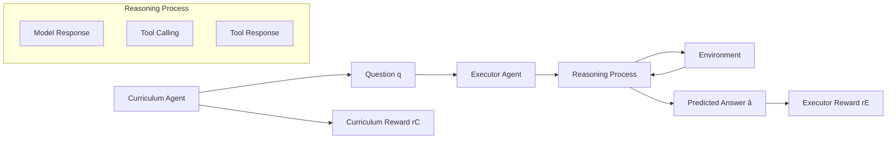

arXiv:2511.16043v1 [cs.LG] 20 Nov 2025
# Agent0: Unleashing Self-Evolving Agents from Zero Data via Tool-Integrated Reasoning

Peng Xia1 Kaide Zeng1 Jiaqi Liu1 Can Qin2 Fang Wu3 Yiyang Zhou1 Caiming Xiong2 Huaxiu Yao1

# Abstract

Large Language Model (LLM) Agents, often trained with Reinforcement Learning (RL), are constrained by a dependency on human-curated data, limiting scalability and tethering AI to human knowledge. Existing self-evolution frameworks offer an alternative but are typically restricted by the model’s inherent capabilities and single-round interactions, hindering the development of complex curricula involving tool use or dynamic reasoning. We introduce Agent0, a fully autonomous framework that evolves high-performing agents without external data through multi-step co-evolution and seamless tool integration. Agent0 establishes a symbiotic competition between two agents initialized from the same base LLM: a curriculum agent that proposes increasingly challenging frontier tasks, and an executor agent that learns to solve them. We integrate external tools to enhance the executor’s problem-solving capacity; this improvement, in turn, pressures the curriculum agent to construct more complex, tool-aware tasks. Through this iterative process, Agent0 establishes a self-reinforcing cycle that continuously produces high-quality curricula. Empirically, Agent0 substantially boosts reasoning capabilities, improving the Qwen3-8B-Base model by 18% on mathematical reasoning and 24% on general reasoning benchmarks. Code is available at https://github.com/aiming-lab/Agent0.

# 1. Introduction

Large Language Model (LLM) Agents have shown remarkable capabilities in tackling complex, long-horizon problems (Qiu et al., 2025b;a; Jin et al., 2025; Yu et al., 2025a; Tang et al., 2025; Zhai et al., 2025) that require

1UNC-Chapel Hill 2Salesforce Research 3Stanford University. Correspondence to: Peng Xia &#x3C;pxia@cs.unc.edu>, Huaxiu Yao &#x3C;huaxiu@cs.unc.edu>.

Preliminary work. research (OpenAI, 2025; Google, 2024; Team et al., 2025) and agentic coding (Jimenez et al., 2023; Anthropic, 2025; Wang et al., 2024a). To optimize these complex, multi-step interactions and move beyond hard-coded workflows, Reinforcement Learning (RL) has emerged as a principal training paradigm (Ouyang et al., 2022; Shao et al., 2024; Tu et al., 2025), achieving significant progress on complex reasoning tasks. However, the efficacy of these methods, whether Reinforcement Learning from Human Feedback (RLHF) or Reinforcement Learning from Verifiable Rewards (RLVR), relies heavily on massive, high-quality, human-curated datasets (Zhang et al., 2025c). This dependency not only creates a severe scalability bottleneck (Yue et al., 2025), which is time-consuming, labor-intensive, and costly, but also fundamentally tethers the potential of AI to the limits of human knowledge and annotation speed.

To break free from this reliance on human data, self-evolution frameworks have emerged as a promising alternative (Zhao et al., 2025; Liu et al., 2025a; Huang et al., 2025; Wang et al., 2025d), offering a scalable pathway by enabling models to autonomously generate their own training data. Yet, despite their potential, existing self-play or self-challenging approaches face severe constraints. First, their capabilities are capped by the model’s inherent knowledge and reasoning abilities (Fang et al., 2025; Cheng et al., 2024; Zhou et al., 2025a), causing the generated tasks to rarely surpass the model’s current complexity (Zhou et al., 2025b), leading to learning stagnation. Second, these frameworks typically operate only in single-round interactions (Li et al., 2025c), failing to capture the dynamic, context-dependent nature of real-world problems. This dual limitation not only restricts the complexity of the self-generated curriculum but, more critically, hinders the model from mastering essential skills that require complex tool use or multi-step reasoning.

To address these challenges, as demonstrated in Figure 1, we introduce Agent0, a fully autonomous framework designed to guide the evolution of agents entirely from scratch. Agent0 completely eliminates the dependence on any external data or human annotations, pioneeringly combining tool integration with multi-round co-evolution. The framework’s implementation begins with a base LLM from which

# Agent0: Unleashing Self-Evolving Agents from Zero Data via Tool-Integrated Reasoning

Agent0: Unleashing Self-Evolving Agents from Zero Data via Tool-Integrated Reasoning

**MATH**

| Qwen3-8B | 78.9 |
| -------- | ---- |
| w/ tools | 79.2 |
| Agent0   | 82.4 |

**SuperGPQA**

| Qwen3-8B | 28.3 |
| -------- | ---- |
| w/ tools | 29.4 |
| Agent0   | 33.0 |

**MMLU-Pro**

| Qwen3-8B | 51.8 |
| -------- | ---- |
| w/ tools | 54.8 |
| Agent0   | 63.4 |

**BBEH**

| Qwen3-8B | 8.6  |
| -------- | ---- |
| w/ tools | 9.4  |
| Agent0   | 13.7 |

*Figure 1.* The Agent0 autonomous co-evolution framework. The Curriculum Agent (left) uses RL to generate frontier tasks, rewarded by the Executor Agent's uncertainty and tool-use frequency. The Executor Agent (right) learn to solve them by RL. This shared tool integration drives a virtuous cycle, spiraling up task complexity and agent capability entirely from scratch.

we initialize two functionally distinct agents: *an executor agent* and *a curriculum agent*. These agents co-evolve through a symbiotic competition: the curriculum agent is trained using RL (Shao et al., 2024) to propose frontier tasks that precisely challenge the executor's current capabilities, using the executor's uncertainty (*i.e.*, self-consistency across multiple answers) and its frequency of tool use as reward signals. Concurrently, the executor agent is trained via RL to successfully solve these tasks, optimizing on a filtered set of challenging problems generated by the frozen curriculum agent and using pseudo-labels derived from its own majority voting. Equipping the executor with a tool enhances its problem-solving abilities, which in turn compels the tool-equipped curriculum agent to generate more complex, tool-based curricula. This establishes a virtuous cycle, driving a synchronous spiral of improvement in both agent capability and curriculum complexity. Furthermore, we extend this paradigm to support multi-turn interactions, enabling the generation of context-rich, conversational tasks that better reflect real-world problem-solving.

The primary contribution of this paper is Agent0, a novel framework that autonomously evolves LLM agents from scratch through tool-augmented reasoning without relying on any external data. Across ten benchmarks spanning mathematical and general reasoning, empirical results show that Agent0 achieves substantial model agnostic capability gains, improving mathematical reasoning performance by 18% and general reasoning performance by 24%. In addition, our analysis confirms this gain is driven by our co-evolutionary loop, where the curriculum agent learns to generate progressively complex tasks, creating a virtuous

cycle of the executor's capability improvement.

## 2. Preliminaries

**LLM as a Policy Agent.** We formulate the LLM as an agent, represented by a policy $$\pi_\theta$$ with parameters $$\theta$$. Given a prompt $$x$$, the agent autoregressively generates a response $$y \sim \pi_\theta(\cdot|x)$$. The general objective of reinforcement learning is to optimize $$\theta$$ to maximize the expected reward $$J(\theta) = \mathbb{E}_{x\sim\mathcal{D}, y\sim\pi_\theta(\cdot|x)}[R(y|x)]$$.

**Group Relative Policy Optimization (GRPO).** GRPO (Shao et al., 2024) is a reinforcement learning method that avoids training a critic by using intra-group relative rewards. For each prompt $$x$$, the model samples $$G$$ responses $$\{y_1, \ldots, y_G\}$$, which are scored to get rewards $$\{r_1, \ldots, r_G\}$$. GRPO computes normalized advantages $$\hat{A}_i$$ using a z-score: $$\hat{A}_i = \frac{r_i - \text{mean}(\{r_j\}_{j=1}^G)}{\text{std}(\{r_j\}_{j=1}^G) + \epsilon_{\text{norm}}}$$, where $$\epsilon_{\text{norm}}$$ is a small constant for numerical stability. The policy is then updated by minimizing the following PPO-style clipped loss function (Schulman et al., 2017):

$$
\mathcal{L}_{\text{GRPO}}(\theta) = -\frac{1}{G}\sum_{i=1}^{G} \min\left(\frac{\pi_\theta(x_i)}{\pi_{\theta_{\text{old}}}(x_i)}\hat{A}_i, \text{clip}\left(\frac{\pi_\theta(x_i)}{\pi_{\theta_{\text{old}}}(x_i)}, 1-\epsilon, 1+\epsilon\right)\hat{A}_i\right) + \beta\text{KL}(\pi_\theta\|\pi_{\theta_{\text{old}}}),
$$
(1)

where $$\frac{\pi_\theta(x_i)}{\pi_{\theta_{\text{old}}}(x_i)}$$ is the importance sampling ratio between the current policy $$\pi_\theta$$ and the reference policy $$\pi_{\theta_{\text{old}}}$$ from the previous iteration. $$\hat{A}_i$$ is the normalized advantage, and $$\epsilon$$ and $$\beta$$ are hyperparameters. The KL-divergence term acts

2

Agent0: Unleashing Self-Evolving Agents from Zero Data via Tool-Integrated Reasoning

![Policy Update by GRPO diagram showing the Agent0 co-evolutionary loop with Curriculum Agent, Executor Agent, Environment, and various components including majority voting and policy updates]

**Figure 2.** The Agent0 co-evolutionary loop. (1) Curriculum Evolution: The Curriculum Agent $\pi_\theta$ is trained via RL to generate tasks, maximizing a reward $R_C$ based on executor Uncertainty $R_{\text{unc}}$, Tool Use $R_{\text{tool}}$ and Repetition Penalty $R_{\text{rep}}$. (2) Executor Evolution: Tasks are filtered by self-consistency score $\hat{p}$ to create a challenging dataset $\mathcal{D}^{(t)}$. The Executor Agent $\pi_\phi$ is then trained on $\mathcal{D}^{(t)}$ via ADPO, an ambiguity-aware RL method using majority-vote pseudo-labels $\tilde{y}$.

as a regularization penalty to stabilize training.

## 3. The Agent0 Framework

### 3.1. Framework Overview

Agent0 is a fully autonomous, iterative co-evolutionary framework designed to enhance the capabilities of LLM agents without relying on any human-annotated data. At the core of this framework are two functionally distinct agents initialized from the same base LLM, $\pi_{\text{base}}$: (1) **Curriculum Agent** ($\pi_\theta$) aims to generate frontier tasks that are appropriately challenging for the current Executor Agent; (2) **Executor Agent** ($\pi_\phi$) aims to solve the increasingly complex tasks proposed by the Curriculum Agent.

These two agents co-evolve iteratively through a process of symbiotic competition, as illustrated in Figure 2. Each iteration $t$ of this process is divided into two stages:

**Curriculum Evolution**. We train the Curriculum Agent $\pi_\theta$ using RL to specialize in generating tasks that challenge the current Executor Agent $\pi_\phi^{(t-1)}$.

**Executor Evolution**. We use the frozen Curriculum Agent $\pi_\theta^{(t)}$ to generate a pool of tasks, from which we filter a challenging dataset $\mathcal{D}^{(t)}$. We then train the Executor Agent $\pi_\phi$ on this dataset using RL, evolving it into $\pi_\phi^{(t)}$.

The integration of a code interpreter tool establishes a virtuous cycle: the Executor Agent's problem-solving capabilities are enhanced by the tool, which in turn compels the tool-equipped Curriculum Agent to generate more complex, tool-based curricula. Furthermore, the framework supports multi-turn interactions, enabling the Curriculum Agent to generate context-rich, conversational tasks that better reflect real-world problem-solving.

### 3.2. Curriculum Agent Training

The goal of the Curriculum Agent $\pi_\theta$, is to generate a prompt $x$ that maximizes a composite reward signal $R_C$. This reward signal is designed to quantify the challenge of task $x$ for the current Executor Agent $\pi_\phi$. We optimize $\pi_\theta$ using the GRPO algorithm described in the Section 2.

For each task $x_i$ generated by $\pi_\theta$, we compute its reward by sampling $k$ responses $\{y_j\}_{j=1}^k$ from the current Executor $\pi_\phi$. The composite reward $R_C$ consists of two key components:

**Uncertainty Reward**. This reward incentivizes the Curriculum Agent to generate tasks that the Executor finds confusing or uncertain (Shi et al., 2025; Bae et al., 2025). We use the Executor's self-consistency $\hat{p}(x; \pi_\phi)$ as a proxy for uncertainty. $\hat{p}$ is defined as the proportion of the $k$ responses that vote for the majority answer ($\tilde{y}$). The reward function is designed to be maximized when $\hat{p} = 0.5$, where the Executor's uncertainty is highest:

$$R_{\text{unc}}(x; \pi_\phi) = 1 - 2|\hat{p}(x; \pi_\phi) - 0.5|$$
(2)

This function penalizes tasks that are either too easy ($\hat{p} \to 1$) or too hard ($\hat{p} \to 0$).

**Tool Use Reward**. To drive the virtuous cycle, we must explicitly reward tasks that prompt the Executor to use its tool. We define $R_{\text{tool}}$ based on the number of tool invocations, identified by the tool response marker, i.e., '''output, within a complete prediction $y = \pi_\phi(x)$. Let $N_{\text{tool}}(y)$ be

3

Agent0: Unleashing Self-Evolving Agents from Zero Data via Tool-Integrated Reasoning

# Algorithm 1 Self-Evolutionary Framework Agent0

where λunc, λtool, and λrep are hyperparameters. We use this RC as the reward ri in the GRPO loss.

Require: Base LLM πbase; Iterations T; Samples k.
1: Initialize π(0) ← πbase and π(0) ← πbase.
2: for θ, ϕ
3: ▷each iteration t = 1, . . . , T do
Curriculum Evolution (Train πθ)
4: Initialize πθ ← π(t−1)
5: Generate a θ
6: for task x batch of tasks X = {xi} ∼ πθ
7: Sample i ∈ X do k
8: k responses {yj}j=1 ∼ πϕ(xi)
9: Compute RC (xi) using Eq. 5
10: end for
11: Update πθ using LGRPO with (X, RC) → πθ
▷ Executor Evolution (Train πϕ)
12: Generate X ∼ π(t) and filter to D(t) = {(x, p, ŷ) where |ppool θ ˆ(x) − 0.5| ≤ δ}
13: Initialize πϕ ← π(t−1)
14: for batch B = {(x, pˆ(x), y˜)} ∼ DD do
15: Initialize T, ˜
16: for (x, pˆ(x), y˜) ∈ BD do
17: Sample k trajectories {τ}k ∼ πϕ(x)
18: Compute rewards R = ∑i=1k I(oi = y˜)
19: Compute scaled advantages A ← A · f(ˆp(x))
20: Add {τ} to T, {A} to A, ˆ(x) to Pbatch
21: end for
22: Update πϕ using LADPO (Eq. 8) on collected batch
23: end for
24: π(t) ← πϕ
25: end for

the total count of these markers in y. The reward is then calculated as a weighted, capped value:

Rtool(x; πϕ) = γ · min(N(y), C)

where γ is a scaling hyperparameter for reward score and C is a cap on the number of rewarded calls to prevent rewarding excessive or spurious tool use.

# Repetition Penalty

To encourage diversity within a training batch X, following (Huang et al., 2025), we introduce a repetition penalty Rrep. We first compute pairwise distances between generated tasks using a similarity metric, such as BLEU score (Papineni et al., 2002):

dij = 1 − BLEU(xi, xj). Tasks are then grouped into clusters C = {C1, ..., CK} where dij &#x3C; τBLEU. The penalty for a task xi belonging to cluster Ck is proportional to its relative cluster size:

Rrep(xi) = λrep |Ck| / B

# Composite Reward

The final reward combines these signals, subtracting the repetition penalty, and is gated by a format check Rformat.

RC (xi) = Rformat(xi) · max(0, (λuncRunc + λtoolRtool) − Rrep(xi))

# Multi-Turn Rollout

We replace the standard single-turn generation with a multi-step, tool-integrated rollout process. During this process, each of the k trajectories is generated by having the policy π(t−1) first produce text reasoning. When the policy emits a tool-call trigger (i.e., ‘‘‘python...‘‘‘ tags), generation is paused. The code c1 is then executed in a sandbox, which returns an execution result or error f1. This feedback f1, prepended with a simple prefix like ‘‘‘output...‘‘‘, is fed back to the policy. The policy then continues generating, conditioning on the history and the new feedback [t1 ⊕ c1 ⊕ f1 ⊕ ...]. This iterative process repeats until the policy generates a final answer o (i.e., in {boxed...} tags), resulting in a complete, hybrid reasoning trajectory. This dynamic, interleaved feedback mechanism allows the agent to iteratively refine its reasoning and correct errors, mimicking the “aha moment” of self-correction.

# Pseudo-Label Advantage

After generating k full trajectories and identifying their k final answers {oi}k, we use the previously determined majority answer y as the pseudo-label. We then assign a terminal reward R˜ to I(oi = y).

4

Agent0: Unleashing Self-Evolving Agents from Zero Data via Tool-Integrated Reasoning

each trajectory based on whether its answer $o_i$ matches this pseudo-label. This outcome reward $R_i$ is used to compute the advantage $A_i$ for the entire multi-step trajectory $i$.

## 3.3.2. AMBIGUITY-DYNAMIC POLICY OPTIMIZATION

Standard GRPO treats all training samples equally (Schulman et al., 2017; Shao et al., 2024). However, in our self-evolutionary setting, we rely on majority voting to derive pseudo-labels, which introduces two critical issues: label noise and restricted exploration on ambiguous tasks. To address these, we propose Ambiguity-Dynamic Policy Optimization (ADPO), which incorporates two key modifications motivated by the data's ambiguity signal $\hat{p}(x)$.

**Ambiguity-Aware Advantage Scaling.** The first issue is that for high-ambiguity tasks (low $\hat{p}(x)$), the majority answer is prone to errors. Directly optimizing on these noisy labels using standard GRPO risks reinforcing incorrect reasoning. To prevent overfitting to potentially inaccurate pseudo-labels, we scale the normalized advantage $\hat{A}_i$. We define a scaling factor $s(x) = f(\hat{p}(x))$, where $f$ is an increasing function of self-consistency. The advantage is modified as $\tilde{A}_i(x) = \hat{A}_i \cdot s(x)$. This proportionally downweights the training signal from unreliable, low-consistency samples.

**Ambiguity-Modulated Trust Regions.** The second issue pertains to the rigid constraints imposed by standard proximal algorithms (Yu et al., 2025b). While static clipping (e.g., $\epsilon$) is designed to ensure stability, it creates an asymmetric barrier to learning. As illustrated in Figure 3, empirical analysis reveals that the upper clipping bound is predominantly triggered by tokens with low probabilities. This indicates that the standard mechanism disproportionately "clamps" the growth of unlikely tokens, effectively stifling the emergence of new reasoning paths. This restriction is particularly detrimental for high-ambiguity tasks (low $\hat{p}(x)$), where the correct reasoning often resides in the tail of the current policy distribution and requires significant updates to surface. To address this bottleneck, ADPO dynamically modulates the trust region. We define the upper clipping bound $\epsilon_{\text{high}}(x)$ as a decreasing function of $\hat{p}(x)$. This effectively relaxes the constraint for ambiguous inputs, permitting larger gradient steps to uplift potential low-probability solutions, while retaining tight bounds on

Figure 3. Up-clipped token probabilities. Most up-clipped tokens have low probabilities, implying standard clipping limits exploration.

confident samples to preserve stability.

The Executor Agent is updated by minimizing the ADPO objective:

$$\mathcal{L}_{\text{ADPO}}(\theta) = \mathbb{E}_{x \sim D^{(t)}} \left[ -\frac{1}{G} \sum_{i=1}^{G} \min \left( r_i(\theta) \tilde{A}_i(x), \text{clip}\left(r_i(\theta), 1 - \epsilon_{\text{low}}, 1 + \epsilon_{\text{high}}(x)\right) \tilde{A}_i(x) \right) \right],$$
(8)

where $r_i(\theta)$ is the importance sampling ratio, $\tilde{A}_i(x)$ is the ambiguity-scaled advantage, and $\epsilon_{\text{high}}(x)$ is the dynamic upper bound inversely related to $\hat{p}(x)$.

## 4. Experiments

In this section, we evaluate the performance of Agent0, aiming to answer the following questions: (1) How does the performance of Agent0 compare against state-of-the-art self-evolving baselines? (2) Is the proposed co-evolutionary loop effective at progressively improving the agents' performance over multiple iterations? (3) How effective is each key component of our framework? (4) Can the mathematical reasoning abilities cultivated by Agent0 generalize to improve performance on general-domain reasoning tasks?

### 4.1. Experimental Setup

**Implementation Details.** Our framework Agent0, is implemented based on the VeRL (Sheng et al., 2025). We evaluate Agent0 on two base models: Qwen3-4B-Base and Qwen3-8B-Base (Yang et al., 2025a). Both the two Agent are initialized from these base models. During the co-evolutionary loop, for each task $x_i$, we sample $k = 10$ responses from the Executor to compute uncertainty and generate pseudo-labels. The task filtering threshold is set to $\delta = 0.25$, retaining tasks with a self-consistency $\hat{p}(x)$ between 0.3 and 0.8. For the Curriculum Agent, we set the tool reward scaling $\lambda_{\text{tool}} = 0.6$ and cap $C = 4$. For the Executor Agent, we integrate a sandboxed code interpreter (Cheng et al., 2025) based on VeRL-Tool (Jiang et al., 2025), allowing it to execute code snippets enclosed in '''python...''' tags and receive the '''output...'''.

**Baseline Methods.** We compare Agent0 against several state-of-the-art self-improvement methods. 1) *Base Model*: The pre-trained base model without any fine-tuning. 2) *Base Model w/ tool*: The base model evaluated in a zero-shot setting, but given access to the code interpreter. 3) *Self-Evolving Methods*: R-Zero (Huang et al., 2025), Absolute Zero (Zhao et al., 2025), SPIRAL (Liu et al., 2025a) and Socratic-Zero (Wang et al., 2025d).

**Evaluation Datasets and Metrics.** Agent0 requires no

5

                                                         Agent0: Unleashing Self-Evolving Agents from Zero Data via Tool-Integrated Reasoning

                                   Table 1. Comprehensive results on mathematical reasoning benchmarks. The peak performance achieved during each model’s training
    process is highlighted in bold.
     Model Name                         AVG     AMC   Minerva       MATH   GSM8K  Olympiad    AIME25    AIME24
     Qwen3-4B-Base
     Base Model            ✗       ✗    42.6    45.7    38.2        68.2    87.8    41.0       6.15      10.9
     Base Model w/ tool    ✓       ✗    44.2    46.3    39.6        71.0    88.6    43.7       7.71      12.3
     + Absolute Zero       ✓       ✗    46.4    50.0    41.9        76.2    89.3    41.5       13.4      12.2
     + SPIRAL              ✗       ✗    47.0    57.5    42.4        76.4    91.0    38.4       10.0      13.3
     + R-Zero              ✗       ✗    49.1    57.3    52.9        79.6    92.1    44.6       4.27      12.7
     + Agent0              ✓       ✗    52.5    60.6    55.6        80.5    92.6    46.7       14.1      17.4
     Qwen3-8B-Base
     Base Model            ✗       ✗    49.2    52.0    50.0        78.0    89.1    44.7       16.7      13.9
     Base Model w/ tool    ✓       ✗    53.2    60.3    54.9        79.2    90.7    47.9       18.7      20.9
     + Absolute Zero       ✓       ✗    52.6    62.5    52.9        76.6    92.0    47.8       18.2      18.4
     + R-Zero              ✗       ✗    54.7    61.7    60.7        82.0    94.1    48.9       19.2      16.4
     + Socratic-Zero       ✗       ✓    56.1    63.7    52.4        81.2    87.3    55.1       24.5      28.4
     + Agent0              ✓       ✗    58.2    62.4    61.3        82.4    94.5    54.0       24.8      28.0

                                        Table 2. Results on general-domain reasoning benchmarks.
      Model Name                          Overall AVG             MATH AVG  SuperGPQA    MMLU-Pro    BBEH
      Qwen3-4B-Base
      Base Model                   ✗     ✗    27.1                 42.6        20.9        37.4      7.57
      Base Model w/ tool           ✓     ✗    30.3                 44.2        25.8        42.9      8.32
      + Absolute Zero              ✓     ✗    33.6                 46.4        27.1        52.6      8.3
      + SPIRAL                     ✗     ✗    34.2                 47.0        27.1        53.2      9.57
      + R-Zero                     ✗     ✗    34.6                 49.1        27.6        51.5      10.4
      + Agent0                     ✓     ✗    37.6                 52.5        29.9        55.9      12.0
      Qwen3-8B-Base
      Base Model                   ✗     ✗    34.5                 49.2        28.3        51.8      8.6
      Base Model w/ tool           ✓     ✗    36.7                 53.2        29.5        54.8      9.37
      + Absolute Zero              ✓     ✗    39.9                 52.6        33.5        62.5      10.8
      + R-Zero                     ✗     ✗    38.7                 54.7        31.4        58.2      10.6
      + Socratic-Zero              ✗     ✓    39.2                 56.1        30.1        60.9      9.5
      + Agent0                     ✓     ✗    42.1                 58.2        33.0        63.4      13.7

    human-annotated data for training. We evaluate all methods      utilizes a code executor, by 10.6%. It even exceeds Socratic-
    on two suites of benchmarks: 1) Mathematical Reason-            Zero by 3.7%, which relies on external OpenAI APIs. This
    ing: We use a comprehensive set including AMC, Min-             demonstrates the superiority of Agent0’s self-evolution ap-
    erva (Lewkowycz et al., 2022), MATH (Hendrycks et al.,          proach. By using tools to interact with the environment,
    2021), GSM8K (Cobbe et al., 2021), Olympiad-Bench (He           the agent effectively enhances the quality and diversity of
    et al., 2024), AIME25, and AIME24. 2) General-Domain            questions generated by the curriculum agent. Similarly,
    Reasoning: To measure generalization, we use SuperG-            for the execution agent, this more effectively improves its
    PQA (Du et al., 2025), MMLU-Pro (Wang et al., 2024b),           problem-solving capabilities.
    and BBEH (Kazemi et al., 2025). We report the accuracy          Generalization to General-Domain Tasks. Furthermore,
    (pass@1) based on greedy decoding across all benchmarks,        Table 2 shows strong evidence of generalization. On Qwen3-
    except AMC and AIME benchmarks (mean@32).                       8B, Agent0 achieves the highest overall average score

4.2. Main Results

We present the main results for mathematical reasoning in
Table 1 and for general-domain reasoning in Table 2.
Comparison with Baselines. It significantly outperforms
all compared baseline methods in both mathematics and
general-domain reasoning. On Qwen3-8B-Base, Agent0
surpasses the powerful data-free method R-Zero by 6.4%
and outperforms the self-play method Absolute Zero, which
among all approaches, significantly outperforming other
data-free methods. This indicates that the complex, multi-
step reasoning abilities we cultivated in the execution agent
by using the curriculum agent with tools, can be effectively
transferred to general-domain tasks.
4.3. Analysis

In this section, we provide a detailed analysis of each mod-
ule’s performance, along with a series of analytical experi-

                                                                  6

Agent0: Unleashing Self-Evolving Agents from Zero Data via Tool-Integrated Reasoning

## Math AVG and General AVG Performance Charts

Two bar charts showing performance metrics:

**Math AVG:**
- Qwen3-4B and Qwen3-8B comparison across Iter1, Iter2, Iter3
- Values range from approximately 50 to 60
- Shows progressive improvement across iterations

**General AVG:**
- Qwen3-4B and Qwen3-8B comparison across Iter1, Iter2, Iter3
- Values range from approximately 30 to 40
- Shows improvement trends across iterations

**Figure 4.** Performance on mathematical and general reasoning benchmarks, showing consistent improvement for both Qwen3-4B and Qwen3-8B across three co-evolutionary iterations.

**Table 3.** Ablation study of Agent0.

| Method                 | General AVG | Math AVG |
| ---------------------- | ----------- | -------- |
| Agent0                 | 36.7        | 58.2     |
| *Curriculum Agent*     |             |          |
| w/o Training           | 29.5        | 46.8     |
| w/o Tool Reward        | 31.8        | 48.7     |
| w/o Repetition Penalty | 31.3        | 47.9     |
| *Execution Agent*      |             |          |
| w/o ADPO               | 34.9        | 56.2     |
| w/o Multi-turn         | 35.3        | 55.9     |

**Ablation Study.** As shown in Table 3, we conducted a series of ablation experiments to evaluate the impact of each component in our method. Specifically, we evaluate the impact of: (1) the curriculum agent's training, (2) the tool reward, (3) the repetition penalty, (4) our ambiguity scaling mechanism, and (5) the multi-turn reasoning capability. For the curriculum agent, without training, the performance significantly drops by 9.3%. This reflects the value of the learned curriculum. Next, when the tool reward is not included, the model's performance drops by 7.2%. This tests our core hypothesis that explicitly rewarding tool-use tasks is necessary. It shows a severe performance degradation when we remove the diversity component, indicating that $$R_{rep}$$ is highly effective for curriculum diversity, particularly for general tasks. As for the execution agent, training it using the original GRPO with standard advantage and clipping resulted in a performance drop of 1.9%. This is because the original algorithm does not account for the reliability of pseudo-labels, demonstrating the effectiveness of our proposed ambiguity scaling mechanism. The introduction of multi-turn reasoning played a significant role in boosting Agent0's performance, especially for complex mathematical reasoning that requires multi-turn reasoning.

**Consistent Improvement through Co-Evolution.** As shown in Figure 4, our method demonstrates stable and progressive improvement during the iterative process. On Qwen3-8B-Base, the average math score improved from 55.1 (Iter 1) to 56.5 (Iter 2), peaking at 58.2 (Iter 3). In addition to mathematics, Agent0 showed the similar trend on other general-domain reasoning tasks, with an average improvement of 2% per iteration compared to the previous one. This iterative gain validates the effectiveness of our

**Table 5.** Evolution of Task Difficulty and Tool Use. We report the pass rate of the fixed Execution Agent (from Iteration 1) on datasets generated by the Curriculum Agent at different stages.

| Dataset                          | Pass Rate (Executor) | Avg. Tool Calls |
| -------------------------------- | -------------------- | --------------- |
| $\mathcal{D}\_{\text{Iter 1}}$ | 64.0                 | 1.65            |
| $\mathcal{D}\_{\text{Iter 2}}$ | 58.5                 | 2.10            |
| $\mathcal{D}\_{\text{Iter 3}}$ | 51.0                 | 2.60            |

co-evolutionary loop. With the involvement of tools, the curriculum agent progressively generates more difficult tasks, while the execution agent learns to solve these tasks more efficiently. This also confirms that agent self-evolution is a reasonable and promising direction (Huang et al., 2025).

**Strategic Tool Integration Matters.** Our advantage lies not just in having a tool, but in learning how to use it. As shown in Table 4, merely providing a tool (i.e., Base Model w/ Tool) yields a slight performance boost. Agent0 significantly outperforms other tool-using baselines, such as Absolute Zero. Agent0 also significantly surpasses non-tool methods like R-Zero and SPIRAL. This indicates that our curriculum agent, by using the $$R_{\text{tool}}$$ reward to explicitly incentivize the generation of complex tasks requiring tool use, is far more effective than methods that only use tools for validation (e.g., Absolute Zero) or do not use tools at all (e.g., R-Zero). Furthermore, the execution agent utilizes the tool in conjunction with multi-step reasoning, which also leads to performance gains, resulting in co-evolution.

**Table 4.** Comparison on non-tool and other tool-integrated baselines.

| Model          | MATH | General |
| -------------- | ---- | ------- |
| Qwen3-4B       | 42.6 | 22.0    |
| *w/o Tool*     |      |         |
| +SPIRAL        | 47.0 | 30.0    |
| +R-Zero        | 49.1 | 29.8    |
| *w/ Tool*      |      |         |
| +TIR           | 44.2 | 25.7    |
| +Absolute Zero | 46.4 | 29.3    |
| +Agent0        | 52.5 | 32.6    |

**Evolution of Task Difficulty and Tool Use.** We analyze the tasks generated by the curriculum agent during the training iterations. We sample 200 questions from each iteration for this analysis. As shown in Table 5, the pass rate of the execution agent (from Iteration 1) progressively decreases when evaluated on task sets generated by the curriculum agents from Iterations 1, 2, and 3. This indicates that the task difficulty is gradually increasing, confirming that the curriculum adapts to the improvement in the executor's capabilities. More importantly, the average number of tool calls per generated task steadily increases across iterations. This directly proves that our $$R_{\text{tool}}$$ reward successfully guides the curriculum agent to generate more complex and tool-reliant problems, thereby driving a virtuous cycle.

**Qualitative Analysis.** Figure 5 illustrates the co-evolution of task complexity and solving proficiency. The Curriculum Agent effectively generates increasingly difficult problems, progressing from basic geometry (Iter 1) to complex

7

Agent0: Unleashing Self-Evolving Agents from Zero Data via Tool-Integrated Reasoning

| Generated Questions from Curriculum Agent |                                                                                                                                                                                                                                                                                                                                                                                                                                                                                                                                                                  | Test Question (MATH)                                                                                                                                                                                                                                                                                                                                                                                                                                                                                                                                                                                                                                                                                                                                                                                                                                                                                                   |
| ----------------------------------------- | ---------------------------------------------------------------------------------------------------------------------------------------------------------------------------------------------------------------------------------------------------------------------------------------------------------------------------------------------------------------------------------------------------------------------------------------------------------------------------------------------------------------------------------------------------------------- | ---------------------------------------------------------------------------------------------------------------------------------------------------------------------------------------------------------------------------------------------------------------------------------------------------------------------------------------------------------------------------------------------------------------------------------------------------------------------------------------------------------------------------------------------------------------------------------------------------------------------------------------------------------------------------------------------------------------------------------------------------------------------------------------------------------------------------------------------------------------------------------------------------------------------- |
| Iter 1                                    | Let ABC be a triangle with ∠A = 90°. Points D and E lie on sides AB and AC, respectively, such that AD + EC = BC and AD · EC = BD · AE. Find the measure of ∠B.                                                                                                                                                                                                                                                                                                                                                                                                  | Compute: 1 − 2 + 3 − 4 + 5 − ... + 99 − 100  **Model Output by Agent0**  To solve the problem 1 − 2 + 3 − 4 + 5 − ... + 99 − 100, we can observe the pattern in the series. The series alternates between adding and subtracting consecutive integers. We can group the terms in pairs to simplify the calculation: (1 − 2) + (3 − 4) + (5 − 6) + ... + (99 − 100) Each pair (2k − 1) − 2k simplifies to −1. Since there are 100 terms in total, there are 50 pairs. Therefore, the sum of the series is: 50 × (−1) = − 50  Let's confirm this with Python code.  \`\`\`python # Calculate the sum of the series 1 - 2 + 3 - 4 + 5 - ... + 99 - 100 result = sum(i if i % 2 != 0 else -i for i in range(1, 101)) print(result) \`\`\` \`\`\`output -50 \`\`\` The sum of the series 1 − 2 + 3 − 4 + 5 − ... + 99 − 100 is \boxed{-50}. |
| Iter 2                                    | A rectangle R has sides of length 10 and 5. Point P lies inside R such that the distances from P to the four sides of R are x, y, 10 − x, and 5 − y, where x and y are positive real numbers. Find the maximum possible value of x² + y².                                                                                                                                                                                                                                                                                                                        |                                                                                                                                                                                                                                                                                                                                                                                                                                                                                                                                                                                                                                                                                                                                                                                                                                                                                                                        |
| Iter 3                                    | In a particular city, each neighborhood is assigned a distinct integer address from 1 to N. To ensure the safety of the city, the city council decides to organize a unique parade route where no two adjacent neighborhoods should share a common digit in their address. For example, if the parade starts at address 15, the next possible stop cannot be any address containing the digits 1 or 5. What is the maximum value of N such that the parade can visit all neighborhoods without breaking this rule? Express your answer as a three-digit integer. |                                                                                                                                                                                                                                                                                                                                                                                                                                                                                                                                                                                                                                                                                                                                                                                                                                                                                                                        |

Figure 5. Qualitative Case Analysis. Left: Examples of generated questions showing a clear increase in complexity and diversity from Iter 1 to Iter 3. Right: A demonstration of Agent0's solving process, utilizing a hybrid approach of mathematical reasoning and Python code execution to solve a standard MATH problem.

constraint satisfaction tasks (Iter 3). Simultaneously, the Executor Agent0 demonstrates reliable problem-solving capabilities. In the provided example, the agent effectively combines natural language reasoning to identify patterns with the Python code interpreter to verify calculations, validating the model's ability to handle hybrid reasoning tasks.

## 5. Related Work

**Self-Evolving from Zero Data.** The paradigm of self-evolution, where LLMs generate their own training data, has gained significant traction (Liu et al., 2024; Dong et al., 2024; Fang et al., 2025; Yang et al., 2025b; Kuba et al., 2025). This approach ranges from dual-agent "Coder-Tester" setups in verifiable domains (Lin et al., 2025; Wang et al., 2025e) to fully autonomous frameworks (Zhao et al., 2025; Huang et al., 2025; Wang et al., 2025d; Liu et al., 2025b; Tao et al., 2024; Zhang et al., 2025a; Wu et al., 2025b; Lu et al., 2025) that learn to generate novel problems from scratch. To guide this learning, many methods use label-free reinforcement learning, relying on heuristic reward signals such as output confidence (Li et al., 2025a) or consistency (Zhang et al., 2025b; Prabhudesai et al., 2025; Zuo et al., 2025; Yu et al., 2025c). However, these systems are critically limited by the model's inherent knowledge (Han et al., 2025a; Xia et al., 2025), causing curriculum stagnation as tasks rarely surpass the model's current complexity. Agent0 breaks this cap by integrating an external tool, providing external problem-solving power. However, without external tools, such closed-loop systems risk mode collapse and curriculum stagnation, as they remain bounded by the model's inherent knowledge. Agent0 breaks this ceiling by integrating an external tool to introduce objective problem-solving power.

**Tool-Integrated Reasoning (TIR).** Applying Reinforcement Learning (RL) (Jaech et al., 2024; Wang et al., 2025c;b; Zhou et al., 2025c; Wu et al., 2025a; Yang et al.) to enhance LLM tool-use is a growing field. Many approaches rely on domain-specific data or supervised fine-tuning (Jin et al., 2025; Feng et al., 2025; Li et al., 2025b; Geng et al., 2025; Han et al., 2025b; Su et al., 2025). The more general Zero RL setting, however, is notoriously unstable in multi-turn scenarios. Recent advances in TIR address these challenges through three key dimensions: stability, generalization, and complexity. To stabilize learning dynamics, methods like ASPO (Lin & Xu, 2025) and SimpleTIR (Xue et al., 2025) introduce theoretical guarantees and gradient filtering for void turns. Beyond stability, (Chen et al., 2025) demonstrate the cross-domain transferability of tool-use skills. Finally, to handle complex multi-turn scenarios, advanced techniques optimize for long-horizon planning (Gao et al., 2025; Erdogan et al., 2025), memory management (Yan et al., 2025), and interaction efficiency (Wang et al., 2025a).

## 6. Conclusion

We introduce Agent0, a fully autonomous framework where a curriculum agent and an executor agent co-evolve without any human-curated data. We integrated a code interpreter into the loop, which creates a virtuous cycle: the tool-equipped executor's improving capabilities drive the curriculum agent to generate progressively harder tasks. Our experiments show that Agent0 significantly enhances the reasoning abilities of base LLMs. It demonstrates a scalable and effective pathway for evolving highly capable agents, breaking the dependency on human-annotated datasets.

8

# Agent0: Unleashing Self-Evolving Agents from Zero Data via Tool-Integrated Reasoning

# Acknowledgement

We thank Chengsong Huang for helpful discussions. This work is partially supported by the AI for Math Fund from Renaissance Philanthropy. The Authors also acknowledge the National Artificial Intelligence Research Resource (NAIRR) Pilot, Purdue Anvil AI for contributing to this research result.

# References

Achiam, J., Adler, S., Agarwal, S., Ahmad, L., Akkaya, I., Aleman, F. L., Almeida, D., Altenschmidt, J., Altman, S., Anadkat, S., et al. Gpt-4 technical report. arXiv preprint arXiv:2303.08774, 2023.

Anthropic. Claude code, 2025. URL https://www.claude.com/product/claude-code.

Bae, S., Hong, J., Lee, M. Y., Kim, H., Nam, J., and Kwak, D. Online difficulty filtering for reasoning oriented reinforcement learning. arXiv preprint arXiv:2504.03380, 2025.

Chen, Z., Yang, J., Xiao, T., Zhou, R., Zhang, L., Xi, X., Shi, X., Wang, W., and Wang, J. Can tool-integrated reinforcement learning generalize across diverse domains? arXiv preprint arXiv:2510.11184, 2025.

Cheng, P., Dai, Y., Hu, T., Xu, H., Zhang, Z., Han, L., Du, N., and Li, X. Self-playing adversarial language game enhances llm reasoning. Advances in Neural Information Processing Systems, 37:126515–126543, 2024.

Cheng, Y., Chen, J., Chen, J., Chen, L., Chen, L., Chen, W., Chen, Z., Geng, S., Li, A., Li, B., Li, B., Li, L., Liu, B., Liu, J., Liu, K., Liu, Q., Liu, S., Liu, S., Liu, T., Liu, T., Liu, Y., Long, R., Mai, J., Ning, G., Peng, Z. Y., Shen, K., Su, J., Su, J., Sun, T., Sun, Y., Tao, Y., Wang, G., Wang, S., Wang, X., Wang, Y., Wang, Z., Xia, J., Xiang, L., Xiao, X., Xiao, Y., Xi, C., Xin, S., Xu, J., Xu, S., Yang, H., Yang, J., Yang, Y., Yuan, J., Zhang, J., Zhang, Y., Zhang, Y., Zheng, S., Zhu, H., and Zhu, M. Fullstack bench: Evaluating llms as full stack coders, 2025. URL https://arxiv.org/abs/2412.00535.

Cobbe, K., Kosaraju, V., Bavarian, M., Chen, M., Jun, H., Kaiser, L., Plappert, M., Tworek, J., Hilton, J., Nakano, R., et al. Training verifiers to solve math word problems. arXiv preprint arXiv:2110.14168, 2021.

Dong, G., Lu, K., Li, C., Xia, T., Yu, B., Zhou, C., and Zhou, J. Self-play with execution feedback: Improving instruction-following capabilities of large language models. arXiv preprint arXiv:2406.13542, 2024.

Du, X., Yao, Y., Ma, K., Wang, B., Zheng, T., Zhu, K., Liu, M., Liang, Y., Jin, X., Wei, Z., et al. Supergpqa: Scaling up question answering with large language models. arXiv preprint arXiv:2503.13964, 2025.

Erdogan, L. E., Lee, N., Kim, S., Moon, S., Furuta, H., Anumanchipalli, G., Keutzer, K., and Gholami, A. Plan-and-act: Improving planning of agents for long-horizon tasks. arXiv preprint arXiv:2503.09572, 2025.

Fang, W., Liu, S., Zhou, Y., Zhang, K., Zheng, T., Chen, K., Song, M., and Tao, D. Serl: Self-play reinforcement learning for large language models with limited data. arXiv preprint arXiv:2505.20347, 2025.

Feng, J., Huang, S., Qu, X., Zhang, G., Qin, Y., Zhong, B., Jiang, C., Chi, J., and Zhong, W. Retool: Reinforcement learning for strategic tool use in llms. arXiv preprint arXiv:2504.11536, 2025.

Gao, J., Fu, W., Xie, M., Xu, S., He, C., Mei, Z., Zhu, B., and Wu, Y. Beyond ten turns: Unlocking long-horizon agentic search with large-scale asynchronous rl. arXiv preprint arXiv:2508.07976, 2025.

Geng, X., Xia, P., Zhang, Z., Wang, X., Wang, Q., Ding, R., Wang, C., Wu, J., Zhao, Y., Li, K., et al. Webwatcher: Breaking new frontier of vision-language deep research agent. arXiv preprint arXiv:2508.05748, 2025.

Google. Try deep research and our new experimental model in gemini, your ai assistant, 2024. URL https://blog.google/products/gemini/google-gemini-deep-research/.

Han, S., Liu, J., Su, Y., Duan, W., Liu, X., Xie, C., Bansal, M., Ding, M., Zhang, L., and Yao, H. Alignment tipping process: How self-evolution pushes llm agents off the rails. arXiv preprint arXiv:2510.04860, 2025a.

Han, S., Xia, P., Zhang, R., Sun, T., Li, Y., Zhu, H., and Yao, H. Mdocagent: A multi-modal multi-agent framework for document understanding. arXiv preprint arXiv:2503.13964, 2025b.

He, C., Luo, R., Bai, Y., Hu, S., Thai, Z. L., Shen, J., Hu, J., Han, X., Huang, Y., Zhang, Y., et al. Olympiadbench: A challenging benchmark for promoting agi with olympiad-level bilingual multimodal scientific problems. arXiv preprint arXiv:2402.14008, 2024.

Hendrycks, D., Burns, C., Basart, S., Zou, A., Mazeika, M., Song, D., and Steinhardt, J. Measuring massive multitask language understanding. arXiv preprint arXiv:2009.03300, 2020.

Hendrycks, D., Burns, C., Kadavath, S., Arora, A., Basart, S., Tang, E., Song, D., and Steinhardt, J. Measuring mathematical problem solving with the math dataset. arXiv preprint arXiv:2103.03874, 2021.

# Agent0: Unleashing Self-Evolving Agents from Zero Data via Tool-Integrated Reasoning

Huang, C., Yu, W., Wang, X., Zhang, H., Li, Z., Li, R., Huang, J., Mi, H., and Yu, D. R-zero: Self-evolving reasoning llm from zero data. 2025. URL https://arxiv.org/abs/2508.05004.

Jaech, A., Kalai, A., Lerer, A., Richardson, A., El-Kishky, A., Low, A., Helyar, A., Madry, A., Beutel, A., Carney, A., et al. Openai o1 system card. arXiv preprint arXiv:2412.16720, 2024.

Jiang, D., Lu, Y., Li, Z., Lyu, Z., Nie, P., Wang, H., Su, A., Chen, H., Zou, K., Du, C., et al. Verltool: Towards holistic agentic reinforcement learning with tool use. arXiv preprint arXiv:2509.01055, 2025.

Jimenez, C. E., Yang, J., Wettig, A., Yao, S., Pei, K., Press, O., and Narasimhan, K. Swe-bench: Can language models resolve real-world github issues? arXiv preprint arXiv:2310.06770, 2023.

Jin, B., Zeng, H., Yue, Z., Yoon, J., Arik, S., Wang, D., Zamani, H., and Han, J. Search-r1: Training llms to reason and leverage search engines with reinforcement learning. arXiv preprint arXiv:2503.09516, 2025.

Kazemi, M., Fatemi, B., Bansal, H., Palowitch, J., Anastasiou, C., Mehta, S. V., Jain, L. K., Aglietti, V., Jindal, D., Chen, P., et al. Big-bench extra hard. arXiv preprint arXiv:2502.19187, 2025.

Kuba, J. G., Gu, M., Ma, Q., Tian, Y., and Mohan, V. Language self-play for data-free training. arXiv preprint arXiv:2509.07414, 2025.

Kwon, W., Li, Z., Zhuang, S., Sheng, Y., Zheng, L., Yu, C. H., Gonzalez, J. E., Zhang, H., and Stoica, I. Efficient memory management for large language model serving with pagedattention. In Proceedings of the ACM SIGOPS 29th Symposium on Operating Systems Principles, 2023.

Lewkowycz, A., Andreassen, A., Dohan, D., Dyer, E., Michalewski, H., Ramasesh, V., Slone, A., Anil, C., Schlag, I., Gutman-Solo, T., et al. Solving quantitative reasoning problems with language models. Advances in neural information processing systems, 35:3843–3857, 2022.

Li, P., Skripkin, M., Zubrey, A., Kuznetsov, A., and Oseledets, I. Confidence is all you need: Few-shot rl fine-tuning of language models. arXiv preprint arXiv:2506.06395, 2025a.

Li, X., Zou, H., and Liu, P. Torl: Scaling tool-integrated rl. arXiv preprint arXiv:2503.23383, 2025b.

Li, Y., Shen, X., Yao, X., Ding, X., Miao, Y., Krishnan, R., and Padman, R. Beyond single-turn: A survey on multi-turn interactions with large language models. arXiv preprint arXiv:2504.04717, 2025c.

Lin, H. and Xu, Z. Understanding tool-integrated reasoning. arXiv preprint arXiv:2508.19201, 2025.

Lin, Z., Shen, S., Shang, J., Weston, J., and Nie, Y. Learning to solve and verify: A self-play framework for code and test generation. arXiv preprint arXiv:2502.14948, 2025.

Liu, B., Guertler, L., Yu, S., Liu, Z., Qi, P., Balcells, D., Liu, M., Tan, C., Shi, W., Lin, M., Lee, W. S., and Jaques, N. Spiral: Self-play on zero-sum games incentivizes reasoning via multi-agent multi-turn reinforcement learning. arXiv preprint arXiv:2506.24119, 2025a.

Liu, B., Jin, C., Kim, S., Yuan, W., Zhao, W., Kulikov, I., Li, X., Sukhbaatar, S., Lanchantin, J., and Weston, J. Spice: Self-play in corpus environments improves reasoning. arXiv preprint arXiv:2510.24684, 2025b.

Liu, Y., Sun, P., and Li, H. Large language models as agents in two-player games. arXiv preprint arXiv:2402.08078, 2024.

Lu, H., Wen, Y., Cheng, P., Ding, R., Xu, H., Guo, J., Wang, C., Chen, H., Jiang, X., and Jiang, G. Search self-play: Pushing the frontier of agent capability without supervision. arXiv preprint arXiv:2510.18821, 2025.

OpenAI. Openai deep research system card, 2025. URL https://openai.com/index/introducing-deep-research/.

Ouyang, L., Wu, J., Jiang, X., Almeida, D., Wainwright, C., Mishkin, P., Zhang, C., Agarwal, S., Slama, K., Ray, A., et al. Training language models to follow instructions with human feedback. Advances in neural information processing systems, 35:27730–27744, 2022.

Papineni, K., Roukos, S., Ward, T., and Zhu, W.-J. Bleu: a method for automatic evaluation of machine translation. In Proceedings of the 40th annual meeting of the Association for Computational Linguistics, pp. 311–318, 2002.

Prabhudesai, M., Chen, L., Ippoliti, A., Fragkiadaki, K., Liu, H., and Pathak, D. Maximizing confidence alone improves reasoning. arXiv preprint arXiv:2505.22660, 2025.

Qiu, J., Qi, X., Wang, H., Juan, X., Wang, Y., Zhao, Z., Geng, J., Guo, J., Li, P., Shi, J., et al. Alita-g: Self-evolving generative agent for agent generation. arXiv preprint arXiv:2510.23601, 2025a.

Qiu, J., Qi, X., Zhang, T., Juan, X., Guo, J., Lu, Y., Wang, Y., Yao, Z., Ren, Q., Jiang, X., et al. Alita: Generalist agent enabling scalable agentic reasoning with minimal predefinition and maximal self-evolution. arXiv preprint arXiv:2505.20286, 2025b.

# Agent0: Unleashing Self-Evolving Agents from Zero Data via Tool-Integrated Reasoning

Rein, D., Hou, B. L., Stickland, A. C., Petty, J., Pang, R. Y., Wang, H., Qian, C., Zhong, W., Chen, X., Qiu, J., Huang, S., Dirani, J., Michael, J., and Bowman, S. R. Gpqa: A graduate-level google-proof q&#x26;a benchmark. In First Conference on Language Modeling, 2024.

Schulman, J., Wolski, F., Dhariwal, P., Radford, A., and Klimov, O. Proximal policy optimization algorithms. ArXiv preprint, abs/1707.06347, 2017. URL https://arxiv.org/abs/1707.06347.

Shao, Z., Wang, P., Zhu, Q., Xu, R., Song, J., Bi, X., Zhang H., Zhang, M., Li, Y., Wu, Y., et al. Deepseekmath: Pushing the limits of mathematical reasoning in open language models. arXiv preprint arXiv:2402.03300, 2024.

Sheng, G., Zhang, C., Ye, Z., Wu, X., Zhang, W., Zhang, R., Peng, Y., Lin, H., and Wu, C. Hybridflow: A flexible and efficient rlhf framework. In Proceedings of the Twentieth European Conference on Computer Systems, pp. 1279–1297, 2025.

Wang, S., Jiao, Z., Zhang, Z., Peng, Y., Ze, X., Yang, B., Wang, W., Wei, H., and Zhang, L. Socratic-zero: Bootstrapping reasoning via data-free agent co-evolution. arXiv preprint arXiv:2509.24726, 2025d.

Wang, X., Li, B., Song, Y., Xu, F. F., Tang, X., Zhuge, M., Shi, T., Wu, Y., Song, L., Zhou, T., and Zhao, J. Efficient reinforcement finetuning via adaptive curriculum learning. arXiv preprint arXiv:2504.05520, 2025.

Srivastava, A., Rastogi, A., Rao, A., Shoeb, A. A. M., Abid, A., Fisch, A., Brown, A. R., Santoro, A., Gupta, A., Garriga-Alonso, A., et al. Beyond the imitation game: Quantifying and extrapolating the capabilities of language models. Transactions on machine learning research, 2023.

Su, Z., Xia, P., Guo, H., Liu, Z., Ma, Y., Qu, X., Liu, J., Li, Y., Zeng, K., Yang, Z., et al. Thinking with images for multimodal reasoning: Foundations, methods, and future frontiers. arXiv preprint arXiv:2506.23918, 2025.

Tang, X., Qin, T., Peng, T., Zhou, Z., Shao, D., Du, T., Wei, X., Xia, P., Wu, F., Zhu, H., et al. Agent kb: Leveraging cross-domain experience for agentic problem solving. arXiv preprint arXiv:2507.06229, 2025.

Tao, Z., Lin, T.-E., Chen, X., Li, H., Wu, Y., Li, Y., Jin, Z., Huang, F., Tao, D., and Zhou, J. A survey on self-evolution of large language models. arXiv preprint arXiv:2404.14387, 2024.

Team, T. D., Li, B., Zhang, B., Zhang, D., Huang, F., Li, G., Chen, G., Yin, H., Wu, J., Zhou, J., et al. Tongyi deepsearch technical report. arXiv preprint arXiv:2510.24701, 2025.

Tu, A., Xuan, W., Qi, H., Huang, X., Zeng, Q., Talaei, S., Xiao, Y., Xia, P., Tang, X., Zhuang, Y., et al. Position: The hidden costs and measurement gaps of reinforcement learning with verifiable rewards. arXiv preprint arXiv:2509.21882, 2025.

Yan, S., Yang, X., Huang, Z., Nie, E., Ding, Z., Li, Z., Ma, X., Kersting, K., Pan, J. Z., Schütze, H., et al. Memory-r1: Enhancing large language model agents to manage.

11

# Agent0: Unleashing Self-Evolving Agents from Zero Data via Tool-Integrated Reasoning

and utilize memories via reinforcement learning. arXiv

Zhao, A., Wu, Y., Yue, Y., Wu, T., Xu, Q., Yue, Y., Lin, M., Wang, S., Wu, Q., Zheng, Z., and Huang, G. Absolute

Yang, A., Li, A., Yang, B., Zhang, B., Hui, B., Zheng, B., Yu, B., Gao, C., Huang, C., Lv, C., et al. Qwen3 technical report. arXiv preprint arXiv:2505.09388, 2025a.

Yang, X., Han, J., Bommasani, R., Luo, J., Qu, W., Zhou, W., Bibi, A., Wang, X., Yoon, J., Stengel-Eskin, E., et al. Reliable and responsible foundation models. Transactions on Machine Learning Research.

zero: Reinforced self-play reasoning with zero data, 2025. URL https://arxiv.org/abs/2505.03335.

Zhou, Y., Levine, S., Weston, J., Li, X., and Sukhbaatar, S. Self-challenging language model agents. arXiv preprint arXiv:2506.01716, 2025a.

Zhou, Y., Liang, Z., Liu, H., Yu, W., Panaganti, K., Song, L., Yu, D., Zhang, X., Mi, H., and Yu, D. Evolving language models without labels: Majority drives selection, novelty promotes variation. arXiv preprint arXiv:2509.15194, 2025b.

Yang, Z., Shen, W., Chen, R., Li, C., Wan, F., Yan, M., Quan, X., and Huang, F. Spell: Self-play reinforcement learning for evolving long-context language models. arXiv preprint arXiv:2509.23863, 2025b.

Yu, H., Chen, T., Feng, J., Chen, J., Dai, W., Yu, Q., Zhang, Y.-Q., Ma, W.-Y., Liu, J., Wang, M., et al. Memagent: Reshaping long-context llm with multi-conv rl-based memory agent. arXiv preprint arXiv:2507.02259, 2025a.

Yu, Q., Zhang, Z., Zhu, R., Yuan, Y., Zuo, X., Yue, Y., Dai W., Fan, T., Liu, G., Liu, L., et al. Dapo: An open-source llm reinforcement learning system at scale. arXiv preprint arXiv:2503.14476, 2025b.

Yu, Z., Su, W., Tao, L., Wang, H., Singh, A., Yu, H., Wang, J., Gao, H., Yuan, W., Weston, J., et al. Restrain: From spurious votes to signals–self-driven rl with self-penalization. arXiv preprint arXiv:2510.02172, 2025c.

Yue, Y., Chen, Z., Lu, R., Zhao, A., Wang, Z., Song, S., and Huang, G. Does reinforcement learning really incentivize reasoning capacity in llms beyond the base model? arXiv preprint arXiv:2504.13837, 2025.

Zhai, Y., Tao, S., Chen, C., Zou, A., Chen, Z., Fu, Q., Mai, S., Yu, L., Deng, J., Cao, Z., et al. Agentevolver: Towards efficient self-evolving agent system. arXiv preprint arXiv:2511.10395, 2025.

Zhang, D.-C., Zhao, Y., Wu, J., Zhang, L., Li, B., Yin, W., Jiang, Y., Li, Y.-F., Tu, K., Xie, P., et al. Evolvesearch: An iterative self-evolving search agent. In Proceedings of the 2025 Conference on Empirical Methods in Natural Language Processing, pp. 13134–13147, 2025a.

Zhang, K., Yao, Q., Liu, S., Wang, Y., Lai, B., Ye, J., Song, M., and Tao, D. Consistent paths lead to truth: Self-rewarding reinforcement learning for llm reasoning. arXiv preprint arXiv:2506.08745, 2025b.

Zhang, K., Zuo, Y., He, B., Sun, Y., Liu, R., Jiang, C., Fan, Y., Tian, K., Jia, G., Li, P., et al. A survey of reinforcement learning for large reasoning models. arXiv preprint arXiv:2509.08827, 2025c.

Agent0: Unleashing Self-Evolving Agents from Zero Data via Tool-Integrated Reasoning

# Appendix

# A. Experimental Details

# A.1. Hyperparameter Settings

# Executor Agent Training

- Global Batch Size: 128
- Learning Rate: 1 × 10−6
- Weight Decay: 1 × 10−2
- KL Penalty Coefficient (λKL): 1 × 10−2
- Max Steps: 40
- Number of Rollouts: 16
- Rollout Temperature: 1.0
- Rollout Top-p: 0.99

# Curriculum Agent Training

- Global Batch Size: 128
- Learning Rate: 1 × 10−6
- Weight Decay: 1 × 10−2
- KL Penalty Coefficient (λKL): 1 × 10−2
- Max Steps: 5
- Number of Rollouts: 4
- Rollout Temperature: 1.0
- Rollout Top-p: 0.99

# A.2. Prompt

This section presents the prompt templates used for the executor and curriculum agent, and judge prompt in Table 6, Table 7 and Table 8.

# Table 6. Prompt template used for executor agent.

System Prompt:

A conversation between User and Assistant. The user asks a question, and the Assistant solves it. The assistant first thinks about the reasoning process in the mind and then provides the user with the answer. User: Please integrate natural language reasoning with programs to solve the problem above. If you want to run any python code, write code in the python markdown code block and the execution will be appended in an output code block like ‘‘‘python you code here‘‘‘ ‘‘‘output result here‘‘‘. Please put your final answer within boxed{}.

User Prompt:

{problem}

Agent0: Unleashing Self-Evolving Agents from Zero Data via Tool-Integrated Reasoning

# Table 7. Prompt template used for curriculum agent.

System Prompt:

You are an expert competition-math problem setter. FIRST, in your private scratch-pad, think step-by-step to design a brand-new, non-trivial problem. The problem could come from any field of mathematics, including but not limited to algebra, geometry, number theory, combinatorics, prealgebra, probability, statistics, and calculus. Aim for a difficulty such that fewer than 30% of advanced high-school students could solve it. Avoid re-using textbook cliches or famous contest problems. THEN, without revealing any of your private thoughts, output exactly the following two blocks:

&#x3C;question>

The full problem statement on one or more lines

&#x3C;/question>

boxed{final answer}

Do NOT output anything else—no explanations, no extra markup.

# Table 8. Prompt template used for judging.

We use the GPT-4o (Achiam et al., 2023) as the judge model (temperature: 0.1).

System Prompt:

You are a math answer checker.

User Prompt:

Hi, there is an answer: {answer}, and the ground truth answer is: {response}, please check whether the answer is correct or not, and return the only Yes or No.

# A.3. Sandbox Configuration

We integrated a Python-based code execution sandbox (Cheng et al., 2025) to enable verification and algorithmic reasoning. The system comprises two core components: a Multi-Turn Interaction Protocol and a Distributed Execution Orchestrator, supported by a robust infrastructure.

# Multi-Turn Interaction Protocol.

We employ a “stop-and-go” strategy to facilitate multi-step reasoning: The model is instructed to generate reasoning followed by executable Python code within markdown delimiters. Upon detecting a code block via regex, generation halts. The code is extracted and run in an isolated sandbox, capturing stdout or stderr. Execution results are appended to the conversation history. The model then interprets these results to derive a final answer formatted in LaTeX boxed notation (boxed{· · · }).

# Distributed Execution Orchestrator.

To manage parallel candidate generation (e.g., N = 10), we implemented a load-balancing mechanism: Execution is decoupled into isolated worker nodes to prevent interference with the main inference server. A thread-safe Round-Robin scheduler distributes requests across nodes. A ThreadPoolExecutor manages asynchronous calls, preventing main loop blocking. The system robustly handles network timeouts and failures, feeding error messages back to the model for potential self-correction.

# Infrastructure.

Built on Flask and vLLM (Kwon et al., 2023), the system ensures high throughput. To maintain stability, a background thread performs low-priority tensor operations during idle periods, preventing GPU deep sleep and ensuring consistent latency.

# B. Overview of the Baselines

- Base Model: The pre-trained base model without any fine-tuning.

14

Agent0: Unleashing Self-Evolving Agents from Zero Data via Tool-Integrated Reasoning

Base Model w/ tool: The base model evaluated in a zero-shot setting, but given access to the code interpreter.

- R-Zero (Huang et al., 2025): A self-evolving framework that operates from zero data, but does not utilize external tools.
- Absolute Zero (Zhao et al., 2025): A self-play method that does use a code executor for verification, representing a strong tool-aware baseline.
- SPIRAL (Liu et al., 2025a): A self-play method based on zero-sum games and multi-turn interactions.
- Socratic-Zero (Wang et al., 2025d): A strong baseline representing methods that leverage external proprietary models for reasoning assistance.

# C. Evaluation Benchmarks

- AMC: A collection of problems from standard American middle and high school math competitions, serving as a foundational benchmark for pre-collegiate mathematical reasoning.
- Minerva (Lewkowycz et al., 2022): The dataset evaluates the model’s ability to handle formal scientific notation and solve complex STEM-related questions.
- MATH (Hendrycks et al., 2021): A comprehensive dataset of challenging high school competition problems across various subfields (e.g., algebra, geometry), requiring complex heuristic search and multi-step derivation.
- GSM8K (Cobbe et al., 2021): A classic benchmark consisting of high-quality grade school math word problems that test the model’s ability to perform multi-step logic using basic arithmetic operations.
- Olympiad-Bench (He et al., 2024): An advanced benchmark aggregating extremely difficult problems from Chinese and International Mathematical Olympiads, designed to probe the upper limits of LLM reasoning capabilities.
- AIME24 &#x26; AIME25: These datasets comprise problems from the 2024 and 2025 American Invitational Mathematics Examinations, serving as a rigorous test of advanced problem-solving on recent, likely uncontaminated data.
- SuperGPQA (Du et al., 2025): An evolution of the GPQA dataset (Rein et al., 2024), this benchmark features difficult graduate-level questions across scientific domains that are challenging even for experts, specifically designed to minimize data contamination and retrieval shortcuts.
- MMLU-Pro (Wang et al., 2024b): An enhanced version of the MMLU benchmark (Hendrycks et al., 2020) that introduces harder questions, increased options, and more complex reasoning requirements to better differentiate between top-tier language models.
- BBEH (Kazemi et al., 2025): A selected subset of challenging tasks from the Big-Bench suite (Srivastava et al., 2023), focusing on areas where language models traditionally struggle, such as symbolic manipulation, logical deduction, and algorithmic tracking.

# D. Additional Results and Analysis

# D.1. The Impact of the Number of Turns on Performance

We investigate the impact of the conversation length on model performance by increasing the interaction turns from 1 to 4 during the curriculum generation phase. As shown in Table 9, extending the number of turns yields significant benefits. Compared to the single-turn baseline, the 4-turn setting improves the executor’s overall performance by 3.4%, with specific gains of 3% on mathematical benchmarks and 2.6% on general domain tasks. This performance boost can be attributed to the increased complexity of the curriculum. Multi-turn interactions encourage the curriculum agent to generate tasks with longer context dependencies and progressive difficulty. Consequently, the executor is forced to enhance its capability to maintain logical consistency and reasoning over extended horizons, rather than relying on simple pattern matching.

# D.2. Detailed Results

For a more detailed analysis, we report the complete results of the 3-iteration experiments in Table 10 and Table 11. These tables provide a comprehensive breakdown of the agent’s performance across all individual benchmarks, further validating the effectiveness and robustness of Agent0.

15

Agent0: Unleashing Self-Evolving Agents from Zero Data via Tool-Integrated Reasoning

Table 9. Ablation study on the number of interaction turns. Increasing turns from 1 to 4 leads to consistent performance gains across all domains.

| Number of Turns | Overall AVG | Math AVG | General AVG |
| --------------- | ----------- | -------- | ----------- |
| 1               | 35.5        | 50.4     | 30.8        |
| 2               | 35.8        | 50.7     | 31.1        |
| 3               | 36.1        | 51.2     | 31.3        |
| 4               | 36.7        | 51.9     | 31.6        |

Table 10. Comprehensive results on mathematical reasoning benchmarks. The peak performance achieved during each model's training process is highlighted in bold.

| Model Name        | 🛠️ | 🔁 | AVG      | AMC      | Minerva  | MATH     | GSM8K    | Olympiad | AIME25   | AIME24   |
| ----------------- | --- | -- | -------- | -------- | -------- | -------- | -------- | -------- | -------- | -------- |
| *Qwen3-4B-Base*   |     |    |          |          |          |          |          |          |          |          |
| Base Model        | ✗   | ✗  | 42.6     | 45.7     | 38.2     | 68.2     | 87.8     | 41.0     | 6.15     | 10.9     |
| + Agent0 (Iter 1) | ✓   | ✗  | 51.9     | 59.8     | 55.0     | 79.9     | 92.6     | 46.1     | 13.0     | 16.8     |
| + Agent0 (Iter 2) | ✓   | ✗  | 52.2     | 60.0     | 55.1     | 80.2     | 92.5     | 46.5     | 13.8     | 17.1     |
| + Agent0 (Iter 3) | ✓   | ✗  | **52.5** | **60.6** | **55.6** | **80.5** | **92.6** | **46.7** | **14.1** | **17.4** |
| *Qwen3-8B-Base*   |     |    |          |          |          |          |          |          |          |          |
| Base Model        | ✗   | ✗  | 49.2     | 52.0     | 50.0     | 78.0     | 89.1     | 44.7     | 16.7     | 13.9     |
| + Agent0 (Iter 1) | ✓   | ✗  | 55.1     | 57.3     | 59.0     | 81.6     | 93.9     | 48.4     | 20.9     | 24.9     |
| + Agent0 (Iter 2) | ✓   | ✗  | 56.5     | 59.2     | 60.1     | 81.9     | 94.0     | 51.2     | 22.9     | 26.1     |
| + Agent0 (Iter 3) | ✓   | ✗  | **58.2** | **62.4** | **61.3** | **82.4** | **94.5** | **54.0** | **24.8** | **28.0** |

## E. Case Analysis

To provide qualitative evidence of the model's evolution, Table 12, Table 13, Table 14, Table 15, Table 16, Table 17, Table 18, Table 19, and Table 20 through 9 present three representative questions generated at each stage from Iteration 1 to Iteration 3. We observe a clear progression in difficulty: while the initial iteration features relatively straightforward queries, the tasks in Iteration 3 evolve into highly complex, multi-step problems requiring deep reasoning. This escalation is driven by the co-evolutionary dynamic, where the Curriculum Agent, incentivized to maximize the Executor's learning signal, must continuously push the difficulty frontier to challenge the Executor's expanding proficiency, thereby effectively preventing learning stagnation.

16

**Agent0: Unleashing Self-Evolving Agents from Zero Data via Tool-Integrated Reasoning**

*Table 11.* Results on general-domain reasoning benchmarks.

| Model Name        | 🛠️ | 🔄 | Overall AVG | MATH AVG | SuperGPQA | MMLU-Pro | BBEH |
| ----------------- | --- | -- | ----------- | -------- | --------- | -------- | ---- |
| *Qwen3-4B-Base*   |     |    |             |          |           |          |      |
| Base Model        | ✗   | ✗  | 27.1        | 42.6     | 20.9      | 37.4     | 7.57 |
| + Agent0 (Iter 1) | ✓   | ✗  | 36.7        | 51.9     | 28.9      | 55.1     | 10.7 |
| + Agent0 (Iter 2) | ✓   | ✗  | 36.9        | 52.2     | 29.3      | 55.3     | 11.0 |
| + Agent0 (Iter 3) | ✓   | ✗  | 37.6        | 52.5     | 29.9      | 55.9     | 12.0 |
| *Qwen3-8B-Base*   |     |    |             |          |           |          |      |
| Base Model        | ✗   | ✗  | 34.5        | 49.2     | 28.3      | 51.8     | 8.6  |
| + Agent0 (Iter 1) | ✓   | ✗  | 40.7        | 55.1     | 32.5      | 62.2     | 13.0 |
| + Agent0 (Iter 2) | ✓   | ✗  | 41.3        | 56.5     | 32.5      | 62.4     | 13.6 |
| + Agent0 (Iter 3) | ✓   | ✗  | 42.1        | 58.2     | 33.0      | 63.4     | 13.7 |

*Table 12.* Sampled questions generated by Curriculum Agent (Iter 1).

**Questions from Curriculum Agent**

Let $S$ be the set of all positive integers $n$ for which the polynomial

$$P(x) = x^3 - 2023x^2 + nx - 1$$

has three distinct positive integer roots. Find the sum of all elements in $S$.

*Table 13.* Sampled questions generated by Curriculum Agent (Iter 1).

**Questions from Curriculum Agent**

In a triangle $ABC$ with side lengths $a$, $b$, and $c$ (where $a = BC$, $b = CA$, and $c = AB$), let the area be $K$. If the incircle of the triangle touches $BC$, $CA$, and $AB$ at $D$, $E$, and $F$ respectively, and the lengths of $BD$, $CE$, and $AF$ are $x$, $y$, and $z$ respectively, prove that $x^2 + y^2 + z^2 \geq \frac{3K}{2}$.

*Table 14.* Sampled questions generated by Curriculum Agent (Iter 1).

**Questions from Curriculum Agent**

What is the minimum number of points inside a square with side length 1 that are needed to ensure that at least two of the points are at most 0.25 units apart from each other?

*Table 15.* Sampled questions generated by Curriculum Agent (Iter 2).

**Questions from Curriculum Agent**

On a $9 \times 9$ chessboard, initially one cell is black. In each move, you can choose a white cell that has at least one black cell in the same row or column and invert the color of that chosen cell from white to black. Determine the minimum number of moves required to turn the entire chessboard into a black board.

*Table 16.* Sampled questions generated by Curriculum Agent (Iter 2).

**Questions from Curriculum Agent**

Let $S = \{1, 2, 3, \ldots, 100\}$. A subset $A$ of $S$ is called *good* if for any $x, y \in A$ (with $x \neq y$), the sum $x + y$ is not a perfect square. Find the maximum possible size of a *good* subset of $S$.

17

Agent0: Unleashing Self-Evolving Agents from Zero Data via Tool-Integrated Reasoning

# Table 17. Sampled questions generated by Curriculum Agent (Iter 2).

# Questions from Curriculum Agent

In the land of Polytopia, each city is represented by a unique point on a large spherical map. The king decides to create a new city at a special point on this sphere. To determine the location, he uses a sequence of operations on the coordinates of existing cities.

The map is represented by a sphere where the equation x2 + y2 + z2 = 1 holds for any point (x, y, z) representing a city. The king chooses two existing cities, A and B, with coordinates (a1, a2, a3) and (b1, b2, b3), respectively. He defines a new city C with coordinates calculated by the formula:

ci = a2 + b2 + aibi · (1 + a1b1 + a2b2 + a3b3)

2 i2 + i2 + b2 + b2 + b2 + (aib + aib + aib)

1 + a1 + a2 a3 1 1 2 2 3 3 2

for i = 1, 2, 3. Given that the coordinates of city A are (2, 2, 2) and the coordinates of city B are (2, 2, 2), find the coordinates of the new city C.

# Table 18. Sampled questions generated by Curriculum Agent (Iter 3).

# Questions from Curriculum Agent

A sequence of positive integers a1, a2, a3, . . . , a2024 is defined such that for each n ≥ 1, the number an+1 is determined by the rule an+1 = an + ⌊√an⌋, starting with a1 = 1. Find the remainder when a2024 is divided by 1000.

# Table 19. Sampled questions generated by Curriculum Agent (Iter 3).

# Questions from Curriculum Agent

In a knockout tournament with 2n players, where n is a positive integer, each match eliminates one player. The tournament is structured such that each round halves the number of players. What is the minimum number of matches that must be played to determine the champion if, for each round, the number of matches played is a Fibonacci number?

# Table 20. Sampled questions generated by Curriculum Agent (Iter 3).

# Questions from Curriculum Agent

A circle is divided into 2023 congruent arcs. The endpoints of one arc are colored red and blue. If two points that are diametrically opposite are both colored red, what is the probability that the two endpoints of the arc directly adjacent to the red endpoints are both blue? Express your answer as a common fraction.

18

