Artificial Intelligence Review (2026) 59:11
https://doi.org/10.1007/s10462-025-11422-4

# Agentic AI: a comprehensive survey of architectures, applications, and future directions

**Mohamad Abou Ali<sup>1,2,3</sup> · Fadi Dornaika<sup>1,4</sup> · Jinan Charafeddine<sup>5</sup>**

Received: 20 July 2025 / Accepted: 7 October 2025
© The Author(s) 2025

## Abstract

Agentic AI represents a transformative shift in artificial intelligence, but its rapid advancement has led to a fragmented understanding, often conflating modern neural systems with outdated symbolic models—a practice known as *conceptual retrofitting*. This survey cuts through this confusion by introducing a novel dual-paradigm framework that categorizes agentic systems into two distinct lineages: the symbolic/classical (relying on algorithmic planning and persistent state) and the neural/generative (leveraging stochastic generation and prompt-driven orchestration). Through a systematic PRISMA-based review of 90 studies (2018–2025), we provide a comprehensive analysis structured around this framework across three dimensions: (1) the theoretical foundations and architectural principles defining each paradigm; (2) domain-specific implementations in healthcare, finance, and robotics, demonstrating how application constraints dictate paradigm selection; and (3) paradigm-specific ethical and governance challenges, revealing divergent risks and mitigation strategies. Our analysis reveals that the choice of paradigm is strategic: symbolic systems dominate safety-critical domains (e.g., healthcare), while neural systems prevail in adaptive, data-rich environments (e.g., finance). Furthermore, we identify critical research gaps, including a significant deficit in governance models for symbolic systems and a pressing need for hybrid neuro-symbolic architectures. The findings culminate in a strategic roadmap arguing that the future of Agentic AI lies not in the dominance of one paradigm, but in their intentional integration to create systems that are both *adaptable* and *reliable*. This work provides the essential conceptual toolkit to guide future research, development, and policy toward robust and trustworthy hybrid intelligent systems.

**Keywords** Agentic AI · Artificial intelligence · Systematic review · Neural architectures · Symbolic AI · Multi-agent systems · AI governance · Neuro-symbolic AI

Extended author information available on the last page of the article

Published online: 14 November 2025


# 1 Introduction

The field of artificial intelligence (AI) is undergoing a paradigm shift from the development of passive, task-specific tools toward the engineering of autonomous systems that exhibit genuine agency. Modern Agentic AI systems (Wissuchek and Zschech 2025; Viswanathan et al. 2025) are defined by capabilities such as proactive planning, contextual memory, sophisticated tool use, and the ability to adapt their behavior based on environmental feedback. These systems operate not as mere solvers but as collaborative partners, capable of dynamically perceiving complex environments, reasoning about abstract goals, and orchestrating sequences of actions—either independently or as part of a sophisticated multi-agent ecosystem (Xie et al. 2024; Du et al. 2025).

To establish a precise conceptual foundation, we distinguish between the field’s core concepts. An AI Agent (or a single-agent system) is a self-contained autonomous system designed to accomplish a goal. It operates primarily in isolation, though it may interact with tools and APIs. Its agency is defined by its autonomy, proactivity, and its ability to complete a task from start to finish independently.

For example, a single, powerful LLM-based (large language model-based) agent tasked with “Write a full project proposal for a new mobile app” would autonomously break down the task, conduct research, write the sections, and format the final document.

In contrast, Agentic AI is the broader field and architectural approach concerned with creating systems that exhibit agency. Crucially, this often involves the orchestration of multi-agent systems (MAS), where multiple specialized agents work together, coordinating and communicating to solve problems that are too complex for a single agent.

For example, an Agentic AI system designed for the same task would employ a team of specialized agents: a project manager agent to break the goal into tasks, a Researcher Agent to gather market data, a writer agent to draft content, and a quality assurance agent to review the output. Their collaborative workflow is the embodiment of Agentic AI.

In summary, one can conceptualize an AI Agent as a single, sophisticated worker, while Agentic AI represents the principle of leveraging agency, frequently by architecting and managing an entire team of such workers.

This rapid evolution, however, has led to a fragmented and often anachronistic understanding of the field. A critical issue identified in prior reviews is conceptual retrofitting—the misapplication of classical symbolic frameworks (e.g., Belief–Desire–Intention (BDI) (Archibald et al. 2024), perceive–plan–act–reflect (PPAR) loops [Zeng et al. 2024; Erdogan et al. 2025)] to describe modern systems built on large language models (LLMs) (Plaat et al. 2025), which operate on fundamentally different principles of stochastic generation and prompt-driven orchestration. This practice obscures the true operational mechanics of LLM-based agents (Gabison and Xian 2025; Wang et al. 2024; Zhao et al. 2023; Chen et al. 2024) and creates a false sense of continuity between incompatible architectural paradigms.

Several recent reviews have explored aspects of Agentic AI, but most fall short of capturing its full scope or addressing the core challenge of conceptual retrofitting. As summarized in Table 1, existing surveys are often limited in scope, focusing on specific technical aspects, application domains, or high-level concepts without providing a unifying framework that acknowledges the fundamental paradigmatic schism.


Agentic AI: a comprehensive survey of architectures, applications, and... Page 3 of 37 11

**Table 1** Summary of prior surveys on Agentic AI

| References                  | Focus                 | Key contributions                           | Limitations                   |
| --------------------------- | --------------------- | ------------------------------------------- | ----------------------------- |
| Plaat et al. (2025)         | Agentic LLMs          | Reasoning-acting-interacting taxonomy       | Limited empirical validation  |
| Schneider (2025)            | GenAI → agentic shift | Conceptual framework for autonomy           | No performance metrics        |
| Acharya et al. (2025)       | Foundational methods  | Combined RL with cognitive architectures    | Scalability not addressed     |
| Gridach et al. (2025)       | Scientific discovery  | Tools for autonomous research workflows     | No governance discussion      |
| Hosseini and Seilani (2025) | Enterprise strategy   | Agentic design for organizational alignment | Lack of technical depth       |
| Sapkota et al. (2025)       | Business operations   | Systematic review methodology               | Missing benchmark comparisons |


**Fig. 1** Historical evolution of AI paradigms: this timeline charts the key breakthroughs and eras in AI, from early symbolic systems to the modern agentic era. It highlights the transformer architecture as the pivotal enabling technology for large language models (LLMs), which in turn powered the generative AI revolution and provided the substrate for contemporary agentic systems

| Symbolic AI Era<br/>1950s-1980s                                                                       | Machine Learning Era<br/>1980s-2010s                                                          | Deep Learning Era<br/>2010s-Present                                                                                  | Generative AI Era<br/>2014                                   | Generative AI Era<br/>2017                                            | Agentic AI Era<br/>2018-2021                                           | Agentic AI Era<br/>2021-2022                                   | Agentic AI Era<br/>2022-2023                                                     | 2023-Present                                                               |
| ----------------------------------------------------------------------------------------------------- | --------------------------------------------------------------------------------------------- | -------------------------------------------------------------------------------------------------------------------- | ------------------------------------------------------------ | --------------------------------------------------------------------- | ---------------------------------------------------------------------- | -------------------------------------------------------------- | -------------------------------------------------------------------------------- | -------------------------------------------------------------------------- |
| • Rule-Based Systems<br/>• Expert Systems (MYCIN, DENDRAL)<br/>• Relies on hard-coded logic and rules | • Statistical ML<br/>• Shift to learning from data<br/>• Powers early recommendations systems | • Deep Neural Networks<br/>• Breakthroughs in pattern recognition (ImageNet 2012)<br/>• Enabled by big data and GPUs | • Generative Models Emerge<br/>• GANs & VAEs create new data | • Transformer Architecture<br/>• Revolutionize NLP and enable scaling | • Rise of LLMs<br/>• GPT and BERT demonstrate powerful text generation | • Multimodal Models<br/>• DALL-E and CLIP fuse text and images | • Autonomous AI Agents<br/>• Systems like AutoGPT use tools for multi-step tasks | • Agentic Frameworks<br/>• Multi-agent collaboration and persistent memory |


Several recent reviews have explored aspects of Agentic AI, but most fall short of capturing its full scope or addressing core challenges. Table 1 summarizes their focus, contributions, and limitations.

This paper addresses these gaps by first establishing a clear historical context (Fig. 1), which delineates the evolution of AI through five distinct but overlapping eras.

The *Symbolic AI Era (1950s–1980s)* (Liang 2025) established the foundational ambition of artificial intelligence, grounded in logic and explicit human knowledge. This period was dominated by rule-based systems and expert systems such as MYCIN and DENDRAL (Swartout 1985), which operated on carefully hand-crafted symbolic rules. Intelligence was conceived as a top-down, deductive process, representing the purest form of the symbolic paradigm.

The *Machine learning (ML) Era (1980s–2010s)* (Thomas and Gupta 2020; Nithya et al. 2023; Trigka and Dritsas 2025) marked a pivotal shift away from hard-coded logic toward

🦅 Springer


systems that could learn from data. While still heavily dependent on human-engineered features, this period introduced statistical ML models such as Support Vector Machines and decision trees, which powered applications ranging from classification to recommendation. It was a transitional stage that moved the field away from pure symbolism but still lacked the automated feature learning that would define subsequent eras.

The arrival of the Deep learning Era (2010s–present) (Hatcher and Yu 2018; Alom et al. 2019; Dong et al. 2021; Khoei et al. 2023; Chhabra and Goyal 2023) was catalyzed by the confluence of increased compute power and large datasets. Deep neural networks, including convolutional and recurrent architectures, enabled systems to automatically learn hierarchical representations from raw data. This era revolutionized pattern recognition in vision, speech, and text, breaking longstanding barriers in perception. Yet, despite their power, these models largely functioned as sophisticated pattern classifiers rather than autonomous agents.

Out of this foundation emerged the generative AI era (2014–present) (Sakirin and Kusuma 2023; Anandhi 2025; Sengar et al. 2024; Surbakti 2025; Zhang et al. 2025), fueled by advances in generative modeling. Early breakthroughs such as generative adversarial networks were soon eclipsed by the introduction of the transformer architecture in 2017, which enabled the scaling of large language models (LLMs) such as GPT and BERT. These systems moved beyond perception to generation, producing coherent text, code, and media. In doing so, they provided the essential substrate—a powerful, general-purpose statistical reasoner—that made modern Agentic AI feasible.

Finally, the Agentic AI era (2022–present) represents the current frontier, where the generative capabilities of LLMs are harnessed for action and autonomy. This era is characterized by the rise of AI agents (Durante et al. 2024; Masterman et al. 2024; Piccialli et al. 2025) such as AutoGPT, which can pursue goals through planning and tool use. Increasingly, these agents evolve into multi-agent systems (Acharya et al. 2025; Viswanathan 2025; Plaat et al. 2025; Schneider 2025; Hosseini and Seilani 2025), exemplified by frameworks like CrewAI and AutoGen, where specialized roles and orchestrated collaboration enable teams of agents to tackle complex problems. In contrast to the algorithmic deliberation of the symbolic paradigm, this stage is defined by the neural paradigm, where agency emerges from the stochastic orchestration of generative models.

This chronological progression provides essential context but also reveals a critical conceptual schism. The Agentic AI era is not simply a linear descendant of symbolic AI but is instead built upon a completely different architectural foundation. To address this, we introduce a novel conceptual framework (Fig. 2) designed to prevent retrospective conflation by clearly distinguishing the symbolic and neural lineages of Agentic AI. This dual-axis taxonomy provides the unified lens necessary to rigorously analyze the field’s theoretical underpinnings, architectural innovations, and practical deployments.

This paper addresses these gaps through four integrated contributions:

1. A novel dual-paradigm taxonomy We introduce and employ a new framework (Fig. 2) as our primary analytical tool, explicitly distinguishing symbolic and neural lineages to prevent conceptual retrofitting and enable accurate system classification.
2. Architectural clarification We demystify the operational principles of modern neural frameworks, explaining how they achieve agency through mechanisms like prompt chaining and conversation orchestration, rather than symbolic planning.


Agentic AI: a comprehensive survey of architectures, applications, and...    Page 5 of 37    11

**Symbolic / Classical Lineage**

**Paradigm:**
Algorithmic & Symbolic Reasoning

**Core Principle:**
Top-Down / Explicit Logic / Deterministic

**Defining Characteristics:**
Algorithmic Planning, Persistent Symbolic State, Hand-crafted Rules

**Foundation:**
Rule-Based Systems
e.g., MYCIN

**Theoretical Frameworks:**
MDPs → POMDPs

**Cognitive Architectures:**
BDI Model, SOAR

**Classical Autonomous Agents**

**Application Domains:**
e.g., Healthcare, Finanace, Robotics

**Neural / Generative Lineage**

**Foundation:**
Deep Learning
CNNs and RNNs

**Enabling Breakthrough:**
Transformer Architecture

**Core Engine:**
Large Language Models (LLMs)
e.g., GPT-3, PaLM

**Mechanism of Agency:**
Prompt Engineering, Tool Use, Context Management

**Modern Agent Frameworks**
e.g., LangChain, AutoGen, CrewAI

**Paradigm:**
Stochastic & Emergent Reasoning

**Core Principle:**
Bottom-Up / Statistical Prediction / Prompt-Driven

**Defining Characteristics:**
Stochastic Generation, Volatile State, No Native Planning

**Fig. 2** Conceptual framework of Agentic AI's dual lineages. This taxonomy resolves conceptual retrofitting by distinguishing the symbolic/classical lineage (left), defined by algorithmic planning and persistent state, from the neural/generative lineage (right), defined by stochastic generation and prompt-driven orchestration. While both paradigms target similar applications, their underlying mechanisms are fundamentally incompatible. This framework provides the analytical structure for this survey

3. *Empirical mapping* We conduct a systematic PRISMA-based literature review of 90 studies, categorizing them using our dual-paradigm framework to trace research trends and evaluate architectures by their appropriate standards.

4. *Governance anchoring* We embed ethical, accountability, and alignment challenges within each paradigm of our taxonomy to ensure that safety considerations are discussed in the correct technological context.

The paper is structured as follows: Sect. 2 presents our theoretical framework and dual-paradigm taxonomy. Section 3 details our systematic methodology. Section 4 presents our findings through a paradigm-aware analysis of the literature. Section 5 discusses the implications, limitations, and future directions revealed by our analysis. Section 6 concludes with a synthesis of key contributions.

## 2 Theoretical framework: a dual-paradigm taxonomy for Agentic AI

This paper introduces a novel dual-paradigm taxonomy (Fig. 2) to resolve conceptual retrofitting and provide a structured lens for analyzing the field. This framework serves as the primary analytical tool for this survey, categorizing agentic systems into two distinct lineages: the *symbolic/classical* and the *neural/generative*.

🦅 Springer


# 2.1 Core principles of autonomy and agency

The conceptual language for describing agency originated within the symbolic paradigm. The foundational constructs of autonomy and agency are essential for both lineages, though they are implemented in fundamentally different ways. Autonomy refers to a system’s ability to operate independently, free from direct human intervention, whereas agency encapsulates the notion of goal-directed behavior that incorporates intention, contextual awareness, and decision-making capabilities (Patel et al. 2020; Kolt 2025). Agentic AI synthesizes these traits by initiating tasks, dynamically ranking goals, monitoring progress, and adjusting behavior through feedback loops (Trencsenyi et al. 2025).

These mechanisms parallel human executive functions such as planning, inhibition, and cognitive flexibility. They provide the high-level descriptive framework for intelligent behavior, which both symbolic and neural systems aim to achieve through divergent mechanisms.

# 2.2 The symbolic lineage: algorithmic decision-making

The symbolic lineage is characterized by explicit logic, algorithmic planning, and deterministic or probabilistic models. Its evolution provides the theoretical bedrock for pre-LLM autonomous systems.

# 2.2.1 Markov decision processes (MDPs)

MDPs provide the mathematical scaffolding for modeling environments with full state information (Lu et al. 2019, 2023), a hallmark of early symbolic and classical statistical AI. An MDP is defined by a tuple (S, A, P, R), representing states, actions, transition probabilities, and rewards. These systems operate effectively in deterministic, rule-based domains but lack the capacity for robust reasoning under uncertainty, anchoring them firmly in the symbolic paradigm.

# 2.2.2 Partially observable MDPs (POMDPs)

POMDPs extend MDPs by introducing probabilistic belief states to handle environments where the agent has incomplete information (Rozek et al. 2024; Lu et al. 2024). This was a key advancement, allowing symbolic agents to infer hidden states through observation and enabling more adaptive behavior. However, as illustrated in Fig. 3, this is still a form of algorithmic state estimation. The significant computational overhead of belief tracking limits their scalability and real-world application (Frering et al. 2025; Gillen and Byl 2020), a fundamental constraint of the symbolic approach.

# 2.2.3 Cognitive architectures: BDI and SOAR

Cognitive architectures like belief-desire-intention (BDI) and State, operator, and result (SOAR) represent the pinnacle of the symbolic paradigm’s attempt to engineer agency. SOAR is a specific, comprehensive cognitive architecture focused on modeling human-like problem-solving and learning. They explicitly model internal states and processes, as sum-


Agentic AI: a comprehensive survey of architectures, applications, and...         Page 7 of 37    11

## From Rule-Based scheduling to Belief-Based Inference

Robot sees full calendar and suggests time slots with if-then logic.

[Diagram showing Environment with Observation Space and State Space, MDP Agent with Policy on the left side, and POMDP Agent with State Estimation and Policy on the right side, connected through Sensing Phenomenon. A robot icon is shown on the left and an assistant icon on the right.]

Assistant learns hidden user preferences from declines and acceptances.

**Fig. 3** Classical symbolic reasoning: comparison between a rule-based MDP scheduler (left) and a belief-based POMDP assistant (right). The MDP agent relies on explicit calendar states and deterministic policies, while the POMDP agent infers hidden user preferences from behavioral feedback. Both represent the symbolic paradigm's approach to decision-making

| Component            | Human function                    | Symbolic AI parallel                |
| -------------------- | --------------------------------- | ----------------------------------- |
| Belief module        | Working memory                    | Symbolic knowledge base/world model |
| Desire module        | Motivation                        | Goal stack/utility function         |
| Intention module     | Executive control                 | Action policy/planner               |
| Meta-cognition layer | Self-reflection, error monitoring | Monitor/replan loop                 |


<strong>Table 2</strong> Mapping human cognitive functions to symbolic AI modules

marized in Table 2. These systems directly implement a perceive-plan-act-reflect loop using symbolic representations, making them powerful but brittle and difficult to scale to complex, real-world environments. Their relationship to human cognitive functions is a direct, top-down mapping of symbolic logic.

## 2.3 The neural lineage: statistical learning and emergent reasoning

The neural lineage is built on a foundation of statistical learning from data, culminating in the generative capabilities of large language models (LLMs). Its progression is marked by a move away from explicit logic toward emergent, stochastic behavior.

### 2.3.1 Deep reinforcement learning (DRL)

Deep reinforcement learning (DRL) represents a critical transition. It scales learning to high-dimensional inputs (like images and text) using neural networks (Singh et al. 2025; Bodepudi et al. 2020). DRL agents learn policies directly from data, moving away from hand-crafted symbolic rules. methods such as proximal policy optimization (PPO) allow for fine-grained behavioral optimization (Kumar and Elumalai 2025; Yazid and Rachmawati 2023). PPO is a core DRL algorithm that enables stable and efficient learning of complex behaviors.

Springer


11    Page 8 of 37    M. Abou Ali et al.

As shown in Fig. 4, advancements like meta-DRL introduced generalization across tasks, a precursor to the adaptability required for modern agency. DRL is a bridge, using neural networks to learn the policies that symbolic systems would have to be explicitly programmed with.

## 2.3.2 The LLM substrate and the paradigm shift

The emergence of large language models (LLMs) was not an evolution but a revolution that created the new neural paradigm. LLMs provided a powerful, general-purpose substrate for reasoning based on statistical prediction in a high-dimensional space of concepts. This enabled a fundamental architectural shift from designing cognitive agents to orchestrating generative pipelines.

Frameworks like LangChain (Mavroudis 2024), AutoGen (Wu et al. 2023), and CrewAI (Venkadesh et al. 2024; Duan and Wang 2024) do not implement symbolic PPAR loops

## Deep Reinforcement Learning (DRL)

```mermaid
graph LR
    State_s --> Agent
    Agent --> Policy_π
    Policy_π --> Action_a
    Action_a --> Environment
    Environment --> Reward
    Environment --> State
    State --> Agent
    Reward --> Agent
```



## DRL with Meta-Learning

```mermaid
graph TB
    Training_Signal[Training Signal θ] --> Outer_Loop
    Distribution[Distribution of Environments] --> Environment
    Agent --> Action
    Action --> Environment
    Environment --> Observation
    Observation --> Agent
    Last_Action --> Agent
    Environment --> Reward
    Reward --> Inner_Loop[Inner Loop DRL]
    Inner_Loop --> Outer_Loop[Outer Loop Meta-Learning]
    Outer_Loop --> θ
```

**Fig. 4** The shift toward learned behavior: architectural contrast between vanilla DRL (single-task optimization) and meta-DRL (dual-loop generalization). The latter improves adaptability across tasks through meta-optimization loops, moving from explicit programming toward learned, emergent capabilities


Agentic AI: a comprehensive survey of architectures, applications, and...    Page 9 of 37    11

or BDI architectures. They represent a new paradigm of *LLM orchestration*, where pretrained models act as central executives that coordinate tasks through fundamentally different mechanisms, as detailed in Table 3.

This shift marks the definitive break from the symbolic tradition. Agency in the neural paradigm is an emergent property of prompt-driven orchestration, not a product of internal symbolic logic. The evolution of a personal assistant, depicted in Fig. 5, culminates in this new architecture.

## 2.4 Multi-agent orchestration: the pinnacle of the neural paradigm

The most advanced manifestation of the neural paradigm is multi-agent orchestration. Frameworks like AutoGen (Wu et al. 2023) and LangGraph (Wang and Duan 2024) coordinate diverse, modular agents through structured communication protocols. As visualized in Fig. 6, an orchestrator (often an LLM itself) acts as a context manager and task router, assessing the overall goal and dynamically assigning specialized subtasks to other agents.

This architecture achieves scalability and complex problem-solving not through a single agent's cognitive complexity, but through the emergent intelligence of a well-orchestrated system. It is the culmination of the neural lineage, firmly establishing the new orthodoxy of LLM-driven pipelines and completing the paradigm shift from the symbolic AI tradition.

| Framework                                                                                                                  | Primary mechanism                    | Functional paradigm (replaces traditional concept)                                                                 |
| -------------------------------------------------------------------------------------------------------------------------- | ------------------------------------ | ------------------------------------------------------------------------------------------------------------------ |
| LangChain Mavroudis (2024), Johnson (2025), Gupta (2024), Topsakal and Akinci (2023) and Taulli and Deshmukh (2025)        | Prompt chaining                      | Orchestrates linear sequences of LLM calls and API tools (replaces: symbolic planning)                             |
| AutoGen Wu et al. (2023) and Dibia (2025)                                                                                  | Multi-agent conversation             | Facilitates structured dialogues between collaborative LLM agents (replaces: monolithic control)                   |
| CrewAI Venkadesh et al. (2024) and Duan and Wang (2024)                                                                    | Role-based workflow                  | Assigns roles and goals to a team of agents, managing their interaction workflow (replaces: centralized scheduler) |
| Semantic Kernel Kothapalli (2024), Meyer (2024) and Costea (2025)                                                          | Plugin/function composition          | Connects LLMs to pre-written code functions ("skills") for execution (replaces: integrated actuation)              |
| LlamaIndex Gheorghiu (2024), Ramirez-Medina et al. (2025), Mozolevskyi and AlShikh (2024) and Braunschweiler et al. (2023) | Retrieval-augmented generation (RAG) | Efficiently retrieves and injects relevant information into the LLM's context (replaces: internal knowledge base)  |


<strong>Table 3</strong> Orchestration mechanisms of modern neural agentic frameworks


11   Page 10 of 37                                                                                                                                M. Abou Ali et al.

# From Basic Scheduling to Intuitive Personal Assistant: A Visual Journey

**MDP Phase:**
The Robot
Scheduling

**POMDP Phase:**
The Mind-Reading
Assistant

Infers Hidden Preferences
Deals with Uncertainty

**Meta-Learning:**
The Super-
Adaptive AI
Companion

**Fast Adaptation**
Learns How to Learn
Adapts Quickly to
New Users

From Basic Scheduling to Intuitive Personal AI

**Fig. 5** The journey from symbolic to neural agency: the evolution of a personal assistant from a deterministic rule-based (MDP) system, to an uncertainty-aware (POMDP) system, and finally to a modern LLM-orchestrated agent. This journey bridges the two paradigms, ending with a system that exhibits intelligent behavior through entirely different mechanisms

## 3 Methodology

A rigorous and transparent methodology is essential for constructing a comprehensive review that captures the dual paradigms of Agentic AI. This section outlines the systematic process used to identify, evaluate, and synthesize literature, with a specific focus on categorizing works according to the symbolic and neural lineages defined in our conceptual framework (Fig. 2). It follows established review protocols to ensure reproducibility while accounting for the field's rapid evolution.

### 3.1 Review design

This study adopts the *PRISMA 2020 framework* (preferred reporting items for systematic reviews and meta-analyses) (Page et al. 2021a, b), guiding all stages from search strategy to synthesis. The methodology is designed to capture and distinguish between the symbolic/classical and neural/generative lineages of Agentic AI research across computer science, cognitive psychology, robotics, and ethics.

⚷ Springer


Agentic AI: a comprehensive survey of architectures, applications, and... Page 11 of 37 11

## Multi-Agent Workflow


**Fig. 6** The architecture of the neural paradigm: multi-agent orchestration in modern AI systems. This schematic illustrates the operational paradigm of neural systems. A central orchestrator (e.g., an LLM) manages a dynamic workflow of specialized agents through structured messaging and context management. Functionality emerges from prompt routing and API tool use, explicitly replacing the symbolic perceive-plan-act-reflect loop

*Objectives* This systematic review aims to provide a comprehensive analysis of Agentic AI systems through the following specific research objectives:

1. To identify, classify, and synthesize literature based on the dual architectural paradigms (symbolic vs. neural) of Agentic AI.
2. To examine the evolution of capabilities, applications, and performance metrics within and across each paradigm.
3. To analyze governance frameworks and ethical challenges, contextualizing them within their respective architectural paradigms.
4. To highlight paradigm-specific research gaps and propose informed future directions based on the synthesized evidence.

## 3.2 Data sources and search strategy

A multi-database search strategy was employed to identify literature across both historical symbolic and modern neural Agentic AI research. Sources included: IEEE Xplore, ACM Digital Library, arXiv, SpringerLink, ScienceDirect, and Google Scholar.

The search strategy employed a structured set of keyword clusters designed to comprehensively capture the core concepts associated with both architectural paradigms. To represent the *symbolic/classical* lineage, targeted terms included foundational concepts such as "Cognitive architectures", "BDI agent", "SOAR", "POMDP", "symbolic planning", and "multi-agent systems" (in its traditional sense). Conversely, the *neural/generative* paradigm was captured through terms reflecting its contemporary emergence, such as "LLM agent", "AI orchestration", "prompt chaining", "tool-augmented LLM", "multi-agent conversa-

Springer


# 3.3 Inclusion and exclusion criteria

To ensure the review’s methodological integrity and thematic relevance, predefined inclusion and exclusion parameters were applied during the screening process. These criteria were designed to capture high-quality literature from both paradigms of Agentic AI.

# Inclusion criteria

The literature search employed the following inclusion criteria to identify publications that contribute directly to the core themes of Agentic AI architectures and applications. Specifically, we included peer-reviewed journal articles, conference proceedings, and formally published technical reports from recognized institutions. To capture the most recent advancements in the rapidly evolving neural paradigm, we also incorporated high-impact pre-prints from arXiv, which were manually screened for methodological rigor and citation impact, with a focus on those presenting novel architectures or frameworks. The scope of included work encompassed studies involving the design, implementation, or evaluation of autonomous agents, spanning both classical symbolic systems and modern LLM-orchestrated frameworks. All selected publications were required to be in English and published within the temporal window of January 2018 to March 2025.

# Exclusion criteria

To ensure a focused and methodologically rigorous review, studies were excluded according to the following criteria. Non-English language publications were omitted. We also excluded non-peer-reviewed or informal sources such as opinion pieces, editorials, blog posts, and unverified online content. Furthermore, studies focused exclusively on generative AI (e.g., for image generation or text completion) without incorporating agentic features like goal-directedness, tool use, or multi-step autonomy were deemed out of scope. Finally, duplicate records retrieved from multiple databases were identified and removed to prevent redundancy in the analysis.

These criteria ensured the retention of conceptually aligned and methodologically sound studies from both paradigms, preserving the review’s comprehensive scope. A summary is provided in Table 4.

# 3.4 Screening and selection process

The screening protocol adhered to the PRISMA 2020 guidelines to ensure methodological transparency and reproducibility. Records were compiled from selected databases, yielding an initial pool of 165 items (157 from databases, 8 from supplemental sources).


Agentic AI: a comprehensive survey of architectures, applications, and...    Page 13 of 37    11

| Category  | Criteria                                                                                                                                                                                                                                                                                                   |
| --------- | ---------------------------------------------------------------------------------------------------------------------------------------------------------------------------------------------------------------------------------------------------------------------------------------------------------- |
| Inclusion | • Peer-reviewed journal and conference papers<br/>• Technical reports from reputable institutions<br/>• Studies on autonomous agents from both symbolic and neural paradigms<br/>• Applications across various domains demonstrating agentic capabilities<br/>• Published in English between 2018 and 2025 |
| Exclusion | • Non-English publications<br/>• Blogs, opinion pieces, or informal content<br/>• Studies focused solely on generative AI without agentic autonomy<br/>• Duplicate records across multiple databases                                                                                                       |


<strong>Table 4</strong> Inclusion and exclusion criteria for literature selection

Following deduplication, 120 unique records remained. Title and abstract screening excluded 42 studies due to irrelevance or insufficient focus on Agentic AI. Full-text assessment confirmed 78 articles met all inclusion criteria.

In alignment with PRISMA's guidance for systematic reviews that require foundational context, a supplemental phase was conducted (Page et al. 2021a). During thematic synthesis, 12 seminal theoretical papers from the symbolic paradigm [e.g., foundational works on MDPs by Kaelbling et al. (1998) and cognitive architectures by Laird (2022)] were incorporated. These papers were essential for providing complete historical context for the taxonomic framework and understanding the symbolic lineage, though they were analyzed separately from contemporary neural paradigm research. This resulted in a final corpus of 90 publications for contextual and theoretical grounding, with 78 studies forming the core for analysis of contemporary trends.

The process is illustrated in Fig. 7, which clearly distinguishes the primary systematic search from the supplemental inclusion of foundational context.

## 3.5 Data analysis

The 78 studies forming the core of the review underwent thematic synthesis following the methodology described by Thomas and Harden (2008), with analysis specifically structured around the dual-paradigm framework.

The synthesis was conducted following the framework by Thomas and Harden (2008) and was structured around the dual-paradigm taxonomy. The coding process was primarily *deductive*, using the pre-defined categories of the Symbolic and Neural paradigms as initial codes. Within these paradigms, *inductive* coding was applied to identify emergent themes related to architectures, applications, and challenges.

To ensure reliability, the coding was performed by two independent coders. An intercoder reliability (ICR) check was conducted on a 15% subset of the papers, resulting in a Cohen's Kappa coefficient of 0.82, indicating substantial agreement. Discrepancies were resolved through discussion until consensus was reached. The final coding scheme was applied to the entire corpus using NVivo (Van et al. 2025) to facilitate analysis and manage the thematic structure.

🦅 Springer


11   Page 14 of 37    M. Abou Ali et al.


**Fig. 7** PRISMA 2020 flow diagram. Records were identified from databases (n=157) and supplemental sources (n=8). After deduplication (n=120) and title/abstract screening (n=42 excluded), full-text review confirmed 78 eligible studies. A supplemental phase added 12 seminal theoretical papers for contextual framing of the symbolic paradigm (shown in dashed box), yielding a final corpus of 90 publications for the review

## 3.5.1  Key analytical techniques

Our analysis employed a multi-faceted methodological approach to systematically investigate the body of research. The initial phase involved *paradigm classification*, whereby each study was categorized according to its primary architectural paradigm—either symbolic/ classical or neural/generative—based on the core operational mechanisms defined in our conceptual framework. Following this classification, we conducted a detailed *framework mapping* within each paradigm to group studies by their specific architectural approaches, including orchestration models (e.g., AutoGen, CrewAI), memory structures, and learning mechanisms. Building on this organized foundation, a *cross-paradigm comparison* was performed to identify fundamental differences in implementation, performance, and limitations between the two overarching paradigms. In parallel, we performed *domain clustering* to group applications by sector–such as healthcare, finance, robotics, and scientific discovery–which enabled the identification of performance patterns and deployment strategies both within and across paradigms. Finally, an *ethical coding* procedure was applied, using a structured lexicon to tag recurring themes related to governance, safety, transparency, and bias, with particular attention paid to how these ethical challenges manifest differently within each paradigm.

🏠 Springer


Agentic AI: a comprehensive survey of architectures, applications, and…

Qualitative coding was supported by tools such as NVivo (Van et al. 2025), which enabled hierarchical theme identification and cross-paradigm analysis. Quantitative results were tabulated and compared within and across domains and paradigms to synthesize technical and operational insights. This paradigm-informed approach ensured a nuanced understanding of the current landscape of Agentic AI research, supporting both theoretical grounding and real-world applicability while maintaining the analytical rigor required for this review.

# 3.6 Limitations

While this review provides a comprehensive synthesis of Agentic AI research, several limitations must be acknowledged. First, the inherent temporal and scope dynamics of the field, particularly within the rapidly evolving neural paradigm, present a challenge; although our search extended to early 2025, some very recent developments may not be captured, a risk mitigated but not fully eliminated by the inclusion of pre-prints. Furthermore, our methodological approach required a contextual reference expansion through the supplemental inclusion of 12 seminal symbolic papers to ensure a robust theoretical framing of the classical lineage. We emphasize that these papers, analyzed separately from contemporary research, were used strictly for contextual and historical background and represent a deviation from a purely systematic retrieval process.

Additional constraints arose from the nature of the subject matter itself. Transparency constraints were encountered as many state-of-the-art neural agentic systems operate as proprietary solutions with limited public documentation, meaning architectural details and performance metrics were sometimes incomplete or inferred from secondary sources. Methodological heterogeneity across the reviewed studies, with their varied evaluation metrics, also limited our ability to perform direct cross-study benchmarking, particularly between paradigms that employ fundamentally different performance measures. Finally, despite implementing rigorous classification criteria, the paradigm classification challenge of assigning hybrid or transitional architectures to a single paradigm may, in some cases, involve necessary simplification.

These limitations collectively highlight the challenges of conducting systematic reviews in a nascent and fast-paced field with multiple co-existing paradigms. Our two-phase approach–a systematic review of contemporary research supplemented by a narrative inclusion of foundational symbolic context–was designed to balance methodological rigor with comprehensiveness while respecting the fundamental distinctions between these architectural paradigms.

# 4 Findings: a paradigm-aware analysis of the Agentic AI landscape

The results of our systematic review, synthesized through the lens of our dual-paradigm taxonomy, are presented in Fig. 8 and Table 5. This paradigm-aware analysis reveals several key patterns that were previously obscured in the literature.


11 Page 16 of 37 M. Abou Ali et al.

## A Paradigm-Annotated Taxonomy of Agentic AI Systems


| **Architectural Foundations**<br/><br/>**Decision Models**<br/>• MDPs<br/>• POMDPs<br/><br/>**Cognitive Layers**<br/>• BDI model<br/>• SOAR<br/>• ACT-R<br/><br/>**Frameworks**<br/>• LangChain<br/>• AutoGen<br/>• CrewAI<br/>• Semantic Kernel<br/>• LlamaIndex | **Cognition & Behavior**<br/><br/>**Orchestration Patterns**<br/>• Prompt Chaining (LangChain)<br/>• Multi-Agent Conversation (AutoGen)<br/>• Role-Based Workflow (CrewAI)<br/>**Learning Dynamics**<br/>• Meta-learning<br/>• Meta-DRL for task generalization<br/>• Textual Backpropagation (Agentic Neural Networks)<br/>**Agent Capabilities**<br/>• Perceive<br/>• Plan<br/>• Act<br/>• Reflect | **Coordination Protocols**<br/><br/>**Symbolic (Deterministic)**<br/>• Contract Net Protocol<br/>• Blackboard systems<br/><br/>**Neural (emergent)**<br/>• Conversation-based coordination<br/>• Dynamic context (LangGraph) | **Ethics & Governance**<br/><br/>**Safeguard Mechanisms**<br/>• XAI protocols<br/>• Red teaming<br/><br/>**Paradigm-specific risks**<br/>• Symbolic: Perverse instantiation<br/>• Neural: Prompt injection, hallucination<br/><br/>**Mitigations**<br/>• Symbolic: Formal verification, audits<br/>• Neural: Red teaming, context logging<br/><br/>**Oversight Dimensions**<br/>• Transparency<br/>• Accountability | **Application Domains**<br/><br/>**Healthcare**<br/>• Diagnostic Agents<br/><br/>**Finance**<br/>• Fraud Detection<br/><br/>**Education**<br/>• Adaptive Tutors<br/><br/>**Legal**<br/>• Contract Review<br/>**Robotics**<br/>• Multi-Agent Planning | **Research landscape**<br/><br/>**Critical Gaps**<br/>• Human-AI collaboration<br/>• Symbolic governance models<br/>• Evaluation for long-horizon agency | **Future Directions**<br/><br/>**Strategic Trajectories**<br/>• Multi-agent ecosystems<br/>• Neuro-symbolic reasoners<br/>• Hybrid governance modules<br/>• Interoperability APIs |
| ----------------------------------------------------------------------------------------------------------------------------------------------------------------------------------------------------------------------------------------------------------------- | ---------------------------------------------------------------------------------------------------------------------------------------------------------------------------------------------------------------------------------------------------------------------------------------------------------------------------------------------------------------------------------------------------- | ---------------------------------------------------------------------------------------------------------------------------------------------------------------------------------------------------------------------------- | ------------------------------------------------------------------------------------------------------------------------------------------------------------------------------------------------------------------------------------------------------------------------------------------------------------------------------------------------------------------------------------------------------------------- | ---------------------------------------------------------------------------------------------------------------------------------------------------------------------------------------------------------------------------------------------------- | -------------------------------------------------------------------------------------------------------------------------------------------------------- | --------------------------------------------------------------------------------------------------------------------------------------------------------------------------------- |


**Legend:**
- Symbolic / Classical (blue)
- Neural / Generative (orange)
- Hybrid / General (purple/pink)

**Timeline:**

| **Symbolic Era (1950s–1980s)**<br/>• MDPs, BDI, SOAR | **ML Era (1980s–2010s)**<br/>• Statistical learning, feature engineering | **Deep Learning (2010s–Present)**<br/>• DRL, CNN/RNN | **Generative AI (2014–2022)**<br/>• LLMs, prompt chaining | **Agentic AI (2022–Present)**<br/>• LangChain, AutoGen, CrewAI |
| ---------------------------------------------------- | ------------------------------------------------------------------------ | ---------------------------------------------------- | --------------------------------------------------------- | -------------------------------------------------------------- |


**Fig. 8** A paradigm-annotated taxonomy of Agentic AI systems. This expanded framework organizes the Agentic AI landscape into seven modular domains, each color-coded by architectural paradigm: symbolic/classical (blue), neural/generative (orange), and hybrid/general (purple). A bottom timeline anchors these paradigms across five historical eras—from symbolic logic to agentic ecosystems—highlighting the evolution of cognition, coordination, and governance. The taxonomy now includes orchestration patterns (e.g., prompt chaining, multi-agent dialogue), coordination protocols (symbolic vs. emergent), and paradigm-specific risks with tailored mitigation strategies. Application domains are annotated by their dominant lineage, illustrating the trade-offs between symbolic rigor and neural adaptability. This visualization offers a strategic roadmap for designing, evaluating, and deploying agentic systems across diverse contexts

## 4.1 Paradigm-based classification of the literature

Our analysis of the complete corpus reveals three significant patterns:

1. *Paradigm specialization by domain* High-stakes, regulated domains like Healthcare and Legal Tech show a strong preference for symbolic or highly constrained neural architectures (e.g., Singh et al. 2024; Magesh et al. 2024), while dynamic domains like Finance leverage neural orchestration for complex analysis (e.g., Chandrashekar et al. 2025).

2. *The governance divide* Research in ethics and governance is overwhelmingly focused on the novel challenges of the neural paradigm (e.g., Gabison and Xian 2025; Raza et al. 2025), revealing a significant gap in modernized governance frameworks for purely symbolic systems.

3. *Temporal paradigm shift* The data shows a clear transition: symbolic and hybrid cognitive architectures dominated early research (2018–2021), while neural Orchestration Frameworks have overwhelmingly dominated post-2022, following the rise of LLMs.

## 4.2 Foundational studies: the roots of two lineages

The theoretical bedrock of Agentic AI is found in two distinct lineages, each with its own foundational breakthroughs. Landmark studies have shaped the conceptual and architectural foundations of both paradigms, spanning strategic reasoning, cognitive models, and align-

🔓 Springer


Agentic AI: a comprehensive survey of architectures, applications, and...     Page 17 of 37     11

**Table 5** Paradigm-based taxonomy of Agentic AI literature (2018–2025)

| Category                     | Paradigm              | Key papers                                                                                                                                                                                                                                                                                 | Year           | Focus area              | Keycontributions                                                                                               |
| ---------------------------- | --------------------- | ------------------------------------------------------------------------------------------------------------------------------------------------------------------------------------------------------------------------------------------------------------------------------------------ | -------------- | ----------------------- | -------------------------------------------------------------------------------------------------------------- |
| Foundational<br/>theories    | Hybrid                | Plaat et al. (2025), Schneider<br/>(2025), Acharya et al. (2025),<br/>Gridach et al. (2025), Hos-<br/>seini and Seilani (2025) and<br/>Sapkota et al. (2025)                                                                                                                               | 2025           | Autonomy<br/>frameworks | Theoretical<br/>foundations<br/>bridging sym-<br/>bolic and neural<br/>concepts of<br/>agency                  |
| Architectural<br/>frameworks | Neural                | Wu et al. (2023), Venkadesh<br/>et al. (2024), Duan and Wang<br/>(2024), Kothapalli (2024),<br/>Meyer (2024), Costea (2025),<br/>Gheorghiu (2024), Mavroudis<br/>(2024), Johnson (2025), Gupta<br/>(2024), Topsakal and Akinci<br/>(2023), Taulli and Deshmukh<br/>(2025) and Dibia (2025) | 2023–<br/>2025 | System<br/>design       | Neural-based<br/>multi-agent<br/>orchestration,<br/>tool integration,<br/>and workflow<br/>management          |
| Healthcare<br/>applications  | Symbolic /<br/>hybrid | Singh et al. (2024), Huh et al.<br/>(2023), Basit et al. (2024) and<br/>Cárdenas et al. (2024)                                                                                                                                                                                             | 2023–<br/>2024 | Medical AI              | Clinical decision<br/>support using<br/>deterministic<br/>and constrained<br/>neural systems<br/>for safety    |
| Robotics and<br/>automation  | Hybrid                | Bai et al. (2025), Zhang et al.<br/>(2024), Annanth et al. (2021),<br/>Singireddy and Daim (2018)<br/>and Patel et al. (2020)                                                                                                                                                              | 2018–<br/>2025 | Autonomous<br/>systems  | Combines sym-<br/>bolic planners<br/>(POMDPs) for<br/>safety with neu-<br/>ral components<br/>for adaptability |
| Financial<br/>systems        | Neural                | Roychowdhury et al. (2023),<br/>Yang et al. (2023), Chan-<br/>drashekar et al. (2025), Kon-<br/>stantinidis et al. (2024) and<br/>Al-E'mari et al. (2025)                                                                                                                                  | 2023–<br/>2025 | FinTech                 | Neural agents<br/>for fraud detec-<br/>tion, algorithmic<br/>trading, and risk<br/>assessment                  |
| Education<br/>technology     | Neural                | Suh (2025) and Fisher et al.<br/>(2020)                                                                                                                                                                                                                                                    | 2020–<br/>2025 | EdTech                  | Neural-based<br/>adaptive learn-<br/>ing systems<br/>and intelligent<br/>tutoring                              |
| Legal and<br/>compliance     | Neural<br/>(RAG)      | Magesh et al. (2024)                                                                                                                                                                                                                                                                       | 2024           | Legal tech              | Neural agents<br/>heavily<br/>constrained by<br/>symbolic<br/>retrieval (RAG)<br/>for accuracy                 |


Springer


11 Page 18 of 37 M. Abou Ali et al.

**Table 5** (continued)

| Category                    | Paradigm | Key papers                                                                                                                                                                                                                                                                                                                                                                                                                                                                                                                | Year      | Focus area           | Key contributions                                                                |
| --------------------------- | -------- | ------------------------------------------------------------------------------------------------------------------------------------------------------------------------------------------------------------------------------------------------------------------------------------------------------------------------------------------------------------------------------------------------------------------------------------------------------------------------------------------------------------------------- | --------- | -------------------- | -------------------------------------------------------------------------------- |
| Ethics and governance       | Neural   | Gabison and Xian (2025), Raza et al. (2025), Syros et al. (2025), Feng et al. (2025), Tallam (2025), Clatterbuck et al. (2024), Chan et al. (2023), Tóth et al. (2022), Baron (2025), Chan et al. (2024), Papagni et al. (2023), Singh and Ngu (2025), Yadav (2024), Hellrigel-Holderbaum and Dung (2025), Zhang et al. (2025), Kasirzadeh and Gabriel (2025), Tiwari (2025), Costa and Aparicio (2025), Lakkamraju (2025), Zou et al. (2025), Borghoff et al. (2025), Tennant et al. (2023) and Rossi and Mattei (2019)  | 2019–2025 | AI safety            | Frameworks addressing neural-specific challenges (alignment, bias, opacity)      |
| Evaluation and benchmarking | Neural   | Liu et al. (2023), Reuel et al. (2024), Yehudai et al. (2025), Zhuge et al. (2024) and Moshkovich et al. (2025)                                                                                                                                                                                                                                                                                                                                                                                                           | 2023–2025 | Performance metrics  | Benchmarks focused on neural agent capabilities (reasoning, tool use)            |
| Emerging technologies       | Hybrid   | Sultanow et al. (2025), Yang et al. (2025), Agashe et al. (2014), Huang et al. (2025), Bachrach et al. (2020), Radanliev (2025), Ma et al. (2025), Schmidt and Loidolt (2023), Koutra et al. (2025), Lu et al. (2024), Cervantes et al. (2020), Nayak (2025), Karim et al. (2025), Thompson (2024), Bovo et al. (2025), Samuel et al. (2022), Wu et al. (2025), Zhuang et al. (2025), Jeong (2025), Li and Xie (2025), Sumers et al. (2023), Romero et al. (2023), Shapiro et al. (2023) and Nong (2025); Li etal. (2025) | 2020–2025 | Innovation frontiers | Research into neuro-symbolic integration, quantum AI, and human-AI collaboration |


ment. A summary of these contributions is provided in Table 6, highlighting their focus areas, key innovations, and their primary architectural paradigm.

These studies collectively mark the progression from explicit, algorithmic deliberation to emergent, stochastic intelligence. They serve as reference points for the fundamental differences in how adaptability, coordination, and strategic reasoning are implemented in each paradigm, illustrating the conceptual divide captured by our framework.


Agentic AI: a comprehensive survey of architectures, applications, and... Page 19 of 37 11

**Table 6** Foundational studies and breakthroughs in Agentic AI by paradigm

| Study | Focus area | Key contribution | Primary paradigm |
|-------|------------|------------------|------------------|
| Planning and decision-making (Kaelbling et al. 1998) | Theoretical foundations | Formalized the MDP/ POMDP models for algorithmic decision-making under uncertainty | Symbolic |
| The SOAR cognitive architecture (Laird 2022) | Cognitive models | Provided a unified theory of cognition and a general cognitive architecture for symbolic agents | Symbolic |
| Strategic reasoning with language models (Gandhi et al. 2023) | Strategic reasoning | Demonstrated emergent long-term planning and belief modeling in multi-agent settings using LLMs | Neural |
| AI alignment: a comprehensive (Survey Ji et al. 2023) | Alignment architecture | Proposed scalable frameworks for robustness and interpretability, primarily focused on neural systems | Neural |
| Human–AI interaction on TikTok (Kang and Lou 2022) | Human–AI interaction | Explored agency trade-offs and context-driven decisions in dynamic social platforms powered by algorithms | Neural |
| Orchestration logics for AI platforms (Weber et al. (2024) | System integration | Analyzed orchestration strategies for agentic workflows, a key concern for neural pipeline management | Neural |

## 4.3 Architectural paradigms: a mechanistic comparison

The advent of large language models (LLMs) has solidified the neural/generative paradigm, which operates on principles fundamentally incompatible with its symbolic predecessor. Modern agentic frameworks leverage LLMs as generative engines within software pipelines, explicitly departing from classical cognitive loops. Their core innovation lies in dynamic context management, prompt engineering, and tool composition. Table 7 provides a comparative analysis based on their primary orchestration mechanism, categorizing them under the neural paradigm and avoiding conceptual retrofitting into symbolic models.

This analysis underscores that these frameworks form the backbone of the neural paradigm, designed for practical task completion through orchestration, not for simulating internal cognitive processes. Mapping them to PPAR or BDI obscures their true innovative mechanics, which are defined by prompt-driven stochasticity, not algorithmic symbol manipulation.

## 4.4 Domain-specific implementations: a paradigm-driven analysis

Agentic AI frameworks are being deployed across sectors where autonomy and adaptability are essential. The choice of paradigm is critically influenced by domain-specific con-

🔓 Springer


11      Page 20 of 37                                                                      M. Abou Ali et al.

**Table 7** Orchestration mechanisms of modern neural agentic frameworks

| Framework                                     | Primarymechanism                               | Functional paradigm and representative applications                                                                                                                                                                                                                                       |
| --------------------------------------------- | ---------------------------------------------- | ----------------------------------------------------------------------------------------------------------------------------------------------------------------------------------------------------------------------------------------------------------------------------------------- |
| LangChain<br/>(Mavroudis<br/>2024)            | Prompt chaining                                | Orchestrates linear sequences of LLM calls and API tools. Replaces symbolic planning with stochastic generation of next steps. Applications: multi-step workflow automations, automated medical reporting (Huh et al. 2023)                                                               |
| AutoGen (Wu<br/>et al. 2023)                  | Multi-agent<br/>conversation                   | Facilitates structured dialogues between collaborative LLM agents. Replaces monolithic control with emergent problem-solving through conversation. Applications: collaborative task solving, economic research co-ordination (Dawid et al. 2025)                                          |
| CrewAI (Ven-<br/>kadesh et al.<br/>2024)      | Role-based<br/>workflow                        | Assigns roles and goals to a team of agents, managing their interaction workflow. Replaces centralized scheduling with dynamic, role-driven process management. Applications: market analysis and risk modeling (Chandrashekar et al. 2025)                                               |
| Semantic ker-<br/>nel (Kotha-<br/>palli 2024) | Plugin/function<br/>composition                | Connects LLMs to pre-written code functions ("skills"). Replaces integrated actuation with stochastic planning of plugin sequences. Applications: breaking down high-level user intents into executable skills                                                                            |
| LlamaIndex<br/>(Gheorghiu<br/>2024)           | Retrieval-aug-<br/>mented generation<br/>(RAG) | Provides sophisticated data connectors and indexing. Replaces internal symbolic knowledge bases with on-demand, external context retrieval. Applications: financial sentiment analysis (Konstantinidis et al. 2024), enhancing information retrieval for research (Kommineni et al. 2024) |


straints—ethical, regulatory, or epistemic. The following implementations exemplify how each paradigm is applied.

## Domain-specific applications and paradigm choices

The application of Agentic AI reveals a distinct paradigm split influenced by the core requirements of each sector. In *healthcare, where safety and compliance are paramount*, applications diverge clearly along architectural lines. Symbolic systems, such as rule-based clinical decision support tools, are predominantly employed for predictable and auditable tasks. In contrast, the flexibility of neural paradigms is leveraged for tasks like generating structured medical reports (Huh et al. 2023) and powering on-premise edge agents (Basit et al. 2024); however, these neural frameworks are often contained within deterministic tool-chaining pipelines to ensure the reliability required in clinical settings.

🏛 Springer


Agentic AI: a comprehensive survey of architectures, applications, and…

This pattern of complementary paradigm use is also evident in finance, a domain demanding high accuracy and auditability. Here, neural frameworks dominate tasks involving complex data synthesis and analysis. For instance, CrewAI’s role-based workflow is applied to market analysis (Chandrashekar et al. 2025) as it provides a clear, auditable trail of agent actions. Similarly, LlamaIndex-powered models for financial sentiment (Konstantinidis et al. 2024) demonstrate how neural systems use Retrieval-Augmented Generation (RAG) to ground their stochastic outputs in verified data, thereby reducing hallucination. Despite this, symbolic systems maintain a critical role in high-frequency trading and core regulatory logic where absolute determinism is non-negotiable.

Finally, in scientific research, which requires profound epistemic rigor, the choice of paradigm is dictated by the nature of the intellectual task. The deployment of AutoGen to coordinate multi-agent conversations for economic research (Dawid et al. 2025) exemplifies the neural paradigm’s strength in simulating collaborative, exploratory discovery and critique. This stands in direct contrast to the role of symbolic systems, which remain the bedrock for theorem proving and logical inference, highlighting a fundamental architectural choice between exploratory generation and deductive reasoning.

These implementations demonstrate that the paradigm choice is not merely technical but is decisively shaped by domain-specific needs, validating the need for a clear taxonomic framework to classify and select appropriate architectures.

# 4.5 Coordination protocols: from algorithmic contracts to emergent conversation

A critical yet often underexplored aspect of multi-agent systems (MAS) is the fundamental distinction in their coordination mechanisms. A deeper examination reveals that these strategies are a primary differentiator between the two paradigms, reflecting their core architectural principles: explicit algorithms in the symbolic paradigm versus emergent, stochastically-guided behavior in the neural paradigm.

Within the symbolic paradigm, coordination is achieved through pre-defined, algorithmic protocols rooted in decades of distributed AI research. These protocols are engineered to ensure predictable, verifiable, and fault-tolerant interactions, making them indispensable for critical systems where correctness is paramount. A quintessential example is the contract net protocol (CNP) (Xu and Weigand 2001), a classic negotiation framework where a manager agent announces a task through a “call for proposals.” Other agents then evaluate their capabilities and submit bids, leading the manager to award the contract to the most suitable agent. This process, analogous to an auction, is extensively applied in domains like manufacturing and logistics scheduling. Another foundational strategy is the blackboard system (Craig 1988), where a shared memory space acts as a central coordination point. Specialist agents, akin to experts surrounding a physical blackboard, monitor this space for relevant data and contribute their expertise incrementally to build towards a solution. This approach is highly effective for complex, unstructured problems like medical diagnosis or signal interpretation. Furthermore, market-based approaches facilitate coordination through a virtual economy where agents buy and sell services or resources, providing a decentralized method for resource allocation in networked systems.

In direct opposition, coordination within the Neural Paradigm is not typically governed by hard-coded protocols. Instead, it emerges as a property of structured conversation and prompt-driven orchestration (Borghoff et al. 2025; Wang et al. 2025; Brodimas et al.


11   Page 22 of 37                                         M. Abou Ali et al.

2025). Here, a central orchestrator (often an LLM itself) or the agents themselves leverage their generative capabilities to dynamically assign roles, manage dialogue, and synthesize results. This can manifest in several distinct patterns. *Conversation-based coordination* (Casella and Wang 2025; Luo et al. 2025; Tran et al. 2025), exemplified by frameworks like AutoGen, achieves collaboration through structured conversational loops where agents with defined roles interact within a group chat, with the LLM's context window managing the interaction state. A more explicit variant is the *role-based workflow* (Berti et al. 2024) (e.g., CrewAI), where a higher-level orchestrator assigns tasks based on pre-defined roles and goals, though the routing decisions are still driven by LLM-based reasoning rather than deterministic algorithms. Lastly, *dynamic context management* (Cheung et al. 2025; Wang and Duan 2024) (e.g., LangGraph) implements coordination through state machines that control information flow between nodes; the graph structure defines possible paths, but the specific execution is determined stochastically by the LLM's output at each step.

The fundamental dichotomy between these coordination strategies is summarized in Table 8, which highlights the core operational differences.

This analysis confirms that the paradigm shift extends to the very fabric of multi-agent coordination. The symbolic paradigm offers *verifiable reliability* through rigorously engineered protocols, while the neural paradigm offers *adaptable emergence* through learned conversation patterns. This critical distinction is essential for understanding the capabilities, risks, and appropriate applications of modern MAS, thereby further validating the necessity of the dual-paradigm framework presented in this survey.

**Table 8** A dual-paradigm comparison of multi-agent coordination mechanisms

| Feature           | Symbolic/classical paradigm                                                           | Neural/generative paradigm                                                                                                                  |
| ----------------- | ------------------------------------------------------------------------------------- | ------------------------------------------------------------------------------------------------------------------------------------------- |
| Primary mechanism | Algorithmic protocols (e.g., contract net, blackboard)                                | Structured conversation and prompt orchestration                                                                                            |
| State management  | Explicit, often centralized (e.g., Manager in CNP, Blackboard)                        | Implicit, managed within the LLM's context window                                                                                           |
| Decision process  | Deterministic or probabilistic based on explicit rules                                | Stochastic generation of next action/response                                                                                               |
| Flexibility       | Low; protocols are fixed and designed for anticipated scenarios                       | High; can adapt to novel coordination patterns not explicitly programmed                                                                    |
| Verifiability     | High; the protocol's logic can be formally verified and audited                       | Low; the emergent coordination path is opaque and difficult to trace                                                                        |
| Key frameworks    | JADE, JaCaMo, early SOAR systems                                                      | AutoGen, CrewAI, LangGraph                                                                                                                  |
| Example           | A manager agent uses CNP to auction a delivery task to the lowest-bidding drone agent | An orchestrator LLM manages a conversation between a programmer agent, a tester agent, and a writer agent to collaboratively build software |


🔓 Springer


Agentic AI: a comprehensive survey of architectures, applications, and…
# 4.6 Evaluating agency: beyond accuracy

The evaluation of Agentic AI systems presents a fundamental challenge that distinguishes it from the assessment of traditional AI models. Simple metrics like accuracy are wholly insufficient. Measuring “agency” requires quantifying a system’s capacity for sustained, goal-directed behavior in dynamic environments, necessitating a multi-dimensional evaluation framework that accounts for paradigm-specific mechanisms of action.

The core challenge lies in the fact that agency is not a monolithic property but a spectrum encompassing autonomy, task success, efficiency, and robustness. Consequently, evaluation must be tailored to the architectural paradigm.

In the symbolic paradigm, evaluation has historically focused on verifiability. Key metrics include goal completion fidelity, which measures the percentage of pre-defined sub-goals correctly achieved in a plan, and plan optimality, which compares the cost (e.g., time, steps) of an agent’s generated plan against a known optimal solution. Furthermore, assessment involves verifying logical soundness through formal methods to ensure rule sets cannot derive contradictory or unsafe actions, and rigorously testing Edge Case Handling against rare but critical scenarios either explicitly encoded in or missing from the agent’s knowledge base.

Conversely, in the neural paradigm, evaluation is inherently more complex due to inherent stochasticity. While benchmarks like AgentBench (Liu et al. 2023) and GAIA (Mialon et al. 2023) represent a shift towards holistic assessment, they have limitations. Metrics must be designed to capture emergent capabilities and failures. This includes evaluating long-horizon task success on complex, multi-step tasks (e.g., “research a topic and write a report with citations”), often measured by final outcome quality as judged by humans or a powerful LLM “judge.” Other critical dimensions are context window and memory management, which assess an agent’s ability to utilize information across extended interactions; tool use proficiency, encompassing tool selection accuracy, call sequence efficiency, and error recovery; robustness to prompts, testing consistency across instruction rephrasings and resilience to injection attacks; and practical cost and latency metrics, measuring computational expense (e.g., total tokens, API calls) and time-to-completion, which are crucial for real-world deployment.

A comprehensive evaluation framework for Agentic AI must therefore integrate these dimensions. It is not enough for an agent to eventually succeed at a task; it must do so efficiently, reliably, and in a manner that is transparent and auditable where required. This typically involves a synergistic combination of automated metrics (e.g., success rate, number of steps), human evaluation for qualitative judgment of output coherence and usefulness, and adversarial testing (e.g., “red teaming”) to probe for specific failure modes like hallucination or goal divergence.

This paradigm-aware approach to evaluation—where symbolic systems are judged on verifiability and neural systems on robust adaptability—is essential for the responsible development and deployment of autonomous agents. It moves the field beyond simple benchmarks towards a more nuanced understanding of what it means for an AI system to be truly “agentic.”

Page 23 of 37


# 5 Discussion: synthesis, implications, and future directions

Our paradigm-aware analysis yields several pivotal insights that chart the current and future state of Agentic AI. The bifurcation of research across symbolic and neural paradigms reveals that effective governance, evaluation, and advancement cannot follow a one-size-fits-all approach but must be strategically tailored to each architectural lineage.

# 5.1 Key insights from the paradigm-aware analysis

Our analysis reveals several fundamental insights:

# 5.1.1 Paradigm-market fit

The review demonstrates a clear paradigm-market fit, wherein symbolic and hybrid architectures dominate safety-critical applications like healthcare and robotics, while pure neural systems thrive in data-rich, adaptive domains such as finance and education. This finding validates our core thesis that paradigm selection is a strategic decision driven by domain constraints rather than technological superiority.

# 5.1.2 Governance imbalance

The taxonomy exposes a significant governance imbalance; while ethical challenges within the neural paradigm are the subject of intense research, the governance of modern, complex symbolic systems remains a critically underexplored area. This creates a vulnerability in safety-critical systems where symbolic AI is predominantly deployed.

# 5.1.3 Evaluation challenge

The successful classification of all 90 studies by this dualist framework validates its comprehensive coverage and utility as a robust tool for literature analysis and future research design. However, it also highlights the evaluation challenge of creating paradigm-specific benchmarks that can accurately measure the distinct capabilities and failure modes of each architectural approach.

# 5.2 Research gaps: a paradigm-specific roadmap

The development of Agentic AI is constrained by significant, unresolved challenges. However, these research imperatives differ profoundly between paradigms, with a particularly pressing need for work on hybrid architectures. A clear roadmap is required to address these paradigm-specific gaps and guide future research investment. The challenges in core areas like evaluation, reasoning, safety, and governance are not monolithic; they manifest in uniquely critical ways depending on whether a system is built on a symbolic or neural foundation.

Table 9 provides a detailed breakdown of these gaps and their corresponding research imperatives across nine critical areas. It highlights that while symbolic paradigms struggle with brittleness and scalability in open-world environments, neural paradigms are plagued


Agentic AI: a comprehensive survey of architectures, applications, and...     Page 25 of 37     11

**Table 9** Paradigm-specific research gaps and imperatives in agentic aI

| Gap area                                                                                              | Symbolic paradigm challenges                                                                                                                                                                                                                                        | Neural paradigm challenges                                                                                                                                                                                                                                                              | Research imperatives                                                                                                                                                                                                                                              |
| ----------------------------------------------------------------------------------------------------- | ------------------------------------------------------------------------------------------------------------------------------------------------------------------------------------------------------------------------------------------------------------------- | --------------------------------------------------------------------------------------------------------------------------------------------------------------------------------------------------------------------------------------------------------------------------------------- | ----------------------------------------------------------------------------------------------------------------------------------------------------------------------------------------------------------------------------------------------------------------- |
| Evalua-<br/>tion and<br/>benchmarks<br/>(Moshkovich<br/>et al. 2025;<br/>Zhuge et al.<br/>2024)       | Lack of standardized<br/>metrics for scalabil-<br/>ity and robustness of<br/>logical reasoning in<br/>complex, open-world<br/>environments                                                                                                                          | Current benchmarks (e.g.,<br/>*AgentBench* Liu et al. 2023),<br/>*GAIA* (Mialon et al. 2023))<br/>fail to adequately test for<br/>subtle misalignments, prompt<br/>robustness, and the true cost<br/>of context management                                                              | Develop paradigm-specific<br/>benchmarks. *Symbolic* Test<br/>logical soundness and failure<br/>predictability. *Neural* Test for<br/>hallucination under pressure,<br/>prompt injection resilience, and<br/>multi-session consistency                            |
| Reasoning<br/>and adaptabil-<br/>ity (Wu et al.<br/>2025; Zhuang<br/>et al. 2025)                     | Systems are brittle; they<br/>fail catastrophically<br/>when faced with novel<br/>scenarios or exceptions<br/>not covered by their<br/>rules                                                                                                                        | Agents struggle with true,<br/>abstract reasoning and<br/>value-laden judgment. Their<br/>"reasoning" is often just so-<br/>phisticated pattern matching<br/>that can break down                                                                                                        | *Hybrid research* Investigate<br/>neuro-symbolic architectures<br/>where neural components<br/>handle pattern recognition and<br/>symbolic modules enforce rig-<br/>orous reasoning and constraint<br/>checking                                                   |
| Long-term<br/>autonomy and<br/>memory                                                                 | Can maintain a per-<br/>sistent, symbolic state<br/>but struggle to learn<br/>and update their world<br/>model from experience<br/>in a scalable way                                                                                                                | Context window limitations<br/>create agents with severe<br/>amnesia across sessions.<br/>Statelessness prevents cumu-<br/>lative learning and building<br/>long-term relationships                                                                                                     | *Symbolic* Research on efficient<br/>belief revision. *Neural* Develop<br/>architectures for external, struc-<br/>tured memory that agents can<br/>reliably read from and write to                                                                                |
| AI Infra-<br/>structure<br/>dependence<br/>R(adanliev<br/>2025)                                       | Performance is often<br/>constrained by the scal-<br/>ability of theorem prov-<br/>ers and logic engines,<br/>which are sensitive to<br/>hardware architecture.<br/>Less dependent on<br/>massive cloud clusters<br/>but requires specialized,<br/>reliable compute | Extreme dependence on vast,<br/>expensive cloud compute<br/>for training and inference.<br/>Creates environmental<br/>costs, centralizes power, and<br/>creates vulnerabilities to<br/>supply chain and geopolitical<br/>disruptions                                                    | Develop energy-efficient<br/>and decentralized computing<br/>paradigms. Research model<br/>distillation, sparse architec-<br/>tures, and hybrid cloud-edge<br/>deployment to reduce reliance<br/>on monolithic infrastructure                                     |
| Human-AI in-<br/>teraction and<br/>interface de-<br/>sign (Schmidt<br/>and Loidolt<br/>2023)          | Interfaces are typically<br/>explicit (e.g., config<br/>files, rule editors). The<br/>goal is to augment<br/>human intelligence with<br/>transparent, predictable<br/>tools. The distinction<br/>between user and agent<br/>is clear                                | The goal is often a col-<br/>laborative, conversational<br/>partner. Risk of creating<br/>opaque "oracles" that users<br/>over-trust. Challenges in<br/>designing intuitive interfaces<br/>for steering, interrupting, and<br/>interpreting the stochastic<br/>outputs of neural agents | Establish principles for<br/>paradigm-aware HCI. *Symbolic*<br/>Develop advanced visualiza-<br/>tion for logic and state. *Neural*<br/>Research intuitive methods for<br/>context steering, confidence<br/>communication, and collabora-<br/>tive task management |
| Trust and<br/>transparency<br/>(Lakkamraju<br/>2025; Borg-<br/>hoff et al.<br/>2025)                  | "How" decisions are<br/>made is transparent (the<br/>logic trace), but "why"<br/>a specific rule exists can<br/>be opaque                                                                                                                                           | Both "how" and "why"<br/>are opaque. Explanations<br/>are post-hoc and often<br/>unreliable. This is the pri-<br/>mary barrier to high-stakes<br/>deployment                                                                                                                            | *Symbolic:* Research on making<br/>goal structures and utility func-<br/>tions explicable. *Neural* Funda-<br/>mental research on mechanistic<br/>interpretability and generating<br/>faithful, real-time explanations                                            |
| Safety and<br/>alignment<br/>(Hellrigel-<br/>Holderbaum<br/>and Dung<br/>2025; Zhang<br/>et al. 2025) | Risk of "perverse<br/>instantiation"—perfectly<br/>executing a flawed or<br/>oversimplified goal<br/>specification with cata-<br/>strophic results                                                                                                                  | Vulnerability to prompt in-<br/>jection, goal drift, and value<br/>misgeneralization. Aligning a<br/>stochastic model to complex<br/>human values is an unsolved<br/>problem                                                                                                            | Paradigm-specific strategies<br/>*Symbolic* Formal verification of<br/>goals and constraints. *Neural*<br/>Advanced red teaming, adver-<br/>sarial training, and "constitu-<br/>tional" oversight mechanisms                                                      |


11 Page 26 of 37 M. Abou Ali et al.

**Table 9** (continued)

| Gap area                                                                     | Symbolic paradigm challenges                                                                                            | Neural paradigm challenges                                                                                            | Research imperatives                                                                                                                                                                                           |
| ---------------------------------------------------------------------------- | ----------------------------------------------------------------------------------------------------------------------- | --------------------------------------------------------------------------------------------------------------------- | -------------------------------------------------------------------------------------------------------------------------------------------------------------------------------------------------------------- |
| Interoper-ability and integration (Jeong 2025; Li and Xie 2025)              | Difficult to integrate with the messy, un-structured data of the real world and modern software ecosystems              | Excel at using tools via APIs but struggle with true, semantic understanding of what a tool does, leading to misuse   | Develop standards and middle-ware for *paradigm bridg-ing*. Create APIs that allow neural agents to query symbolic reasoners for validation and symbolic systems to leverage neural networks for perception    |
| Governance and account-ability (Ten-nant et al. 2023; Rossi and Mattei 2019) | Liability is more straightforward (flawed logic can be traced) but frameworks for auditing complex rule sets are needed | A profound "attribution gap" exists. Legal frameworks are unprepared for harm caused by emergent, stochastic behavior | Urgently develop paradigm-specific regulatory models. *Symbolic* Audit trails for deci-sion logic. *Neural*: Mandatory context logging, output water-marking, and potentially new forms of developer liability |


by opaqueness, an inability to perform verifiable reasoning, and a massive dependence on unsustainable compute infrastructure. The path forward necessitates a dual strategy: strengthening each paradigm within its core competencies while aggressively pursuing neuro-symbolic integration to create agents that are both adaptable and trustworthy. This table serves as a framework for targeting research efforts where they are most needed to overcome the current limitations of Agentic AI.

## 5.3 Future directions: the path to hybrid intelligence

The most active and promising research in emerging technologies explicitly seeks to integrate both paradigms, confirming that the most viable *path forward is hybrid*. This strategic direction leverages the complementary strengths of symbolic reliability and neural adaptability rather than pursuing the dominance of either paradigm alone.

Agentic AI systems are rapidly evolving beyond static task automation into dynamic, collaborative, and adaptive entities (Ma et al. 2025). Their future development will hinge on interdisciplinary advances, technological convergence, and–critically–a paradigm-aware approach to design that seeks to integrate the strengths of both symbolic and neural lineages into robust hybrid architectures.

A summary of these paradigm-aware trajectories is presented in Table 10, which outlines the specific research and integration priorities for each paradigm's evolution.

### 5.3.1 Analysis of strategic trajectories

The bifurcated future outlined in Table 10 leads to one overriding conclusion: the paramount direction is *architectural integration*. The goal is to forge a new class of hybrid systems that leverage the reliability of symbolic reasoning and the adaptability of neural generation.

● *Neuro-symbolic integration as the keystone* The most profound progress will come from research that successfully couples neural networks for perception and pattern recognition with symbolic engines for reasoning and constraint checking. This is the most promising path to overcoming the brittleness of pure symbolism and the opacity of pure

🔺 Springer


Agentic AI: a comprehensive survey of architectures, applications, and...     Page 27 of 37     11

| Strategic direction         | Symbolic paradigm evolution                                                                                    | Neural paradigm evolution                                                                                                                                               |
| --------------------------- | -------------------------------------------------------------------------------------------------------------- | ----------------------------------------------------------------------------------------------------------------------------------------------------------------------- |
| Multi-agent ecosystems      | Defining verifiable communication protocols and interaction contracts for hybrid agent teams                   | Specializing in emergent, role-based collaboration and negotiation (Huang et al. 2025; Bachrach et al. 2020) (e.g., CrewAI, AutoGen, LangGraph)                         |
| Technological convergence   | Providing the reliable, verifiable logic layer for cyber-physical systems and smart infrastructure             | Acting as the adaptive interface for integrating with Internet of Things (IoT), robotics, blockchain, and quantum computing (Sultanow et al. 2025; Radanliev 2025)      |
| Self-evolving architectures | Research into automated theorem proving and logical rule discovery for system self-improvement                 | Advancing meta-learning and feedback-driven optimization (Ma et al. 2025) for architecture tuning and deployment-aware adaptation                                       |
| Human-AI collaboration      | Enabling interfaces where humans can directly inspect, debug, and modify an agent's logical rule set and goals | Creating intuitive interfaces for shared intent and cognitive/emotional responsiveness Schmidt and Loidolt (2023) via natural language                                  |
| Governance-first design     | Formal verification of goal structures and safety constraints for embeddable governance modules                | Developing techniques for embedded ethics, policy enforcement, and global accountability Gabison and Xian (2025) within stochastic systems (e.g., IBM Governance Stack) |
| Scientific discovery        | Encoding scientific laws and methodological rigor for agent-led hypothesis generation                          | Driving agent-led inquiry and results analysis (Koutra et al. 2025; Lu et al. 2024) in platforms like Sakana AI Scientist (Lu et al. 2024) and microsoft discovery      |
| Research priorities         | Establishing benchmarks for logical soundness, verifiability, and interoperability standards                   | Establishing metrics for moral alignment, cognitive modeling, and alignment (Cervantes et al. 2020; AgentBench Liu et al. 2023)                                         |


<strong>Table 10</strong> Paradigm-aware strategic trajectories for Agentic AI

neural approaches.

● *Paradigm-specialized roles in ecosystems* Future multi-agent ecosystems (Huang et al. 2025; Bachrach et al. 2020) will not be homogenous. They will consist of specialized agents—some highly neural for creative tasks, some highly symbolic for regulatory compliance—that communicate through standardized protocols. The orchestration of

🦅 Springer


such hybrid swarms is a critical research frontier.

- A dual-track approach to governance The development of safety and governance mechanisms (Gabison and Xian 2025) must continue on two tracks: advancing formal methods for symbolic verifiability and developing new statistical, training-based methods for neural alignment. The ultimate governance framework for a hybrid agent will need to seamlessly combine both.
- Convergence as amplification The integration with other technologies (Sultanow et al. 2025; Radanliev 2025) will amplify the capabilities of both paradigms. Neural agents will manage real-time sensor data from IoT, while symbolic modules will ensure the decisions made from that data are safe and compliant.

# 5.4  Ethical and governance challenges: a paradigm-specific analysis

As Agentic AI systems gain autonomy and are deployed in critical domains, they introduce a complex spectrum of ethical and governance concerns (Raza et al. 2025; Gabison and Xian 2025; Ranjan et al. 2025). A critical oversight in current discourse is the treatment of these challenges as monolithic. The risks and requisite mitigation strategies differ profoundly between the symbolic and neural paradigms, demanding a paradigm-aware approach to oversight.

A synthesis of these issues is presented in Table 11, which outlines the core challenges and their paradigm-specific manifestations and governance implications.

# 5.4.1 Analysis and summary

The bifurcation of ethical challenges detailed in Table 11 leads to several critical conclusions. First, it becomes evident that effective governance cannot be architecturally agnostic. Regulation and ethical oversight must be predicated on the underlying paradigm; a requirement for "full explainability," for instance, is feasible for a symbolic system but may be technologically impossible for a pure neural agent, thus necessitating the development of alternative compliance mechanisms.

Furthermore, the rise of hybrid systems compounds ethical complexity. An agent that blends paradigms inherently inherits the governance challenges of both. A neuro-symbolic architecture, for example, requires a framework capable of auditing its deterministic symbolic logic while simultaneously monitoring its neural components for stochastic failures, creating a significantly more demanding oversight burden.

Conversely, the attribution gap presents a specific crisis for the neural paradigm. The fundamental question of "Who is liable?" is most acute here, as its diffuse and stochastic nature directly challenges legal frameworks built on principles of direct causation and intent. This may ultimately require the establishment of new forms of strict liability for developers and operators.

Finally, these distinctions mean that effective human-AI collaboration is inherently paradigm-dependent. Designing appropriate human oversight requires a deep understanding of the agent’s core mechanics. The process of overseeing a symbolic agent is analogous to supervising a junior programmer—it involves checking their logical steps. In stark contrast, overseeing a neural agent is more akin to supervising a brilliant but unpredictable intern–it requires carefully steering their context and interpreting their often-opaque outputs.


Agentic AI: a comprehensive survey of architectures, applications, and... Page 29 of 37 11

## Table 11 Paradigm-specific ethical and governance challenges in Agentic AI

| Challenge                                                                                                | Symbolic paradigmmanifestation                                                                                                                 | Neural paradigmmanifestation                                                                                                                       | Governance and mitigationstrategies                                                                                                                                                                                                        |
| -------------------------------------------------------------------------------------------------------- | ---------------------------------------------------------------------------------------------------------------------------------------------- | -------------------------------------------------------------------------------------------------------------------------------------------------- | ------------------------------------------------------------------------------------------------------------------------------------------------------------------------------------------------------------------------------------------ |
| Accountability<br/>and liabil-<br/>ity (Chan et al.<br/>2023; Tóth et al.<br/>2022)                      | Failure due to flawed<br/>logic or unhandled<br/>edge cases. Liability is<br/>potentially traceable to<br/>programmers or system<br/>designers | Failure due to stochastic<br/>outputs, prompt injection,<br/>or training data biases.<br/>Liability is diffuse and<br/>difficult to attribute      | Paradigm-specific standards:<br/>*Symbolic* Code verification,<br/>formal proof of correctness.<br/>*Neural* Output watermarking,<br/>robust prompt shielding, audit<br/>trails for context history                                        |
| Transparency<br/>and explainabil-<br/>ity (Baron 2025;<br/>Chan et al. 2024)                             | Inherently high. Reason-<br/>ing trace is a sequence<br/>of logical steps or rule<br/>firings. "Why?" is<br/>answerable                        | Inherently low. "Rea-<br/>soning" is an emergent<br/>property of model activa-<br/>tions. "How?" is often<br/>unanswerable; "Why?" is<br/>inferred | *Symbolic* Leverage native<br/>explainability. *Neural* Invest in<br/>SHAP/LIME-style post-hoc ex-<br/>planations and mandatory deci-<br/>sion logs. *Hybrid* Use symbolic<br/>modules to generate explana-<br/>tions for neural decisions |
| Bias and Fair-<br/>ness (Singh and<br/>Ngu 2025; Yadav<br/>2024)                                         | Bias arises from explic-<br/>it, hand-coded rules or<br/>knowledge bases. Easier<br/>to identify but hard to<br/>root out if foundational      | Bias is latent in training<br/>data and amplified sto-<br/>chastically. Pervasive and<br/>subtle, emerging in novel<br/>contexts                   | *Symbolic* Rigorous logic audits,<br/>diverse design teams. *Neural*<br/>Continuous bias monitoring,<br/>curated fine-tuning datasets,<br/>adversarial debiasing                                                                           |
| Safety and<br/>misalignment<br/>(Hellrigel-<br/>Holderbaum<br/>and Dung 2025;<br/>Zhang et al.<br/>2025) | Risk of "perverse instan-<br/>tiation" where agents<br/>exploit literal, rigid<br/>goals with unintended<br/>consequences                      | Risk of goal drift, prompt<br/>hacking, and value<br/>misgeneralization where<br/>agents pursue correlated<br/>but incorrect proxies               | *Symbolic* Comprehensive<br/>failure mode testing. *Neural*<br/>Red teaming, constitutional<br/>AI, and harmlessness training.<br/>*Universal* Sandboxed testing<br/>environments                                                          |
| Autonomy vs.<br/>control (Feng<br/>et al. 2025; Tal-<br/>lam 2025)                                       | Human oversight is<br/>typically designed as<br/>explicit veto points or<br/>permission gates within<br/>a deterministic loop                  | Human oversight is fuzzy,<br/>often implemented as<br/>"human-in-the-loop"<br/>feedback, which can be<br/>ignored or gamed by the<br/>agent        | Define "meaningful human<br/>control" by paradigm. *Symbolic*<br/>Clear interrupt signals. *Neural*<br/>Confidence thresholding for<br/>automatic deferral and nuanced<br/>steering mechanisms                                             |
| Security and<br/>resilience (Nara-<br/>jala and Narayan<br/>2025; Khan et al.<br/>2024)                  | Vulnerabilities include<br/>logic bombs, sensor<br/>spoofing, and exploiting<br/>algorithmic flaws                                             | Vulnerabilities include<br/>prompt injection, train-<br/>ing data poisoning, and<br/>adversarial attacks on<br/>embeddings                         | Paradigm-specific defense:<br/>*Symbolic* Formal verification,<br/>intrusion detection. *Neural*<br/>Advanced prompt hardening,<br/>detection of out-of-distribution<br/>inputs, data provenance                                           |


## 5.5 Limitations and research constraints

While this review provides a comprehensive synthesis of Agentic AI research, several limitations must be acknowledged that also point to broader constraints in the field:

- *Temporal dynamics* The rapid evolution of the neural paradigm means that some very recent developments may not be fully captured, despite our search extending to early 2025.
- *Transparency constraints* Many state-of-the-art neural agentic systems are proprietary, limiting access to architectural details and performance metrics.
- *Methodological heterogeneity* The varied evaluation metrics across studies limited direct cross-paradigm benchmarking.
- *Classification challenges* Assigning hybrid architectures to a single paradigm involved

🦚 Springer


necessary simplification in some cases.

These limitations highlight the challenges of conducting systematic reviews in a nascent and fast-paced field with multiple co-existing paradigms.

# 6 Conclusion

Agentic AI represents a fundamental paradigm shift in the design of intelligent systems, but its rapid evolution has led to a fragmented and often anachronistic understanding of the field. This review has addressed this confusion by introducing and validating a novel conceptual framework: the existence of two distinct lineages of Agentic AI–the symbolic/classical and the neural/generative—each with fundamentally different operational mechanics, strengths, and limitations.

Our analysis demonstrates that the common practice of conceptual retrofitting—describing modern LLM-orchestrated agents with the language of symbolic systems (e.g., PPAR loops, BDI)—obscures their true nature and impedes progress. Through a systematic, paradigm-aware review of the literature, we have established that the architectural divide is both real and meaningful. Symbolic systems excel in environments requiring safety, verifiability, and explicit logic, while neural systems thrive in domains requiring adaptability, pattern recognition, and operation on unstructured data.

The most significant contribution of this work is the demonstration that effective governance, evaluation, and advancement of Agentic AI cannot follow a one-size-fits-all approach but must be strategically tailored to each architectural lineage. This paradigm-specific approach reveals that the most productive path forward is hybrid, not isolated. The future of Agentic AI lies in the strategic integration of neuro-symbolic architectures that leverage the complementary strengths of symbolic reliability and neural adaptability.

This dual-paradigm framework provides the essential analytical lens to move the field beyond a simple catalog of technologies toward a coherent theory of architectural design in Agentic AI. It offers researchers, engineers, and policymakers a precise vocabulary and a functional taxonomy to classify systems, evaluate their capabilities and risks appropriately, and make informed design choices.

Ultimately, the development of Agentic AI is not merely a technical challenge—it is a sociotechnical one. Its success will depend on whether we can architect systems that are not only powerful but also trustworthy. This requires a conscious and deliberate effort to build hybrid intelligence—systems that are both adaptable and reliable, both creative and sound. By recognizing and embracing the distinct nature of these two architectural lineages, we can steer this transformative technology toward a future where agentic systems truly serve as trusted collaborators in scientific discovery, in providing fair and accessible services, and in forming the robust, verifiable backbone of critical infrastructure.

Author contributions Conceptualization Mohamad Abou Ali; Methodology Mohamad Abou Ali, Fadi Dornaika; Formal analysis and investigation: Mohamad Abou Ali, Fadi Dornaika, Jinan Charafeddine; Validation: Mohamad Abou Ali; writing—review and editing: all authors.

Funding Open Access funding provided thanks to the CRUE-CSIC agreement with Springer Nature. This work is partially supported by grant GIU23/022 funded by the University of the Basque Country (UPV/EHU).


Agentic AI: a comprehensive survey of architectures, applications, and…
# Data availability

Not applicable.

# Declarations

# Ethical approval

Not applicable.

# Conflict of interest

The authors declare that they have no Conflict of interest of a financial or personal nature.

# Open Access

This article is licensed under a Creative Commons Attribution 4.0 International License, which permits use, sharing, adaptation, distribution and reproduction in any medium or format, as long as you give appropriate credit to the original author(s) and the source, provide a link to the Creative Commons licence, and indicate if changes were made. The images or other third party material in this article are included in the article’s Creative Commons licence, unless indicated otherwise in a credit line to the material. If material is not included in the article’s Creative Commons licence and your intended use is not permitted by statutory regulation or exceeds the permitted use, you will need to obtain permission directly from the copyright holder. To view a copy of this licence, visit http://creativecommons.org/licenses/by/4.0/.

# References

- Acharya DB, Kuppan K, Divya B (2025) Agentic AI: Autonomous intelligence for complex goals—a comprehensive survey. IEEE Access 13:18912–18936. https://doi.org/10.1109/ACCESS.2025.108495
- Agashe S, Han J, Gan S, Yang J, Li A, Wang XE (2024) Agent’s: an open agentic framework that uses computers like a human. arXiv [cs.AI]
- Al-E’mari S, Sanjalawe Y, Al-E’mari A (2025) The role of artificial intelligence in enhancing financial decision-making and administrative efficiency: a systematic review. Al-Basaer J Bus Res
- Alom MZ, Taha TM, Yakopcic C, Westberg S, Sidike P, Nasrin MS, Esesn BCV, Awwal AAS, Asari VK (2019) A state-of-the-art survey on deep learning theory and architectures. Electronics 8(3):292. https://doi.org/10.3390/electronics8030292
- Anandhi G (2025) A comprehensive survey on generative AI techniques and their tools: recent advances, applications, opportunities, and challenges. Recent Res Mach Learn Cloud Comput 4(1):44–54
- Annanth VK, Abinash M, Rao LB (2021) Intelligent manufacturing in the context of industry 4.0: a case study of siemens industry. In: J Phys Conf Ser, vol 1969, p 012019. https://iopscience.iop.org/article/10.1088/1742-6596/1969/1/012019
- Archibald B, Calder M, Sevegnani M, Xu M (2024) Quantitative modelling and analysis of BDI agents. Softw Syst Model 23(2):343–367
- Bachrach Y, Key P, Levin D, Nosenzo D, Overgoor G, Procaccia AD, Tennenholtz M (2020) Negotiating team formation using deep reinforcement learning. Artif Intell 288:103356
- Bai Y, Ding Z, Taylor A (2025) From virtual agents to robot teams: a multi-robot framework evaluation in high-stakes healthcare context. arXiv [cs.RO]
- Baron, S.: Trust, explainability and AI. Philos. Technol. 38(1) (2025)
- Basit A, Hussain K, Hanif MA, Shafique M (2024) Medaide: leveraging large language models for on-premise medical assistance on edge devices. arXiv [cs.AI]
- Berti A, Maatallah M, Jessen U, Sroka M, Ghannouchi SA (2024) Re-thinking process mining in the AI-based agents era. arxiv:2408.07720
- Bodepudi AV, Katnapally N, Velaga V, Moore CS, Chinta PCR, Karaka LM (2020) Agentic AI and reinforcement learning: towards more autonomous and adaptive AI systems. J Educ Teach Train 11(1):177–193
- Borghoff UM, Bottoni P, Pareschi R (2025) Human-artificial interaction in the age of Agentic AI: a system-theoretical approach. Front Human Dyn. https://doi.org/10.3389/fhumd.2025.1579166
- Bovo R, Ahuja K, Suzuki R, Dogan MD, Gonzalez-Franco M (2025) Symbiotic AI: augmenting human cognition from pcs to cars. arXiv [cs.HC]
- Braunschweiler N, Doddipatla R, Keizer S, Stoyanchev S (2023) Evaluating large language models for document-grounded response generation in information-seeking dialogues. arXiv [cs.CL]
- Brodimas D, Birbas A, Kapolos D, Denazis S (2025) Intent-based infrastructure and service orchestration using agentic-AI. IEEE Open J. Commun. Soc., 1–1

Page 31 of 37


# References

Cárdenas O, Falconi S, Tusa E, Rodríguez A, (2024) Development of a ChatBot model for health telecare: Integration of LangChain, embeddings with OpenAI, and Pinecone using the question answering technique. J Appl Res 22(3):389–402

Casella A, Wang W (2025) Performant LLM agentic framework for conversational AI. https://arxiv.org/abs/2503.06410

Cervantes S, López S, Cervantes J-A (2020) Toward ethical cognitive architectures for the development of artificial moral agents. Cognit Syst Res 64:117–125

Chandrashekar G, Akram MT, Khan M, Kumar P, Mandal P (2025) A survey on stock investment risk analysis using CrewAI multi-agent system. Int Res J Mod Eng Technol Sci 7(1):5647–5650

Chan A, et al (2023) Harms from increasingly agentic algorithmic systems. In: 2023 ACM conference on fairness accountability and transparency, pp 651–666. https://doi.org/10.1145/3593013.3594033

Chan A, et al (2024) Visibility into AI agents. In: The 2024 ACM conference on fairness, accountability, and transparency. https://doi.org/10.1145/3630106.3658948

Chen S, Liu Y, Han W, Zhang W, Liu T (2024) A survey on LLM-based multi-agent system: recent advances and new frontiers in application arxiv:2412.17481

Cheung LH, Wang L, Lei D (2025) Conversational, Agentic AI-enhanced architectural design process: three approaches to multimodal AI-enhanced early-stage performative design exploration. Archit. Intell. 4(1)

Chhabra P, Goyal DS (2023) A thorough review on deep learning neural network. In: 2023 international conference on artificial intelligence and smart communication (AISC), pp 220–226. https://doi.org/10.1109/AISC57060.2023.10085166

Clatterbuck H, Castro C, Morán AM (2024) Risk alignment in Agentic AI systems. arXiv [cs.CY]

Costa CJ, Aparicio JT (2025) Exploring the societal and economic impacts of artificial intelligence: a scenario generation methodology. arXiv [cs.CY]

Costea D (2025) Microsoft semantic Kernel in action. Manning Publications, Shelton, Connecticut, USA. https://www.manning.com/books/microsoft-semantic-kernel-in-action

Craig ID (1988) Blackboard systems. Artif Intell Rev 2(2):103–118

Dawid H, Harting P, Wang H, Wang Z, Yi J (2025) Agentic workflows for economic research: design and implementation. arXiv [econ.GN]

Deva MRR (2025) A review of API management systems and their role in seamless integration between software applications. Asian J Comput Sci Eng 10(2). https://doi.org/10.22377/ajcse.v10i2.227

Dibia V (2025) Multi-agent systems with AutoGen. Manning Publications, New York, NY. https://www.manning.com/books/multi-agent-systems-with-autogen

Dong S, Wang P, Abbas KC (2021) A survey on deep learning and its applications. Comput Sci Rev 40:100379. https://doi.org/10.1016/j.cosrev.2021.100379

Duan Z, Wang J (2024) Exploration of LLM multi-agent application implementation based on langgraph+crewai. arXiv [cs.MA]

Durante Z, et al (2024) Agent AI: surveying the horizons of multimodal interaction. arXiv preprint arXiv:2401.03568

Du H, Thudumu S, Vasa R, Mouzakis K (2025) A survey on context-aware multi-agent systems: techniques, challenges and future directions. arXiv [cs.MA]

Erdogan LE, et al (2025) Plan-and-act: improving planning of agents for long-horizon tasks. arXiv [cs.CL]

Feng KJK, McDonald DW, Zhang AX (2025) Levels of autonomy for AI agents. arXiv [cs.HC]

Fisher J, et al (2020) Livehint: intelligent digital support for analog learning experiences, pp 80–89. http://ceur-ws.org/Vol-2674/paper08.pdf

Frering L, Steinbauer-Wagner G, Holzinger A (2025) Integrating belief-desire-intention agents with large language models for reliable human-robot interaction and explainable artificial intelligence. Eng Appl Artif Intell 141(109771):109771

Gabison GA, Xian RP (2025) Inherent and emergent liability issues in LLM-based agentic systems: a principal-agent perspective. arXiv [cs.CY]

Gandhi K, Sadigh D, Goodman ND (2023) Strategic reasoning with language models. arXiv [cs.AI]

Gheorghiu A (2024) Building data-driven applications with LlamaIndex: a practical guide to retrieval-augmented generation (RAG) to enhance LLM applications. Packt Publishing, Birmingham, England. https://www.packtpub.com/en-us/product/building-data-driven-applications-with-llamaindex-9781835089507

Gillen S, Byl K (2020) Explicitly encouraging low fractional dimensional trajectories via reinforcement learning. arXiv [cs.LG]

Gridach M, Nanavati J, Abidine KZE, Mendes L, Mack C (2025) Agentic AI for scientific discovery: a survey of progress, challenges, and future directions. arXiv [cs.CL]

Gupta M (2024) LangChain in Your Pocket: LangChain essentials: from basic concepts to advanced applications. Packt Publishing, Birmingham, England. https://www.packtpub.com/en-us/product/langchain-in-your-pocket-9781836201243


Agentic AI: a comprehensive survey of architectures, applications, and…
# References

1. Hatcher WG, Yu W (2018) A survey of deep learning: platforms, applications and emerging research trends. IEEE Access 6:24411–24432. https://doi.org/10.1109/ACCESS.2018.2830661
2. Hellrigel-Holderbaum M, Dung L (2025) Misalignment or misuse? The AGI alignment tradeoff. arXiv [cs.CY]
3. Hosseini S, Seilani H (2025) The role of Agentic AI in shaping a smart future: a systematic review. Array 26:100399. https://doi.org/10.1016/j.array.2025.100399
4. Huang K, Sheriff A, Narajala VS, Habler I (2025) Agent capability negotiation and binding protocol (acnbp). arXiv [cs.AI]
5. Huh J, Park HJ, Ye JC (2023) Breast ultrasound report generation using Langchain. arXiv [eess.IV]
6. Jeong C (2025) A study on the MCP x A2A framework for enhancing interoperability of LLM-based autonomous agents. arXiv [cs.AI]
7. Ji J, et al (2023) Ai alignment: a comprehensive survey. arXiv [cs.AI]
8. Johnson R (2025) LangChain essentials: from basics to advanced AI applications. HiTeX Press, Karlsruhe. https://www.amazon.com/LangChain-Essentials-Basics-Advanced-Applications/dp/B0DSSZ7M8N
9. Kaelbling LP, Littman ML, Cassandra AR (1998) Planning and acting in partially observable stochastic domains. Artifi Intell 101(1–2):99–134
10. Kang H, Lou C (2022) Ai agency vs. human agency: understanding human–AI interactions on TikTok and their implications for user engagement. J Comput Mediat Commun 27(5)
11. Karim MM, Van DH, Khan S, Qu Q, Kholodov Y (2025) Ai agents meet blockchain: a survey on secure and scalable collaboration for multi-agents. Future Internet 17(2):57
12. Kasirzadeh A, Gabriel I (2025) Characterizing AI agents for alignment and governance. arXiv [cs.CY]
13. Khan R, Sarkar S, Mahata SK, Jose E (2024) Security threats in agentic ai system. arXiv preprint arXiv:2410.14728. Explores privacy and security threats posed by Agentic AI systems with direct database access
14. Khoei T, Slimane HO, Kaabouch N (2023) Deep learning: systematic review, models, challenges, and research directions. Neural Comput Appl. https://doi.org/10.1007/s00521-023-08957-4
15. Kolt N (2025) Governing AI agents. arXiv [cs.AI]
16. Kommineni VK, König-Ries B, Samuel S (2024) Harnessing multiple LLMS for information retrieval: a case study on deep learning methodologies in biodiversity publications. arXiv [cs.IR]
17. Konstantinidis T, Iacovides G, Xu M, Constantinides TG, Mandic D (2024) Finllama: financial sentiment classification for algorithmic trading applications. arXiv [cs.CL]
18. Kothapalli M (2024) Integrating web applications with Azure OpenAI services: a focus on semantic kernel. Int J Sci Res (Raipur) 13(3):1918–1923
19. Koutra D, et al (2025) Towards Agentic AI for science: hypothesis generation, comprehension, quantification, and validation. ICLR Workshop
20. Kumar J, Elumalai VK (2025) A proximal policy optimization based deep reinforcement learning framework for tracking control of a flexible robotic manipulator. Results Eng 25(104178):104178
21. Laird JE (2022) An analysis and comparison of ACT-R and Soar. arXiv [cs.AI]
22. Lakkamraju V (2025) Agentic AI in human-AI collaboration frameworks. ESP J Eng Technoly Adv 5(2):114–129
23. Liang B (2025) Ai reasoning in deep learning era: From symbolic ai to ... Mathematics 13(11), 1707. Includes section “Symbolic Reasoning Era (1950s–1980s)”
24. Li H, et al (2025) A multi-agent framework with automated decision rule optimization for cross-domain misinformation detection. arXiv [cs.AI]
25. Liu X, et al (2023) Agentbench: evaluating LLMS as agents. arXiv [cs.AI]
26. Li Q, Xie Y (2025) From glue-code to protocols: a critical analysis of A2A and MCP integration for scalable agent systems. arXiv [cs.MA]
27. Lu Y, Squillante MS, Wu CW (2023) Markov decision process framework for control-based reinforcement learning. ACM SIGMETRICS Perform Eval Rev 51(2):39–41
28. Lu C, Lu C, Lange RT, Foerster J, Clune J, Ha D (2024) The AI scientist: towards fully automated open-ended scientific discovery. arXiv [cs.AI]
29. Luo Z, Li D, Wan J, Wang S, Wang G, Cheng M, Li T (2025) Multi-agent collaboration mechanisms based on distributed online meta-learning for mass personalization. J Ind Inf Integr 46:100852. https://doi.org/10.1016/j.jii.2025.100852
30. Lu C, Shi R, Liu Y, Hu K, Du SS, Xu H (2024) Rethinking transformers in solving POMDPS. arXiv [cs.LG]
31. Lu Y, Squillante MS, Wu CW (2019) A general Markov decision process framework for directly learning optimal control policies. arXiv [cs.LG]
32. Magesh V, Surani F, Dahl M, Suzgun M, Manning CD, Ho DE (2024) Hallucination-free? Assessing the reliability of leading AI legal research tools. arXiv [cs.CL]
33. Ma X, Lin C, Zhang Y, Tresp V, Ma Y (2025) Agentic neural networks: self-evolving multi-agent systems via textual backpropagation. arXiv [cs.LG]

Page 33 of 37


Masterman T, Besen S, Sawtell M, Chao A (2024) The landscape of emerging AI agent architectures for reasoning, planning, and tool calling: a survey. arXiv preprint arXiv:2404.11584. https://arxiv.org/abs/2404.11584

Mavroudis V (2024) Langchain v0.3. Preprints Organization

Meyer LA (2024) Building AI applications with microsoft semantic kernel: easily integrate generative AI capabilities and copilot experiences into your applications. Packt Publishing, Birmingham, England. https://www.packtpub.com/en-us/product/building-ai-applications-with-microsoft-semantic-kernel-9781835463703

Mialon G, Fourrier C, Swift C, Wolf T, LeCun Y, Scialom T (2023) GAIA: a benchmark for General AI Assistants. arxiv:2311.12983

Moshkovich D, Mulian H, Zeltyn S, Eder N, Skarbovsky I, Abitbol R (2025) Beyond black-box benchmarking: observability, analytics, and optimization of agentic systems. arXiv [cs.AI]

Mozolevskyi D, AlShikh W (2024) Comparative analysis of retrieval systems in the real world. arXiv [cs.IR]

Narajala VS, Narayan O (2025) Securing agentic ai: A comprehensive threat model and mitigation framework for generative ai agents. arXiv preprint arXiv:2504.19956. Introduces ATFAA (advanced threat framework for autonomous AI agents) and SHIELD mitigation framework for GenAI agents’ unique threats

Nayak BS (2025) Neuro-symbolic integration in AI agents: bridging the gap between perception and reasoning. Int J Comput Eng Technol 16(1):1142–1158

Nithya T, Kumar VN, Gayathri Deepa S, C V, Subramanian RS (2023) A comprehensive survey of machine learning: advancements, applications, and challenges. In: 2023 second international conference on augmented intelligence and sustainable systems (ICAISS), pp 354–361. https://doi.org/10.1109/ICAISS58181.2023.10250547

Nong Y (2025) Transfer learning in agentic systems: improving cross-task knowledge application in AI agents. Research Square

Page MJ et al (2021) The PRISMA 2020 statement: an updated guideline for reporting systematic reviews. BMJ 372:71

Page MJ et al (2021) Prisma 2020 explanation and elaboration: updated guidance and exemplars for reporting systematic reviews. BMJ 372:160

Papagni G, de Pagter J, Zafari S, Filzmoser M, Koeszegi ST (2023) Artificial agents’ explainability to support trust: considerations on timing and context. AI Soc 38(2):947–960

Patel V, Kanani S, Pathak T, Patel P, Ali MI, Breslin J (2020) A demonstration of smart doorbell design using federated deep learning. arXiv [cs.DC]

Piccialli F, Chiaro D, Sarwar S, Cerciello D, Qi P, Mele V (2025) AgentAI: a comprehensive survey on autonomous agents in distributed AI for industry 4.0. expert systems with applications 291, 128404. https://doi.org/10.1016/j.eswa.2024.128404

Plaat A, van Duijn M, van Stein N, Preuss M, van der Putten P, Batenburg KJ (2025) Agentic large language models, a survey. arXiv [cs.AI]

Radanliev P (2025) The rise of AI agents: integrating AI, blockchain technologies, and quantum computing. Addison Wesley Professional, Boston, MA. https://www.oreilly.com/library/view/the-rise-of/9780135352939/ch07.xhtml

Ramirez-Medina J, Ataei M, Amirfazli A (2025) Accelerating scientific research through a multi-llm framework. arXiv [physics.app-ph]

Ranjan R, Gupta S, Singh SN (2025) Fairness in Agentic AI: a unified framework for ethical and equitable multi-agent system. arXiv [cs.MA]

Raza S, Sapkota R, Karkee M, Emmanouilidis C (2025) TRiSM for Agentic AI: a review of trust, risk, and security management in LLM-based agentic multi-agent systems. arXiv [cs.AI]

Reuel A, Hardy A, Smith C, Lamparth M, Hardy M, Kochenderfer MJ. Betterbench: assessing AI benchmarks, uncovering issues, and establishing best practices. arXiv [cs.AI] (2024)

Romero OJ, Zimmerman J, Steinfeld A, Tomasic A (2023) Synergistic integration of large language models and cognitive architectures for robust AI: An exploratory analysis. arXiv [cs.AI]

Rossi F, Mattei N (2019) Building ethically bounded AI. Proc Conf AAAI Artif Intell 33(01):9785–9789

Roychowdhury S, et al (2023) Hallucination-minimized data-to-answer framework for financial decision-makers. arXiv [cs.CL]

Rozek B, Lee J, Kokel H, Katz M, Sohrabi S (2024) Partially observable hierarchical reinforcement learning with AI planning (student abstract). Proc Conf AAAI Artif Intell 38(21):23635–23636

Sakirin T, Kusuma S (2023) A survey of generative artificial intelligence techniques. Babylon J Artif Intell 2023, 10–14. https://doi.org/10.58496/bjai/2023/003

Samuel J, Kashyap R, Samuel Y, Pelaez A (2022) Adaptive cognitive fit: artificial intelligence augmented management of information facets and representations. Int J Inf Manage 65(102505):102505


Agentic AI: a comprehensive survey of architectures, applications, and…
Page 35 of 37

1. Sapkota R, Roumeliotis KI, Karkee M (2025) Ai agents vs. Agentic AI: a conceptual taxonomy, applications and challenges. arXiv [cs.AI]
2. Schmidt P, Loidolt S (2023) Interacting with machines: Can an artificially intelligent agent be a partner? Philos Technol 36(3)
3. Schneider J (2025) Generative to Agentic AI: survey, conceptualization, and challenges. arXiv [cs.AI]
4. Sengar SS, Hasan AB, Kumar S, Carroll F (2024) Generative artificial intelligence: a systematic review and applications. Multimed Tools Appl 84(21):23661–23700. https://doi.org/10.1007/s11042-024-20016-1
5. Shapiro D, Li W, Delaflor M, Toxtli C (2023) Conceptual framework for autonomous cognitive entities. arXiv [cs.HC]
6. Singh A, Ehtesham A, Mahmud S, Kim J-H (2024) Revolutionizing mental health care through LangChain: a journey with a large language model. In: 2024 IEEE 14th annual computing and communication workshop and conference (CCWC), pp 0073–0078. https://ieeexplore.ieee.org/document/10427865
7. Singh J, Magazine R, Pandya Y, Nambi A (2025) Agentic reasoning and tool integration for LLMS via reinforcement learning. arXiv [cs.AI]
8. Singh K, Ngu W (2025) Bias-aware agent: enhancing fairness in AI-driven knowledge retrieval. arXiv [cs.IR]
9. Singireddy SRR, Daim TU (2018) Technology roadmap: Drone delivery—Amazon prime air, pp. 387–412. Springer, Cham. https://link.springer.com/chapter/10.1007/978-3-319-68987-6_13
10. Suh S (2025) Investigating the impact of personalized AI tutors on language learning performance. arXiv [cs.AI]
11. Sultanow E, Tehrani M, Dutta S, Buchanan WJ, Khan MS (2025) Quantum agents. arXiv [quant-ph]
12. Sumers TR, Yao S, Narasimhan K, Griffiths TL (2023) Cognitive architectures for language agents. arXiv [cs.AI]
13. Surbakti FPS (2025) Systematic literature review on generative AI: ethical challenges and opportunities. Int J Adv Comput Sci Appl 16(5)
14. Swartout WR (1985) Rule-based expert systems: the mycin experiments of the stanford heuristic programming project: B.g. buchanan and e.h. shortliffe, (addison-wesley, reading, ma, 1984); 702 pages, $40.50. Artificial Intelligence 26(3), 364-https://doi.org/10.1016/0004-3702(85)90067-0
15. Syros G, Suri A, Nita-Rotaru C, Oprea A (2025) Saga: a security architecture for governing AI agentic systems. arXiv [cs.CR]
16. Tallam K (2025) Alignment, agency and autonomy in frontier AI: a systems engineering perspective. arXiv [cs.CY]
17. Taulli T, Deshmukh G (2025) Building generative AI agents: using LangGraph, AutoGen, and CrewAI. APress, Berlin, Germany. https://link.springer.com/book/10.1007/979-8-8688-1134-0
18. Tennant E, Hailes S, Musolesi M (2023) Hybrid approaches for moral value alignment in AI agents: a manifesto. arXiv [cs.AI]
19. Thomas RN, Gupta R (2020) A survey on machine learning approaches and its techniques. In: 2020 IEEE international students’ conference on electrical, electronics and computer science (SCEECS), pp 1–6. https://doi.org/10.1109/SCEECS48394.2020.9087123
20. Thomas J, Harden A (2008) Methods for the thematic synthesis of qualitative research in systematic reviews. BMC Med Res Methodol 8(1):45
21. Thompson D (2024) Autonomous AI agents and blockchain interactions: enabling decentralized autonomous organizations (DAOS). J AI-Assist Sci Discov 4(2):73–79
22. Tiwari A (2025) Conceptualising the emergence of agentic urban AI: from automation to agency. Urban Inform. 4(1)
23. Topsakal O, Akinci TC (2023) Creating large language model applications utilizing LangChain: a primer on developing LLM apps fast. In: International conference on applied engineering and natural sciences, vol 1, pp 1050–1056. https://as-proceedings.com/index.php/aens/article/view/1127
24. Tóth Z, Caruana R, Gruber T, Loebbecke C (2022) The dawn of the AI robots: towards a new framework of AI robot accountability. J Bus Ethics 178(4):895–916
25. Tran K-T, Dao D, Nguyen M-D, Pham Q-V, O’Sullivan B, Nguyen HD (2025) Multi-agent collaboration mechanisms: a survey of LLMs arxiv:2501.06322
26. Trencsenyi V, Mensfelt A, Stathis K (2025) The influence of human-inspired agentic sophistication in LLM-driven strategic reasoners. arXiv [cs.AI]
27. Trigka M, Dritsas E (2025) A comprehensive survey of machine learning techniques and models for object detection. Sensors 25(1):214. https://doi.org/10.3390/s25010214
28. Van TT, The HD, Van TV, Van MD (2025) Applying qualitative research in management studies–theory and practical experiences: using NVivo 15. IJIRSS 8(2):4617–4626
29. Venkadesh P, Divya SV, Kumar KS (2024) Unlocking AI creativity: a multi-agent approach with CrewAI. J Trends Comput Sci Smart Technol 6(4):338–356

1 3


# References

Viswanathan PS (2025) Agentic AI: a comprehensive framework for autonomous decision-making systems in artificial intelligence. Int J Comput Eng Technol 16(1):862–879

Wang J, Duan Z (2024) Agent AI with LangGraph: a modular framework for enhancing machine translation using large language models. arXiv [cs.CL]

Wang L, Ma C, Feng X, Zhang Z, Yang H, Zhang J, Chen Z, Tang J, Chen X, Lin Y, Zhao WX, Wei Z, Wen J (2024) A survey on large language model based autonomous agents. Front Comput Sci 18(6)

Wang Z, Moriyama S, Wang W-Y, Gangopadhyay B, Takamatsu S (2025) Talk structurally, act hierarchically: a collaborative framework for LLM multi-agent systems. https://arxiv.org/abs/2502.11098

Weber M, Hein A, Weking J, Krcmar H (2024) Orchestration logics for artificial intelligence platforms: from raw data to industry-specific applications. Syst J Inf

Wissuchek C, Zschech P (2025) Exploring agentic artificial intelligence systems: towards a typological framework. arXiv preprint arXiv:2508.00844

Wu Q, et al (2023) AutoGen: enabling Next-Gen LLM applications via multi-agent conversation. arXiv [cs.AI]

Wu J, Zhu J, Liu Y (2025) Agentic reasoning: reasoning LLMS with tools for the deep research. arXiv [cs.AI]

Xie J, Chen Z, Zhang R, Wan X, Li G (2024) Large multimodal agents: a survey. arXiv [cs.CV]

Xu L, Weigand H (2001) The evolution of the contract net protocol. In: Wang XS, Yu G, Lu H (eds) Advances in web-age information management. Springer, Berlin, pp 257–264

Yadav SJ (2024) Ai bias and fairness: Ethical considerations in service marketing strategies. In: Advances in marketing, customer relationship management, and E-services, pp 49–64. IGI Global, Hershey. https://www.igi-global.com/chapter/i-bias-and-fairness/355986

Yang J, et al (2025) Magma: a foundation model for multimodal AI agents. arXiv [cs.CV]

Yang Y, Tang Y, Tam KY (2023) Investlm: a large language model for investment using financial domain instruction tuning. arXiv [q-fin.GN]

Yazid IN, Rachmawati E (2023) Autonomous driving system using proximal policy optimization in deep reinforcement learning. IAES Int J Artif Intell (IJ-AI) 12(1), 422

Yehudai A, et al (2025) Survey on evaluation of LLM-based agents. arXiv [cs.AI]

Zeng Q, et al (2024) Perceive, reflect, and plan: designing LLM agent for goal-directed city navigation without instructions. arXiv [cs.AI]

Zhang P, Wen D, Zhu G, Chen Q, Han K, Shi Y (2024) Collaborative edge AI inference over cloud-ran. IEEE Trans Commun 72(9):5641–5656

Zhang Z, Zhang J, Zhang X, Mai W (2025) A comprehensive overview of Generative AI (GAI): technologies, applications, and challenges. Neurocomputing 632:129645. https://doi.org/10.1016/j.neucom.2025.129645

Zhang J, Yin L, Zhou Y, Hu S (2025) Agentalign: navigating safety alignment in the shift from informative to agentic large language models. arXiv [cs.CR]

Zhao P, Jin Z, Cheng N (2023) An in-depth survey of large language model-based artificial intelligence agents arxiv:2309.14365

Zhuang Y, et al (2025) Self-taught agentic long context understanding. arXiv [cs.CL]

Zhuge M, et al (2024) Agent-as-a-judge: evaluate agents with agents. arXiv [cs.AI]

Zou HP, et al (2025) A call for collaborative intelligence: Why human-agent systems should precede AI autonomy. arXiv [cs.AI]

Publisher's Note Springer Nature remains neutral with regard to jurisdictional claims in published maps and institutional affiliations.

# Authors and Affiliations

Mohamad Abou Ali1,2,3 · Fadi Dornaika1,4 · Jinan Charafeddine5

✉ Fadi Dornaika
fadi.dornaika@ehu.eus
Mohamad Abou Ali
mohamad.abouali01@liu.edu.lb
Jinan Charafeddine
jinan.charafeddine@devinci.fr


Agentic AI: a comprehensive survey of architectures, applications, and…

# 1

University of the Basque Country, San Sebastian, Spain

Lebanese International University (LIU), Beirut, Lebanon

Beirut International University (BIU), Beirut, Lebanon

IKERBASQUE, Basque Foundation for Science, Bilbao, Spain

De Vinci Higher Education, De Vinci Research Center, Paris, France

Page 37 of 37

